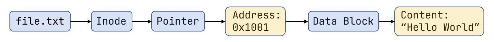
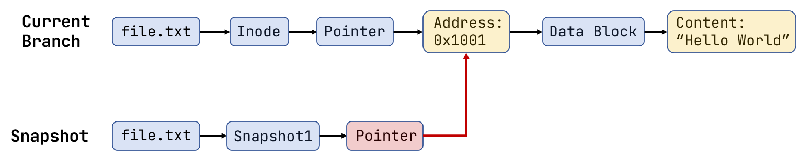
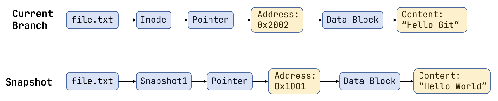
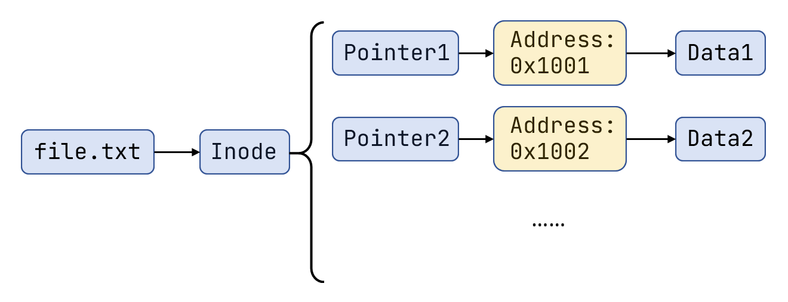

# Git

参考网站：[git-scm](https://git-scm.com/)

## 1 起步

### 1.1 关于版本控制

什么是版本控制？为什么需要版本控制？版本控制是一种记录一个或若干文件内容变化，以便将来查阅特定版本修订情况的系统。

当你在完成一个大型项目时，采用版本控制有很多好处：你可以将选定的文件回溯到之前的状态，甚至将整个项目都回退到过去某个时间点的状态；你可以比较文件的变化细节，查出最后是谁修改了哪个地方，从而找出导致怪异问题出现的原因；等等。

**版本控制系统的发展**：

- **本地版本控制系统**：最直接的方法就是复制整个项目，修改名称加以区分，但这恒容易犯错。于是出现了很多的许多种本地版本控制系统，即采用某种简单的数据库来记录文件的历次更新差异

  
  
  但本地版本控制系统无法让在不同系统上的开发者协同工作
  
- **集中化版本控制系统**：即有单一的集中管理的服务器，保存所有文件的修订版本，而协同工作的人们都通过客户端连到这台服务器。显而易见的缺点是中央服务器的单点故障，则所有人都无法工作，且面临数据丢失风险

	
	
- **分布式版本控制系统**：客户端并不只提取最新版本的文件快照，而是把代码仓库完整地镜像下来，包括完整的历史记录

	 

Git 就是一个开源、成熟、现代的分布式版本控制工具。

### 1.2 Git 基本工作原理

> [!note]
>
> 注意接下来的内容非常重要，我们将从底层理解 Git 的版本的记录和回滚的工作原理

#### 1.2.1 文件快照

文件快照与直接复制不同，而是通过操作**元数据(Metadata)** 中的**地址指针**来完成的。我们从下面一个例子来理解文件快照如何工作：

```
file.txt: "Hello World" --> "Hello Git"
```

- 初始状态：当我们创建一个文件时，文件系统会做两件事

  - 创建**数据块(Data Bolck)**：将 "Hello World" 存储在磁盘的某个物理地址上，假设地址是 `0x1001`。在 Unix 系统中，一个数据块的大小是 4KB，不同的系统可能不同
  - 创建**元数据(Inode)**：记录文件的权限、大小以及指向具体数据块的指针

  底层逻辑：

  

- 执行快照：当系统执行快照指令时，系统会**复制那一时刻的指针信息**。系统会创建一个新的快照记录（比如 `Snapshot1`），它包含一个指针，同样指向 `0x1001`。

  

- 修改文件：采用**写时复制(Copy on Write)**的方法。假设我们把文件内容改为 "Hello Git"，系统会执行以下操作

  1. 开辟新空间：在磁盘的新地址（假设是 `0x2002`）写入新内容 "Hello Git"

  2. 更新当前指针：将当前分支的文件 `file.txt` 的指针指向新地址 `0x2002`

  3. 保留旧指针：快照 `Snapshot1` 的指针依然指向 `0x1001`

  

- 对于需要多个块的储存数据的文件

  
  
  生成快照只需要储存所有指向数据块的指针，而当我们修改某一个块的内容时，只需要对当前块进行写时复制。
  如果文件非常大（比如几个 GB），Inode 还会引入**间接块(Indirect Blocks)**：指针不指向数据，而是指向另一个“存满指针的表”，从而形成树状结构。

> [!note]
>
> 总结一下快照的优势：
>
> - 生成快照只需要储存所有指向数据块的指针，而不需要复制所有数据
> - 当我们修改某一个块的内容时，只需要对当前块进行写时复制；更新快照只需要将当前块的指针指向新的数据块
> - 通过读取某一次快照的指针，就可以回到快照生成时刻文件的状态

#### 1.2.2 Git 工作原理

CVS、Subversion、Perforce 等是**基于差异**的版本控制系统


Git 则是基于文件快照，每当提交更新或保存项目状态时，它基本上就会对当时的全部文件创建一个快照并保存这个快照的索引


但 Git 的快照与前面提到的 Unix 系统快照又有一些区别。传统文件系统是在物理磁盘上做快照，而 Git 是在内容(Content) 上做快照

----

Git 是**内容寻址存储（Content-Addressable Storage）**。Git 中的文件有三种状态：**已提交(committed)**、**已修改(modified)** 和**已暂存(staged)**；这也的 Git 项目拥有三个分区：**工作区**、**暂存区/索引**以及 **Git 目录**


我们仍以下面的例子来理解 Git 的工作原理

```
file.txt: "Hello World" --> "Hello Git"
```

- 工作区：创建的 `file.txt` 就位于工作区，此时 Git 还没有看到这个文件

- 暂存区：执行 `git add file.txt` 后，生成内容快照

  - 存入仓库：Git 将 `"Hello World"` 加上头部信息，计算哈希值（假设为 `hash_v1`），然后以这个哈希值为文件名，将内容压缩存入 `.git/objects/` 目录下。这就是 **Blob 对象**

    > [!note]
    >
    > 如果两个文件内容完全相同，那么 Git 只会保存一个 Blob 对象

  - 更新索引：Git 更新 `.git/index` 文件（即暂存区）。它记录了一行信息：`file.txt -> hash_v1`

- Git 目录：执行 `git commit`，封存历史

  - 生成树对象(Tree)：整个项目的目录结构的快照 `file_name -> hash_value`
  - 生成提交对象(Commit)：指向顶层的 Tree 对象，并包含作者、提交信息等本次提交的元数据

- 更新：Git 会重新计算 add 文件的哈希值 `hash_v2`。如果结果不存在于 `.git/objects/` 中，Git 会将它作为全新的文件压缩存入 `.git/objects/` 中。之后 Commit 于上面一致

> [!note]
>
> 这样看来文件哪怕只有很少的改变，Git 都会重新储存它的完整内容。但 Git 会在后台做**增量压缩(Delta Compression)**
>
> - Git 会选择其中一个版本作为**基准(Base)**，完整保存其内容
> - 对于其他版本，Git 只保存它们相对于基准版本的**差异(Delta)**
>
> 并且 Git 由于哈希去重的机制，往往比基于差异的版本控制系统更节省空间

## 2 基本操作

### 2.1 安装

```bash
# 检查更新
$ sudo apt update
# 安装 Git
$ sudo apt install git

# 检查安装是否成功
$ git --version
git version 2.43.0

# 配置用户名和邮箱
$ git config --global user.name "Lucian"
$ git config --global user.email "Lucian@example.com"
```

### 2.2 获取 Git 仓库

获取 Git 仓库的方式通常有两种

1. 将尚未进行版本控制的本地目录转换为 Git 仓库
2. 从其它服务器 **克隆**一个已存在的 Git 仓库

#### 初始化本地仓库

```bash
$ git init
```

该命令将创建一个名为 `.git` 的子目录，其中含有初始化的 Git 仓库中所有的必须文件，但此时项目里的文件还没有被跟踪

#### 克隆远程仓库

```bash
$ git clone <url>
```

其中 `<repo_url>` 既可以是 HTTPS URL，也可以是 SSH URL

### 2.3 记录每次更新

工作目录下的每一个文件可能处于两种状态：**已跟踪**或**未跟踪**。已跟踪的文件就是 Git 已经知道的文件。编辑过某些已跟踪文件之后，Git 将它们标记为**已修改文件**。


- 执行 `git add <list of filenames>` 命令可将文件上传至暂存区
  - 使用 `git add .` 可以将工作目录下所有文件都提交到暂存区
- 执行 `git commit -m "some message"` 提交暂存区内的文件
  - 也可加上 `-a` 选项，取代 `git add .`

```bash
$ git add README
$ git commit -m "First Commit"
[master (root-commit) 22832d2] First Commit
 1 file changed, 1 insertion(+)
 create mode 100644 README
```

有时我们希望一些文件（编译中间产物等）不要进入 Git 的管理，这时可以创建一个 `.gitignore` 文件，例如

```
# 忽略所有的 .a 文件
*.a

# 但跟踪所有的 lib.a，即便你在前面忽略了 .a 文件
!lib.a

# 只忽略当前目录下的 TODO 文件，而不忽略 subdir/TODO
/TODO

# 忽略任何目录下名为 build 的文件夹
build/

# 忽略 doc/notes.txt，但不忽略 doc/server/arch.txt
doc/*.txt

# 忽略 doc/ 目录及其所有子目录下的 .pdf 文件
doc/**/*.pdf
```

>[!note]
>
> GitHub 有一个十分详细的针对数十种项目及语言的 [`.gitignore` 文件列表](https://github.com/github/gitignore)

### 2.4 查看变更信息

#### 2.4.1 `git status`

可以用 `git status` 查看工作区和暂存区的情况

```bash
$ git status
On branch master
Changes to be committed:
  (use "git restore --staged <file>..." to unstage)
        new file:   uncommited

Changes not staged for commit:
  (use "git add <file>..." to update what will be committed)
  (use "git restore <file>..." to discard changes in working directory)
        modified:   README

Untracked files:
  (use "git add <file>..." to include in what will be committed)
        untracked
```

会显示 New File，Uncommited，Modified 等文件。使用 `git status -s` 得到精简的的信息

```bash
$ git status -s
 M README
A  uncommited
?? untracked
```

- `??` 表示还未追踪，`M` 表示修改的文件，`A` 表示已添加到暂存区

如果我们想要查看具体更改了哪些内容，则可以使用 `git diff` 命令

```bash
$ git diff     
diff --git a/README b/README
index 5e1c309..e51ca0d 100644
--- a/README
+++ b/README
@@ -1 +1 @@
-Hello World
\ No newline at end of file
+Hello Git
\ No newline at end of file
```

#### 2.4.2 git log

使用 `git log` 可以查看提交历史

```bash
$ git log
commit afe5baf8362b664f54848b970f5525fe068208d5 (HEAD -> master)
Author: author_name <email@example.com>
Date:   Tue Feb 24 20:42:56 2026 +0800

    Third Commit

commit 595106cceff6fe10301c27087ff471400ba7f572
Author: author_name <email@example.com>
Date:   Tue Feb 24 20:42:42 2026 +0800

    Second Commit

commit 22832d28b24a1bc72e21568867be8ea7a1248ae1
Author: author_name <email@example.com>
Date:   Tue Feb 24 20:21:03 2026 +0800

    First Commit
```

一些有用的选项：

- `-p` 或 `--patch` 会显示每次提交的差异

- `-1` 可以控制显示最近几次提交

  ```bash
  $ git log -p -1
  commit 89b568cc3e34bcaba4757f1800f3d544ce1b5620 (HEAD -> master)
  Author: author_name <email@example.com>
  Date:   Tue Feb 24 20:47:27 2026 +0800
  
      Fourth Commit
  
  diff --git a/uncommited b/uncommited
  index e69de29..08a6464 100644
  --- a/uncommited
  +++ b/uncommited
  @@ -0,0 +1 @@
  +This is a uncommited test file
  ```

- `--stat` 会每次提交的简洁信息

  ```bash
  $ git log --stat -1
  commit 89b568cc3e34bcaba4757f1800f3d544ce1b5620 (HEAD -> master)
  Author: lunaticund <tianluliu@zju.edu.cn>
  Date:   Tue Feb 24 20:47:27 2026 +0800
  
      Fourth Commit
  
   uncommited | 1 +
   1 file changed, 1 insertion(+)
  ```

  会看到每个文件修改了几次

- `--pretty` 这个选项可以使用[不同的格式](https://git-scm.com/docs/pretty-formats)的方式展示提交历史

其他的**搜索选项**

| 选项                  | 说明                                       |
| :-------------------- | :----------------------------------------- |
| `-<n>`                | 仅显示最近的 n 条提交。                    |
| `--since`, `--after`  | 仅显示指定时间之后的提交。                 |
| `--until`, `--before` | 仅显示指定时间之前的提交。                 |
| `--author`            | 仅显示作者匹配指定字符串的提交。           |
| `--committer`         | 仅显示提交者匹配指定字符串的提交。         |
| `--grep`              | 仅显示提交说明中包含指定字符串的提交。     |
| `-S`                  | 仅显示添加或删除内容匹配指定字符串的提交。 |

```bash
# 找到指定用户的提交
$ git log --author="<name>"

# 找到包含指定信息的提交
$ git log --grep="<pattern>"

# 仅显示从 <since> 到 <until> 之间发生的提交。这两个参数可以是提交的哈希值、分支名称等其他类型的修订版本引用。
$ git log <since>..<until>

# 仅显示包含指定文件的提交
$ git log <file>

# 查看所有分支的提交信息（git log 只能查看当前分支的提交）
$ git log --branches=*
```

### 2.5 撤销操作

> [!caution]
>
> 注意，有些撤消操作是不可逆的

