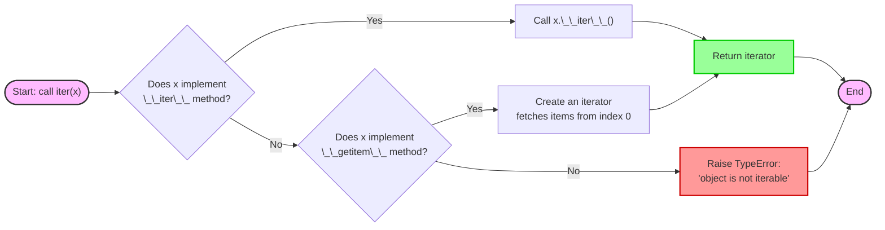
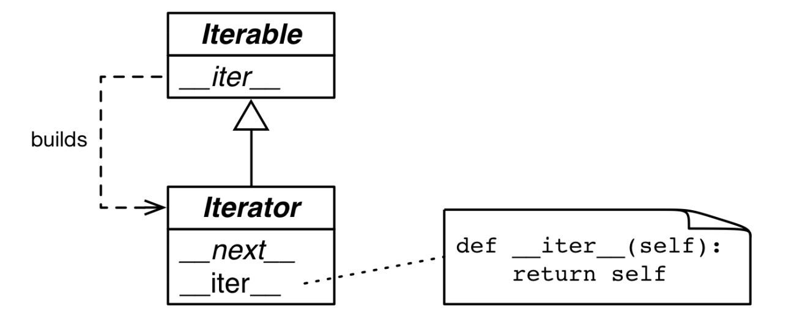

# 控制流

## 1 迭代器、生成器和经典协程

> [!note]
> 迭代器的作用：内存不足时，需要**惰性**获取数据项。在 Python 中所有容器都是**可迭代对象**。Python 迭代器支持以下操作：
>
> - `for` 循环
> - 列表、字典和集合推导式
> - 拆包赋值
> - 构造容器实例

示例：单次序列

```python
import re
import reprlib

RE_WORD = re.compile(r'\w+')

class Sentence:
 	def __init__(self, text):
 		self.text = text
 		self.words = RE_WORD.findall(text) 
        
 	def __getitem__(self, index):
 		return self.words[index] 
    
 	def __len__(self): 
 		return len(self.words)
    
 	def __repr__(self):
 		return 'Sentence(%s)' % reprlib.repr(self.text)
```

### 1.1 `iter()` 函数

需要迭代对象 `x` 时，Python 自动调用 `iter(x)` 函数。内置函数 `iter` 会依次执行以下操作：

1. 检查 `x` 对象是否实现了 `__iter__` 方法，如果实现就调用它，返回一个迭代器
2. 如果没有实现，但实现了 `__getitem__` 方法，那么 `iter` 会创建一个迭代器，尝试按索引（从 0 开始）获取项
3. 尝试失败，则抛出 TypeError，通常提示 "'C' object is not iterable"



`iter()` 函数还可以处理可调用对象。在 Python 中输入 `help(iter)` 得到

```Python
>>> help(iter)
Help on built-in function iter in module builtins:

iter(...)
    iter(iterable) -> iterator
    iter(callable, sentinel) -> iterator

    Get an iterator from an object.  In the first form, the argument must
    supply its own iterator, or be a sequence.
    In the second form, the callable is called until it returns the sentinel.
```

第二种形式，传入的 callable 对象会一直被调用直到返回**哨符(sentinel)**，然后抛出 StopIteration。例如：

```python
>>> def d6():
...     return randint(1,6)
... 
>>> d6_iter = iter(d6, 1)
>>> for roll in d6_iter:                                                                                                                    
...     print(roll)
... 
6
5
3
```

### 1.2 可迭代对象和迭代器

可迭代对象：能让内置函数 `iter` 获取到迭代器的对象。

- 实现了 `__iter__` 方法并返回迭代器的对象是可迭代的
- 实现了接受从 0 开始索引的 `__getitem__` 方法的对象也是可迭代的



Python 中两者的标准接口：

- Iterable：实现 `__iter__` 方法，返回一个迭代器
- Iterator：
  - `__next__` 返回序列中的下一项，如果没有下一项，则抛出 StopIteration
  - `__iter__` 返回 self

```python
>>> s = Sentence('Life of Brain')
>>> it = iter(s)
>>> it
<iterator object at 0x000001CE2B8B6800>
>>> next(it)
'Life'
>>> next(it)
'of'
>>> next(it)
'Brain'
>>> next(it)
Traceback (most recent call last):
  File "<python-input-16>", line 1, in <module>
    next(it)
    ~~~~^^^^
StopIteration
```

> [!caution]
>
> 如果想要重新迭代，必须从可迭代对象重新构建迭代器。`Iterator.__iter__` 返回 self，无法重置。除了使用 `next` 捕获 StopIteration，也没有办法判断剩余项数目。

### 1.3 实现 `__iter__` 方法

#### 1.3.1 经典迭代器

```python
import re
import reprlib

RE_WORD = re.compile(r'\w+')

class Sentence:
 	def __init__(self, text):
		self.text = text
 		self.words = RE_WORD.findall(text)
        
 	def __repr__(self):
 		return f'Sentence({reprlib.repr(self.text)})
    
	def __iter__(self): 
 		return SentenceIterator(self.words) 
    
class SentenceIterator:
 	def __init__(self, words):
 		self.words = words 
 		self.index = 0 
        
 	def __next__(self):
 		try:
 			word = self.words[self.index] 
 		except IndexError:
 			raise StopIteration() 
 		self.index += 1 
 		return word 
    
 	def __iter__(self): 
 		return self
```

如果让 `SentenceIterator` 子类化 `abc.Iterator` 则会继承具体方法 `abc.Iterator.__iter__`

> [!caution]
>
> 不要把可迭代对象变为迭代器，即不要再 Sentence 里实现 `__next__` 方法。
> >[!note]
> >
> >Use the Iterator pattern:
> >
> >- to access an aggregate object’s contents without exposing its internal representation.
> >- to support multiple traversals of aggregate objects.
> >-  to provide a uniform interface for traversing different aggregate structures (that is, to support polymorphic iteration).
> >
> >———— The “Applicability” section about the Iterator design pattern in the *Design Patterns* book
>
> “支持多态遍历”即要求能从同一个可迭代对象获得多个独立的迭代器，各个迭代器要能位置自身的内部状态。

#### 1.3.2 生成器函数

在 Python 中，使用 `yield` 关键字用于定义**生成器(Generator)**。它的作用类似于 `return` ，但有一个核心区别：`return` 会彻底结束函数的执行，而 `yield` 会**暂停**函数，保存当前的运行状态，并返回一个值给调用者。

示例：

```python
>>> def countdown(n):
...     print('Start...')
...     while n>0:
...         yield n
...         n -= 1
...     print('End!')
... 
>>> timer = countdown(3)
>>> next(timer)
Start...
3
>>> next(timer)
2
>>> next(timer)
1
>>> next(timer)
End!
Traceback (most recent call last):       
  File "<python-input-25>", line 1, in <module>
    next(timer)
    ~~~~^^^^^^^
StopIteration
```

当一个函数包含 `yield` 时，它就不再是一个普通的函数，而是一个**生成器函数**。调用该函数时，它不会立即执行代码，而是返回一个**生成器对象**。

- `yield` 的动作：返回一个值，然后“冻结”函数。
- 恢复执行：当外部调用 `next()` 或进行循环迭代时，函数从上次暂停的地方继续执行，直到遇到下一个 `yield` 或函数结束。

使用 `yield` 可以将之前的 `Sentence` 改写为

```python
class Sentence:
 	def __init__(self, text):
		self.text = text
 		self.words = RE_WORD.findall(text)
        
 	def __repr__(self):
 		return f'Sentence({reprlib.repr(self.text)})
    
	def __iter__(self): 
 		for word in self.words:
            yield word
```

#### 1.3.3 惰性实现版本

> [!note]
>
> - **及早求值(Eager Evaluation)**：一旦表达式被赋值给变量，计算就会立即发生
> - **惰性求值(Lazy Evaluation)**：表达式不会在赋值时立即计算，而是推迟到 真正需要其值 的那一刻才进行计算

`re.findall` 会返回一个 list 将所有词语都储存，`re.finditer` 是它的惰性版本，返回一个生成器，逐个产出 `re.MatchObject` 实例。`__iter__` 方法可变为

```python
	def __iter__(self): 
 		for word in RE_WORD.finditer(self.text)
            yield word.group()
```

对于**逻辑简单的生成器函数**，可以用**生成器表达式**（语法糖）进行替换，表达更加简洁

```python
	def __iter__(self): 
 		return (word.group() for word in RE_WORD.finditer(self.text))
```

----

> [!note]
>
> 对比**迭代器**和**生成器**
>
> - 迭代器(Iterator)：是一个实现了迭代协议的对象。它必须包含 `__iter__()` 和 `__next__()` 两个方法。它是一个更底层的概念
> - 生成器(Generator)：是由 Python 解释器支持的一种特殊的迭代器。它通过**函数 + `yield`**关键字或**生成器表达式** 自动创建，不需要手动写 `__next__()` 和 `__iter__()`
>
> ```mermaid
> graph LR
>     Iterable["Iterable<br/>(as: list, str, dict)"] -- "iter()" --> Iterator
>     
>     subgraph IteratorGroup [Iterator]
>         Iterator["General Iterator<br/>(\_\_next\_\_)"]
>         Generator["Generator<br/>(Use yield or <br/>Generator expression)"]
>     end
>     
>     Generator -- "in" --> Iterator
> 
> ```
>

### 1.4 无穷数列生成器

利用生成器的惰性求值特性，我们可以非常轻松地定义无穷数列，而不会导致内存溢出。例如

```python
def fibonacci():
    a, b = 0, 1
    while True:
        yield a
        a, b = b, a + b
```

### 1.5 标准库中的生成器函数

<!DOCTYPE html>
<html lang="zh-CN">
<head>
    <meta charset="UTF-8">
    <meta name="viewport" content="width=device-width, initial-scale=1.0">
    <title>用于筛选的生成器函数</title>
    <style>
        :root {
            --bg-color: #ffffff;
            --text-color: #333333;
            --title-color: #222222;
            --border-color: #dddddd;
            --header-bg: #f8f9fa;
            --hover-bg: #f1f3f5;
            --code-bg: #f4f4f4;
            --code-text: #d63384;
            --tag-bg: #e9ecef;
            --tag-text: #495057;
        }
        @media (prefers-color-scheme: dark) {
            :root {
                --bg-color: #1e1e1e;
                --text-color: #d4d4d4;
                --title-color: #ffffff;
                --border-color: #444444;
                --header-bg: #2d2d2d;
                --hover-bg: #333333;
                --code-bg: #3c3c3c;
                --code-text: #ff79c6;
                --tag-bg: #3a3a3a;
                --tag-text: #bbbbbb;
            }
        }
        body {
            background-color: var(--bg-color);
            color: var(--text-color);
            font-family: -apple-system, BlinkMacSystemFont, "Segoe UI", Roboto, sans-serif;
            line-height: 1.6;
            margin: 0;
            padding: 40px 20px;
            transition: background-color 0.3s, color 0.3s;
        }
        .container {
            max-width: 900px;
            margin: 0 auto;
        }
        h2 {
            text-align: center;
            color: var(--title-color);
            margin-bottom: 30px;
            font-size: 1.5rem;
        }
        table {
            width: 100%;
            border-collapse: collapse;
            border: 1px solid var(--border-color);
            font-size: 14px;
        }
        th, td {
            padding: 12px 15px;
            border: 1px solid var(--border-color);
            text-align: left;
        }
        th {
            background-color: var(--header-bg);
            font-weight: 600;
        }
        tr:hover {
            background-color: var(--hover-bg);
        }
        code {
            font-family: "Cascadia Code", Consolas, Monaco, monospace;
            background-color: var(--code-bg);
            color: var(--code-text);
            padding: 2px 5px;
            border-radius: 4px;
            font-size: 0.95em;
        }
        .module-tag {
            background-color: var(--tag-bg);
            color: var(--tag-text);
            padding: 2px 6px;
            border-radius: 4px;
            font-size: 0.85em;
            font-weight: 500;
        }
    </style>
</head>
<body>
<div class="container">
    <h4>用于筛选的生成器函数</h4>
    <table>
        <thead>
            <tr>
                <th style="width: 15%;">模块</th>
                <th style="width: 35%;">函数</th>
                <th style="width: 50%;">说明</th>
            </tr>
        </thead>
        <tbody>
            <tr>
                <td><span class="module-tag">itertools</span></td>
                <td><code>compress(it, selector_it)</code></td>
                <td>并行处理两个可迭代对象；如果 <code>selector_it</code> 中的项为真值，那么产出 <code>it</code> 中对应的项。</td>
            </tr>
            <tr>
                <td><span class="module-tag">itertools</span></td>
                <td><code>dropwhile(predicate, it)</code></td>
                <td>处理 <code>it</code>，跳过 <code>predicate</code> 的计算结果为真值的项，然后产出剩下的项（不再进一步检查）。</td>
            </tr>
            <tr>
                <td><span class="module-tag">内置</span></td>
                <td><code>filter(predicate, it)</code></td>
                <td>把 <code>it</code> 中的各个元素传给 <code>predicate</code>，如果 <code>predicate(item)</code> 返回真值，那么产出对应的元素；如果 <code>predicate</code> 是 <code>None</code>，那么只产出真值元素。</td>
            </tr>
            <tr>
                <td><span class="module-tag">itertools</span></td>
                <td><code>filterfalse(predicate, it)</code></td>
                <td>与 <code>filter</code> 函数的作用类似，不过 <code>predicate</code> 的逻辑是相反的：<code>predicate</code> 返回假值时产出对应的项。</td>
            </tr>
            <tr>
                <td><span class="module-tag">itertools</span></td>
                <td><code>islice(it, stop)</code><br>或 <code>islice(it, start, stop, step=1)</code></td>
                <td>产出 <code>it</code> 的切片，作用类似于 <code>s[:stop]</code> 或 <code>s[start:stop:step]</code>，不过 <code>it</code> 可以是任何可迭代对象，而且这个函数惰性执行操作。</td>
            </tr>
            <tr>
                <td><span class="module-tag">itertools</span></td>
                <td><code>takewhile(predicate, it)</code></td>
                <td><code>predicate</code> 返回真值时产出对应的项，然后立即停止，不再继续检查。</td>
            </tr>
        </tbody>
    </table>
</div>
</body>
</html>

测试：

```python
>>> import itertools
>>> def vowel(c):
...     return c.lower() in 'aeiou'
...     
>>> sample = 'Aardvark'
>>> list(filter(vowel, sample))
['A', 'a', 'a']
>>> list(itertools.filterfalse(vowel, sample))
['r', 'd', 'v', 'r', 'k']
>>> list(itertools.dropwhile(vowel, sample))
['r', 'd', 'v', 'a', 'r', 'k']
>>> list(itertools.takewhile(vowel, sample))
['A', 'a']
>>> list(itertools.islice(sample, 4))
['A', 'a', 'r', 'd']
>>> list(itertools.islice(sample, 4, 7))
['v', 'a', 'r']
>>> list(itertools.islice(sample, 1, 7, 2))
['a', 'd', 'a']
>>> list(itertools.compress(sample, [1, 0, 1, 1, 0, 1]))
['A', 'r', 'd', 'a']
```

<!DOCTYPE html>
<html lang="zh-CN">
<head>
    <meta charset="UTF-8">
    <meta name="viewport" content="width=device-width, initial-scale=1.0">
    <title>用于映射的生成器函数</title>
    <style>
        /* 默认浅色模式变量 */
        :root {
            --bg-color: #ffffff;
            --text-color: #333333;
            --title-color: #222222;
            --border-color: #dddddd;
            --header-bg: #f8f9fa;
            --hover-bg: #f1f3f5;
            --code-bg: #f4f4f4;
            --code-text: #d63384;
            --tag-bg: #e9ecef;
            --tag-text: #495057;
        }
        /* 自动检测并切换深色模式 */
        @media (prefers-color-scheme: dark) {
            :root {
                --bg-color: #1e1e1e;
                --text-color: #d4d4d4;
                --title-color: #ffffff;
                --border-color: #444444;
                --header-bg: #2d2d2d;
                --hover-bg: #333333;
                --code-bg: #3c3c3c;
                --code-text: #ff79c6;
                --tag-bg: #3a3a3a;
                --tag-text: #bbbbbb;
            }
        }
        body {
            background-color: var(--bg-color);
            color: var(--text-color);
            font-family: -apple-system, BlinkMacSystemFont, "Segoe UI", Roboto, sans-serif;
            line-height: 1.6;
            margin: 0;
            padding: 40px 20px;
            transition: background-color 0.3s, color 0.3s;
        }
        .container {
            max-width: 900px;
            margin: 0 auto;
        }
        h2 {
            text-align: center;
            color: var(--title-color);
            margin-bottom: 30px;
            font-size: 1.5rem;
        }
        table {
            width: 100%;
            border-collapse: collapse;
            border: 1px solid var(--border-color);
            font-size: 14px;
        }
        th, td {
            padding: 12px 15px;
            border: 1px solid var(--border-color);
            text-align: left;
        }
        th {
            background-color: var(--header-bg);
            font-weight: 600;
        }
        tr:hover {
            background-color: var(--hover-bg);
        }
        code {
            font-family: "Cascadia Code", Consolas, Monaco, monospace;
            background-color: var(--code-bg);
            color: var(--code-text);
            padding: 2px 5px;
            border-radius: 4px;
            font-size: 0.95em;
        }
        .module-tag {
            background-color: var(--tag-bg);
            color: var(--tag-text);
            padding: 2px 6px;
            border-radius: 4px;
            font-size: 0.85em;
            font-weight: 500;
        }
    </style>
</head>
<body>
<div class="container">
    <h4>用于映射的生成器函数</h4>
    <table>
        <thead>
            <tr>
                <th style="width: 15%;">模块</th>
                <th style="width: 35%;">函数</th>
                <th style="width: 50%;">说明</th>
            </tr>
        </thead>
        <tbody>
            <tr>
                <td><span class="module-tag">itertools</span></td>
                <td><code>accumulate(it, [func])</code></td>
                <td>产出累计求和；如果提供了 <code>func</code>，那么把前两个项传给它，然后把计算结果和下一项传给它，以此类推，产出最后结果。</td>
            </tr>
            <tr>
                <td><span class="module-tag">内置</span></td>
                <td><code>enumerate(iterable, start=0)</code></td>
                <td>产出 <code>(index, item)</code> 形式的二元组，其中 <code>index</code> 从 <code>start</code> 开始计数，<code>item</code> 则从 <code>iterable</code> 中获取。</td>
            </tr>
            <tr>
                <td><span class="module-tag">内置</span></td>
                <td><code>map(func, it1, [it2, ..., itN])</code></td>
                <td>把 <code>it</code> 中的各项依次传给 <code>func</code>，产出结果；如果传入 <code>N</code> 个可迭代对象，那么 <code>func</code> 必须接受 <code>N</code> 个参数，而且并行处理各个可迭代对象。</td>
            </tr>
            <tr>
                <td><span class="module-tag">itertools</span></td>
                <td><code>starmap(func, it)</code></td>
                <td>把 <code>it</code> 中的各项依次传给 <code>func</code>，产出结果；输入的可迭代对象应该产出可迭代的项 <code>iit</code>，然后以 <code>func(*iit)</code> 形式调用 <code>func</code>。</td>
            </tr>
        </tbody>
    </table>
</div>
</body>
</html>

测试:

```python
>>> sample = [5, 4, 5, 6, 0, 9, 2, 3]
>>> list(itertools.accumulate(sample))
[5, 9, 14, 20, 20, 29, 31, 34]
>>> list(itertools.accumulate(sample,min))
[5, 4, 4, 4, 0, 0, 0, 0]
>>> list(enumerate('asdfghj',1))
[(1, 'a'), (2, 's'), (3, 'd'), (4, 'f'), (5, 'g'), (6, 'h'), (7, 'j')]
>>> import operator
>>> list(map(operator.mul, range(11), range(11)))
[0, 1, 4, 9, 16, 25, 36, 49, 64, 81, 100]
>>> list(itertools.starmap(operator.mul, enumerate('asdfghj', 1)))
['a', 'ss', 'ddd', 'ffff', 'ggggg', 'hhhhhh', 'jjjjjjj']
```

<!DOCTYPE html>
<html lang="zh-CN">
<head>
    <meta charset="UTF-8">
    <meta name="viewport" content="width=device-width, initial-scale=1.0">
    <title>用于合并的生成器函数</title>
    <style>
        :root {
            --bg-color: #ffffff;
            --text-color: #333333;
            --title-color: #222222;
            --border-color: #dddddd;
            --header-bg: #f8f9fa;
            --hover-bg: #f1f3f5;
            --code-bg: #f4f4f4;
            --code-text: #d63384;
            --tag-bg: #e9ecef;
            --tag-text: #495057;
        }
        @media (prefers-color-scheme: dark) {
            :root {
                --bg-color: #1e1e1e;
                --text-color: #d4d4d4;
                --title-color: #ffffff;
                --border-color: #444444;
                --header-bg: #2d2d2d;
                --hover-bg: #333333;
                --code-bg: #3c3c3c;
                --code-text: #ff79c6;
                --tag-bg: #3a3a3a;
                --tag-text: #bbbbbb;
            }
        }
        body {
            background-color: var(--bg-color);
            color: var(--text-color);
            font-family: -apple-system, BlinkMacSystemFont, "Segoe UI", Roboto, sans-serif;
            line-height: 1.6;
            margin: 0;
            padding: 40px 20px;
            transition: background-color 0.3s, color 0.3s;
        }
        .container {
            max-width: 900px;
            margin: 0 auto;
        }
        h2 {
            text-align: center;
            color: var(--title-color);
            margin-bottom: 30px;
        }
        table {
            width: 100%;
            border-collapse: collapse;
            border: 1px solid var(--border-color);
            font-size: 14px;
        }
        th, td {
            padding: 12px 15px;
            border: 1px solid var(--border-color);
            text-align: left;
        }
        th {
            background-color: var(--header-bg);
            font-weight: 600;
        }
        tr:hover {
            background-color: var(--hover-bg);
        }
        code {
            font-family: "Cascadia Code", Consolas, Monaco, monospace;
            background-color: var(--code-bg);
            color: var(--code-text);
            padding: 2px 5px;
            border-radius: 4px;
        }
        .module-tag {
            background-color: var(--tag-bg);
            color: var(--tag-text);
            padding: 2px 6px;
            border-radius: 4px;
            font-size: 0.85em;
        }
        sup {
            color: var(--code-text);
            font-size: 0.7em;
        }
    </style>
</head>
<body>
<div class="container">
    <h4>用于合并的生成器函数</h4>
    <table>
        <thead>
            <tr>
                <th style="width: 15%;">模块</th>
                <th style="width: 35%;">函数</th>
                <th style="width: 50%;">说明</th>
            </tr>
        </thead>
        <tbody>
            <tr>
                <td><span class="module-tag">itertools</span></td>
                <td><code>chain(it1, ..., itN)</code></td>
                <td>先产出 <code>it1</code> 中的所有项，然后产出 <code>it2</code> 中的所有项，以此类推，无缝衔接。</td>
            </tr>
            <tr>
                <td><span class="module-tag">itertools</span></td>
                <td><code>chain.from_iterable(it)</code></td>
                <td>产出 <code>it</code> 生成的各个可迭代对象中的项，一个接一个，无缝衔接；<code>it</code> 产出的项也应该是可迭代对象，例如元组列表。</td>
            </tr>
            <tr>
                <td><span class="module-tag">itertools</span></td>
                <td><code>product(it1, ..., itN, repeat=1)</code></td>
                <td>计算笛卡儿积：从输入的各个可迭代对象中获取项，合并成 N 元组，与嵌套的 <code>for</code> 循环效果一样；<code>repeat</code> 指明重复处理多少次输入的可迭代对象。</td>
            </tr>
            <tr>
                <td><span class="module-tag">内置</span></td>
                <td><code>zip(it1, ..., itN, strict=False)</code></td>
                <td>从输入的各个可迭代对象中并行获取项，产出由此构成的 N 元组，只要有一个可迭代对象耗尽，就静默停止，除非指定了 <code>strict=True</code>。</td>
            </tr>
            <tr>
                <td><span class="module-tag">itertools</span></td>
                <td><code>zip_longest(it1, ..., itN, fillvalue=None)</code></td>
                <td>从输入的各个可迭代对象中并行获取项，产出由此构成的 N 元组，直到最长的可迭代对象耗尽才停止，空缺的值使用 <code>fillvalue</code> 填充。</td>
            </tr>
        </tbody>
    </table>
</div>
</body>
</html>

测试：

``` python
>>> list(itertools.chain('ABC', range(3)))
['A', 'B', 'C', 0, 1, 2]
>>> list(itertools.chain.from_iterable(['ABC', range(3)]))
['A', 'B', 'C', 0, 1, 2]
>>> list(itertools.product('ABC', [1, 2]))
[('A', 1), ('A', 2), ('B', 1), ('B', 2), ('C', 1), ('C', 2)]
>>> list(zip('ABC', [1, 2]))
[('A', 1), ('B', 2)]
>>> list(itertools.zip_longest('ABC', [1, 2], fillvalue='?'))
[('A', 1), ('B', 2), ('C', '?')]
>>> list(zip('ABC', [1, 2], strict=True))
Traceback (most recent call last):
  File "<python-input-59>", line 1, in <module>
    list(zip('ABC', [1, 2], strict=True))
    ~~~~^^^^^^^^^^^^^^^^^^^^^^^^^^^^^^^^^
ValueError: zip() argument 2 is shorter than argument 1
```

<!DOCTYPE html>
<html lang="zh-CN">
<head>
    <meta charset="UTF-8">
    <meta name="viewport" content="width=device-width, initial-scale=1.0">
    <title>用于扩充的生成器函数</title>
    <style>
        :root {
            --bg-color: #ffffff;
            --text-color: #333333;
            --title-color: #222222;
            --border-color: #dddddd;
            --header-bg: #f8f9fa;
            --hover-bg: #f1f3f5;
            --code-bg: #f4f4f4;
            --code-text: #d63384;
            --tag-bg: #e9ecef;
            --tag-text: #495057;
        }
        @media (prefers-color-scheme: dark) {
            :root {
                --bg-color: #1e1e1e;
                --text-color: #d4d4d4;
                --title-color: #ffffff;
                --border-color: #444444;
                --header-bg: #2d2d2d;
                --hover-bg: #333333;
                --code-bg: #3c3c3c;
                --code-text: #ff79c6;
                --tag-bg: #3a3a3a;
                --tag-text: #bbbbbb;
            }
        }
        body {
            background-color: var(--bg-color);
            color: var(--text-color);
            font-family: -apple-system, BlinkMacSystemFont, "Segoe UI", Roboto, sans-serif;
            line-height: 1.6;
            margin: 0;
            padding: 40px 20px;
        }
        .container {
            max-width: 900px;
            margin: 0 auto;
        }
        h2 {
            text-align: center;
            color: var(--title-color);
            margin-bottom: 30px;
        }
        table {
            width: 100%;
            border-collapse: collapse;
            border: 1px solid var(--border-color);
            font-size: 14px;
        }
        th, td {
            padding: 12px 15px;
            border: 1px solid var(--border-color);
            text-align: left;
        }
        th {
            background-color: var(--header-bg);
            font-weight: 600;
        }
        tr:hover {
            background-color: var(--hover-bg);
        }
        code {
            font-family: "Cascadia Code", Consolas, Monaco, monospace;
            background-color: var(--code-bg);
            color: var(--code-text);
            padding: 2px 5px;
            border-radius: 4px;
        }
        .module-tag {
            background-color: var(--tag-bg);
            color: var(--tag-text);
            padding: 2px 6px;
            border-radius: 4px;
            font-size: 0.85em;
        }
        sup {
            color: var(--code-text);
            font-size: 0.75em;
        }
    </style>
</head>
<body>
<div class="container">
    <h4>用于扩充的生成器函数</h4>
    <table>
        <thead>
            <tr>
                <th style="width: 15%;">模块</th>
                <th style="width: 35%;">函数</th>
                <th style="width: 50%;">说明</th>
            </tr>
        </thead>
        <tbody>
            <tr>
                <td><span class="module-tag">itertools</span></td>
                <td><code>combinations(it, out_len)</code></td>
                <td>把 <code>it</code> 产出的 <code>out_len</code> 个项组合在一起，然后产出。</td>
            </tr>
            <tr>
                <td><span class="module-tag">itertools</span></td>
                <td><code>combinations_with_replacement(it, out_len)</code></td>
                <td>把 <code>it</code> 产出的 <code>out_len</code> 个项组合在一起，然后产出，包含重复项的组合。</td>
            </tr>
            <tr>
                <td><span class="module-tag">itertools</span></td>
                <td><code>count(start=0, step=1)</code></td>
                <td>从 <code>start</code> 开始不断产出数值，按 <code>step</code> 指定的步幅增加。</td>
            </tr>
            <tr>
                <td><span class="module-tag">itertools</span></td>
                <td><code>cycle(it)</code></td>
                <td>从 <code>it</code> 中产出各项，存储各项的副本，然后按顺序重复不断地产出整个序列。</td>
            </tr>
            <tr>
                <td><span class="module-tag">itertools</span></td>
                <td><code>pairwise(it)</code></td>
                <td>返回输入的可迭代对象中连续的重叠对 <sup>a</sup>。</td>
            </tr>
            <tr>
                <td><span class="module-tag">itertools</span></td>
                <td><code>permutations(it, out_len=None)</code></td>
                <td>把 <code>out_len</code> 个 <code>it</code> 产出的项排列在一起，然后产出这些排列；<code>out_len</code> 的默认值等于 <code>len(list(it))</code>。</td>
            </tr>
            <tr>
                <td><span class="module-tag">itertools</span></td>
                <td><code>repeat(item, [times])</code></td>
                <td>重复不断地产出指定的项，除非 <code>times</code> 指定次数。</td>
            </tr>
        </tbody>
    </table>
</div>
</body>
</html>

测试：

```python
>>> list(itertools.combinations('ABC', 2))
[('A', 'B'), ('A', 'C'), ('B', 'C')]
>>> list(itertools.combinations_with_replacement('ABC', 2))
[('A', 'A'), ('A', 'B'), ('A', 'C'), ('B', 'B'), ('B', 'C'), ('C', 'C')]
>>> list(itertools.permutations('ABC', 2))
[('A', 'B'), ('A', 'C'), ('B', 'A'), ('B', 'C'), ('C', 'A'), ('C', 'B')]
>>> list(itertools.islice(itertools.count(10, 2), 5))
[10, 12, 14, 16, 18]
>>> list(itertools.islice(itertools.cycle('ABC'), 7))
['A', 'B', 'C', 'A', 'B', 'C', 'A']
>>> list(itertools.repeat('Hi', 3))
['Hi', 'Hi', 'Hi']
>>> list(itertools.pairwise(range(5)))
[(0, 1), (1, 2), (2, 3), (3, 4)]
```

