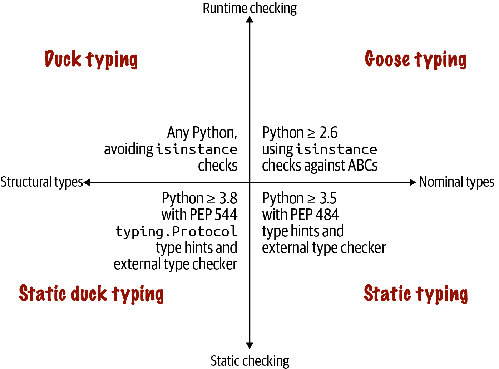
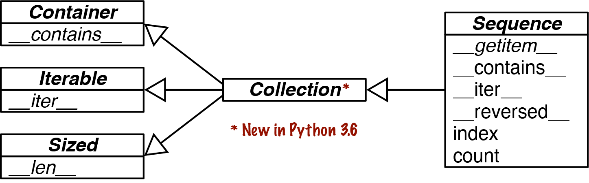
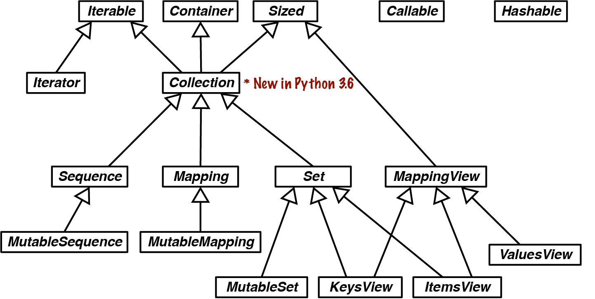
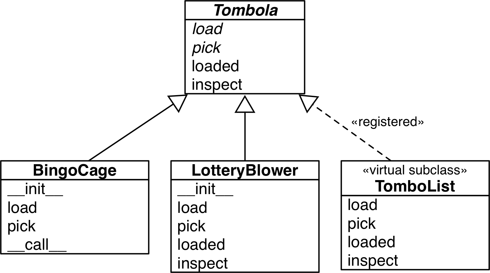
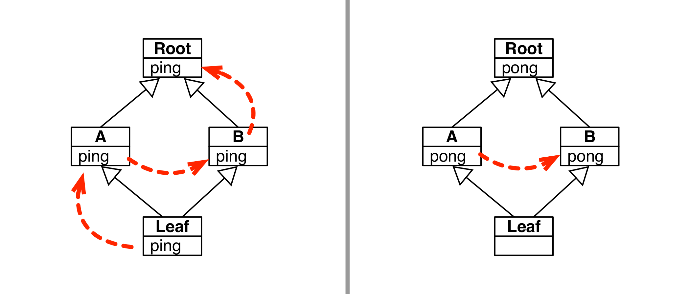
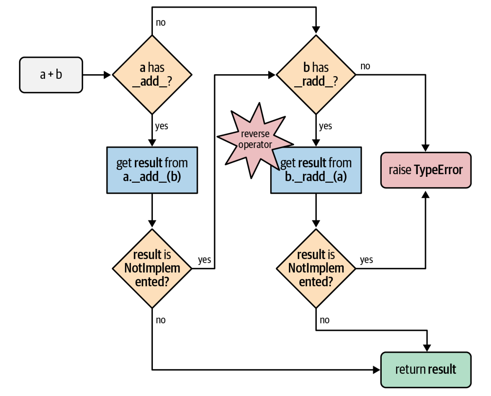

# 类和协议

## 1 符合 Python 风格的对象

前面介绍了很多内置对象的行为和用法，现在我们需要学会自己定义一个符合“Python 风格”的类（让自定义的类向 Python 内置类型那样工作），比如实现一些 Python 中常见的特殊方法等。

>   [!note]
>
>   一个 Python 风格的二维向量类
>
>   ```python
>   from array import array
>   import reprlib
>   import math
>    import functools
>    import operator
>    import itertools
>    
>    class Vector:
>        typecode = 'd'
>        __match_args__ = ('x', 'y', 'z', 't')
>    
>        def __init__(self, components):
>            # 使用数组高效存储双精度浮点数
>            self._components = array(self.typecode, components)
>    
>        def __iter__(self):
>            return iter(self._components)
>    
>        def __repr__(self):
>            # 产生类似 Vector([1.0, 2.0, ...]) 的字符串
>            components = reprlib.repr(self._components)
>            components = components[components.find('['):-1]
>            return f'Vector({components})'
>   
>       def __str__(self):
>           return str(tuple(self))
>   
>        def __bytes__(self):
>            return (bytes([ord(self.typecode)]) +
>                    bytes(self._components))
>    
>        def __eq__(self, other):
>           # 长度不同直接返回 False，长度相同则利用 zip 逐位比较
>           return (len(self) == len(other) and
>                   all(a == b for a, b in zip(self, other)))
>   
>        def __hash__(self):
>            # 对所有分量进行异或散列，实现可哈希性
>            hashes = (hash(x) for x in self)
>            return functools.reduce(operator.xor, hashes, 0)
>    
>        def __abs__(self):
>           # 计算欧几里得模长 (等同于各个分量的平方和开根号)
>           return math.hypot(*self)
>   
>       def __bool__(self):
>            return bool(abs(self))
>    
>        def __len__(self):
>            return len(self._components)
>    
>        def __getitem__(self, key):
>            """支持切片：如果是切片则返回新 Vector，否则返回单个数值"""
>            cls = type(self)
>            if isinstance(key, slice):
>               return cls(self._components[key])
>           index = operator.index(key)
>           return self._components[index]
>   
>        def __getattr__(self, name):
>            """提供对 x, y, z, t 等快捷属性的只读访问"""
>            cls = type(self)
>            try:
>                pos = cls.__match_args__.index(name)
>            except ValueError:
>               pos = -1
>           if 0 <= pos < len(self._components):
>               return self._components[pos]
>           msg = f'{cls.__name__!r} object has no attribute {name!r}'
>            raise AttributeError(msg)
>    
>        def angle(self, n):
>            """计算超球面坐标中的第 n 个角度"""
>            r = math.hypot(*self[n:])
>            a = math.atan2(r, self[n-1])
>           if (n == len(self) - 1) and (self[-1] < 0):
>               return math.pi * 2 - a
>           else:
>               return a
>    
>        def angles(self):
>            """生成所有维度的角度迭代器"""
>            return (self.angle(n) for n in range(1, len(self)))
>   
>       def __format__(self, fmt_spec=''):
>           """
>           扩展格式化：
>           - 默认：笛卡尔坐标 (x, y, ...)
>           - 'h' 结尾：超球面坐标 <r, Φ1, Φ2, ...>
>           """
>            if fmt_spec.endswith('h'): # hyperspherical coordinates
>               fmt_spec = fmt_spec[:-1]
>                coords = itertools.chain([abs(self)], self.angles())
>               outer_fmt = '<{}>'
>            else:
>                coords = self
>                outer_fmt = '({})'
>           
>            components = (format(c, fmt_spec) for c in coords)
>            return outer_fmt.format(', '.join(components))
>    
>       @classmethod
>        def frombytes(cls, octets):
>            """从字节流还原 Vector 对象"""
>            typecode = chr(octets[0])
>           memv = memoryview(octets[1:]).cast(typecode)
>            return cls(memv)
>   ```

### 1.1 对象表示形式

Python 提供以下几种获取对象字符串表示形式的标准方式（特殊方法）

-   `__repr__`：以便于**开发者**理解的方式返回对象的字符串表示形式。Python 控制台或调试器在显示对象时采用这种方式。对应函数为 `repr()`
-   `__str__`：以便于**用户**理解的方式返回对象的字符串表示形式。使用 `print()` 打印对象时采用这种方式。对应函数为 `str()``
-   ``__format__(format_spec)`：以特殊的格式化代码显示对象的字符串表示形式。对应函数或方法为 `format()` 和 `str.format()`，以及 `f` 字符串

    -   其中 `format_spec` 是格式说明符，它是 `format(my_obj, format_spec)` 的第二个参数，也是 `f` 字符串内 `{}` 内代换字段中冒号右边的部分（左边是字段名），还是 `fmt.str.format()` 中的 `fmt`

    -   格式说明符使用的表示法叫做**格式规范微语言**(format specification mini-language)，它为一些内置类型提供了专用的表示代码：

        -   整数：`'b'`、`'c'`、`'d'`、`'o'`、`'x'`、`'X'`、`'n'`，其中 `b` 和 `x` 表示二进制和十六进制

        -   浮点数：`'e'`、`'E'`、`'f'`、`'F'`、`'g'`、`'G'`、`'n'`、`'%'`，其中`f` 和 `%` 表示小数形式和百分数
            ```python
            >>> format(2 / 3, '.1%')
            '66.7%'
            ```

        -   字符串：`s`

        -   转换标志：`!s`、`!r`、`!a`

    -   格式规范微预言是可扩展的，各类可自定义如何解释 `format_spec` 参数

    -   如果一个类没有定义 `__format__` 方法，那么该方法就会从 `object` 继承，并返回 `str(my_object)`，此时若传入格式说明符，则 `object.__format__` 会抛出 `TypeError`

### 1.2 备选构造函数

在自定义类时，可能需要不止一种创建实例的构造函数（从不同的输入创建实例）。除了默认的 `__init__` 方法外，我们还可以自定义方法，作为备选的构造函数。通常会配合 `classmethod` 装饰器来定义备选构造函数，它的作用是：定义操作类而不是操作实例的方法，此时该方法接收的第一个参数是类本身（通常取名为 `cls`）而非实例（`self`）。

还有一个装饰器 `staticmethod`，它也会改变方法的调用方式，使其变得像一个普通函数一样。

### 1.3 可哈希的对象

为了让对象变得可哈希，需要：

-   必须实现 `__hash__` 方法和 `__eq__` 方法

-   让实例不可变（使属性变为只读）

    -   使用两个前导下划线 `__`，将属性标记为“私有”
    -   用 `@property` 装饰器将读值方法 (getter) 标记为特性 (property)

    ```python
    class My_Class:
        def __init__(self, x, y):
            self.__x = float(x)
            self.__y = float(y)
    
        @property
        def x(self): # 读值方法与公开属性同名
            return self.__x
    
        @property
        def y(self):
            return self.__y
    ```

#### “私有”属性和“受保护”的属性

之所以将“私有”属性打引号，是因为 Python 实际上无法像 C++ 那样使用 `private` 修饰符创建私有属性，但是可以用 `__` 前导实现类似功能。带这一前导的属性名会被存入实例属性 `__dict__` 中，而且这个属性的前面会加上一个下划线和类名（比如 `__x` 会变成 `_My_Class__x`）。这个功能成为**名称改写**(name mangling)，它的目的是避免意外访问，但不能防止故意的破坏，因为只要知道改写私有属性名称的机制，任何人都能直接读取私有属性。

```python
>>> v = Vector2d(3, 4)
>>> v.__dict__
{'_Vector2d__x': 3.0, '_Vector2d__y': 4.0}
>>> v._Vector2d__x
3.0
```

但是有不少 Python 程序员不喜欢这种双下划线前缀，因此他们约定：带单个下划线前缀的属性是“受保护”的属性。虽然 Python 解释器不会对这样的属性名做特殊处理，但不少程序员均遵守这一约定，就和遵守常量名大写的约定一样。

不过，在模块中，如果顶层名称使用一个前导下划线，那么的确会有影响：

-   对 `from mymod import *` 来说，`mymod` 中前缀为一个下划线的名称不会被导入
-   然而，可以通过具体指明该名称的方式来导入，比如 `from mymod import _privatefunc`

### 1.4 支持位置模式匹配

如果自定义类能够保存好类的属性，并且使类的实例成为可迭代对象，那么该实例应当支持关键字类模式。

```python
def keyword_pattern_demo(v: Vector2d) -> None:
    match v:
    	case Vector2d(x=0, y=0):
    		print(f'{v!r} is null')
        case Vector2d(x=0):
        	print(f'{v!r} is vertical')
        case Vector2d(y=0):
        	print(f'{v!r} is horizontal')
        case Vector2d(x=x, y=y) if x==y:
        	print(f'{v!r} is diagonal')
        case _:
        	print(f'{v!r} is awesome')
```

然而，要想让实例支持位置模式，需要为类添加一个名为 `__match_args__` 的类属性，按照在位置模式匹配中的使用顺序列出实例属性。

```python
		case Vector2d(_, 0):
 			print(f'{v!r} is horizontal')
```

```python
class Vector2d:
	__match_args__ = ('x', 'y')
	# etc...
```

-   `__match__args__` 应当列出必需的参数，可选的参数则不必列出

### 1.5 使用__slots__节省空间

默认情况下，Python 把各个实例的属性存储在 `__dict__` 字典中，但是字典消耗的内存很多。优化方法是使用 `__slots__` 存储实例属性，它会将属性名称存储在一个隐藏的引用数组中，因此消耗的内存比字典少。

-   `__slots__` 必须在定义类时声明（紧跟 `class` 语句的下一行），之后再添加或修改均无效
-   属性名称可以存储在一个元组或列表中，而存储在元组中可以明确表明 `__slots__` 无法修改
-   若设置了 `__slots__`，则无法访问该实例的 `__dict__` 属性
-   设定不在 `__slots__` 中的属性会抛出 `AttributeError`
-   子类只能继承 `__slots__` 的部分效果，因此对于设置了 `__slots__` 的类，它的子类需要再次声明 `__slots__` 属性
-   如果子类的 `__slots__ = ()`（空元组），表示子类仅接受基类的 `__slots__` 属性列出的属性名称；若子类需要额外属性，则在子类的 `__slots__` 属性中列出来
-   若将 `'__dict__'` 添加到 `__slots__` 列表中，则实例会在各个实例独有的引用数组中存储 `__slots__` 的名称，不过也支持动态创建属性，存储在常规的 `__dict__` 中
-   若定义了 `__slots__`，且想把该类的实例作为弱引用的目标，则必须把 `'__weakref__'` 添加到 `__slots__` 中

### 1.6 覆盖类属性

在 Python 中，**实例属性**是在类定义中声明的，并以 `self.` 开头的变量；而类属性是在类定义中声明的，但不以 `self.` 开头的变量。

-   Python 中，类属性可为实例属性提供默认值
-   如果为不存在的实例属性赋值，那么将会创建一个新实例属性，它会覆盖同名的类属性
-   如果想修改类属性的值，那么必须直接在类上修改，无法通过实例修改；如果想修改所有实例属性的默认值，则可通过 `My_Class.attr = val` 来修改
-   另一种方式是创建一个子类，用子类中的类属性覆盖

## 2 序列特殊方法

-   序列类型的构造函数最好接受可迭代对象为参数
-   如果序列类型的实例包含的项超过 6 个，那么 `repr()` 生成的字符串就会使用 `...` 省略其余项的表示，因为 `repr` 是用于调试的，一般而言在控制台或日志上输出成千上万行的内容是不太合理的
    -   同样因为调试目的，`repr()` 绝对不能抛出异常，如果实现方法有问题，应尽量输出有用的内容，让用户能够识别
    -   可以用 `reprlib` 模块中的 `repr` 函数自动对返回的字符串进行截断，并添加"..."来表示被截断的部分
-   根据前面介绍的鸭子类型，只要让类的**行为**像序列，那么它的实例就是一个序列。要做到这一点，Python 的序列协议（具体概念见下面）只需要 `__len__` 和 `__getitem__` 两个方法即可。

### 2.1 协议和鸭子类型

-   在面向对象编程中，**协议**(protocol)是非正是的接口，只在文档中定义，不在代码中定义
-   协议是非正式的，没有强制力，因此如果知道类的具体使用场景，通常只需要实现协议的一部分
-   Python 3.8 开始支持协议类（即 `typing.Protocol`），这里的“协议”与上面给出的概念不同，具体可分为：
    -   静态协议：协议类规定的协议，这类协议的实现必须提供静态类中定义的所有方法
    -   动态协议：传统意义上的协议
-   在 Python 文档中，如果看到“文件类对象”这样的表述，通常说的就是协议，它的意思是：“行为基本与文件一致，实现了部分文件接口，满足上下文相关需求的东西。”

### 2.2 可切片的序列

Python 中通过调用 `seq.__getitem__(slice(start, end, step))` 获得切片，我们期望的切片行为是：切片得到的都是各自类型的实例。

-   使用 `dir(slice)` 可以看到 `slice` 存在一个方法 `indices`

    ```
    S.indices(len) -> (start, stop, stride)
    
    Assuming a sequence of length len, calculate the start and stop indices, and the stride length of the extended slice described by S. Out of bounds indices are clipped in a manner consistent with the handling of normal slices.
    ```

    通过这个方法可以方便的处理索引越界和负索引。

-   下面的 `__getitem__` 可以给出我们预期的行为

    ```python
    def __getitem__(self, key):
        if isinstance(key, slice):               # 如果 key 是 slice 对象
            cls = type(self)                     # 获取构造实例的类
            return cls(self._components[key])    # 调用类的构造函数，创建新的实例
        index = operator.index(key)              # key 是单个索引
        return self._components[index]
    ```

    注：这个 `__getitem__` 不能处理多维索引，使用元组索引会抛出错误
    
    -   `operator.index()` 背后调用特殊方法 `__index__`，它只有一个用处：判断 `key` 是否为整数

### 2.3 动态存取属性

在单纯的序列中，只能通过 `v[i]` 获取项。但如果能够使用 `x, y, z` 访问 `v[0], v[1], v[3]` 等几个元素，则会更为方便

-   可以用上一节介绍的 `@property` 装饰器为每个属性定义一个读值方法，但这样比较麻烦
-   更简便的方式是使用特殊方法 `__getattr__`，它的机制如下：
    1.   对于 `my_obj.x` 表达式，Python 会检查 `my_obj` **实例**有没有名为 `x` 的属性
    1.   如果没有，就到 `my_obj.__class__` 里查找
    1.   若还没有，就沿着继承图继续往上找
    1.   若依旧找不到，则调用 `my_obj` 所属类中定义的 `__getattr__` 方法，传入 `self` 和属性名称的字符串形式（`'x'`）

```python
	__match_args__ = ('x', 'y', 'z', 't') 

    def __getattr__(self, name):
        cls = type(self) 
        try:
        	pos = cls.__match_args__.index(name) 
        except ValueError: 
        	pos = -1
        if 0 <= pos < len(self._components): 
        	return self._components[pos]
        msg = f'{cls.__name__!r} object has no attribute {name!r}' 
        raise AttributeError(msg)
```

-   结合 `__match_args__`，让 `__getattr__` 实现的动态属性支持位置模式匹配
-   在实现 `__getattr__` 时，可以设置 `AttributeError` 错误信息，以应对不合预期的行为

上面的方法任然会出现一些问题，根据前面的属性查找机制，如果运行过程中为实例属性赋值，那么实例属性就会覆盖 `__getattr__` 方法，使得该方法无法再被调用。解决方法是实现 `__setattr__` 方法（只要对实例属性赋值，就会调用这个特殊方法），以限制实例属性的赋值

```python
def __setattr__(self, name, value):
    cls = type(self)
    if len(name) == 1: 
    	if name in cls.__match_args__: 
    	error = 'readonly attribute {attr_name!r}'
    elif name.islower(): 
    	error = "can't set attributes 'a' to 'z' in {cls_name!r}"
    else:
    	error = '' 
    if error: 
    	msg = error.format(cls_name=cls.__name__, attr_name=name)
    raise AttributeError(msg)
    super().__setattr__(name, value)
```

-   对于被限制的属性，需要在 `__setattr__` 中编写合适的处理方式；对于其他属性，默认采用超类的 `__setattr__` 方法，即调用 `super().__setattr__()`

一个 `complex` 类型的例子

```python
>>> a = 1 + 2j
>>> type(a)
<class 'complex'>
>>> a.real
1.0
>>> a.real = 2
Traceback (most recent call last):
  File "<python-input-3>", line 1, in <module>
    a.real = 2
    ^^^^^^
AttributeError: readonly attribute
```

*一般情况下，实现了 `__getattr__` 方法，则也应定义 `__setattr__`，以防对象的行为不一致*

### 2.4 哈希和快速等值测试

对于包含大量项的序列，要实现其所属类的 `__hash__` 方法，如果直接对整个序列使用 `hash()` 函数，由于需要构建整个序列，因此消耗的资源较多，不太合适。更合理的做法是：使用 `^`（异或）运算符计算所有项（或对应的哈希值），将计算结果作为哈希值。在具体实现中，`functools.reduce` 归约函数是最能胜任这一任务的方式：

```python
# 创建生成器表达式，惰性计算各个分量的哈希值
hashes = (hash(x) for x in self._components) # 也可使用map函数
# 使用 xor 函数计算聚合的哈希值，第三个参数是初始值
functools.recude(operator.xor, hashes, 0)
```

-   `reduce` 函数将序列聚合为一个数值

----

对于等值比较，可以通过形如 `tuple(self) == tuple(other)` 的方式，这样方式实现简单，但需要复制两个完整的列表，如果序列中包含很多项，效率就会很低。为提高效率

-   比较两个序列的长度
-   依次比较两个序列相同位置上的项

```python
def __eq__(self, other):
    return len(self) == len(other) and all(a == b for a, b in zip(self, other))
    # 归约函数 all() 只有当所有比较结果为真时返回 True，有一个错的就返回 False
```

zip 函数名称来自 zipper，将任意个可迭代对象对应项咬合在一起：

-   `zip(*iterables, strict=False)`，并行迭代若干个可迭代对象。
-   `strict=False` 情况，当其中一个可迭代对象耗尽时，`zip` 不发出警告就停止执行。
-   `strict=True` 时，如果可迭代对象长度不同，则抛出 ValueError（快速失败）
-   `itertools.zip_longest` 使用可选的 `fillvalue`（默认值为 `None`）来填充缺失值，因此可以继续生成元组，直到最后一个可迭代对象耗尽

## 3 接口、协议和抽象基

>Program to an interface, not an implementation.
>		—Gamma, Helm, Johnson, Vlissides, First Principle of Object-Oriented Design

### 3.1 类型图



上半部分在 Python 解释器运行时会进行检查，下半部分则需要借助外部静态类型检查工具。左半部分基于对象的结构（对象提供的方法），右半部分则要求具有的类型名称（或超类名称）。

### 3.2 两种协议

> [!note]
>
> 计算机科学中，“协议”根据上下文有不同的含义。例如 HTTP 这种网络协议定义了客户端可以向服务器发送的命令。

Python 中的“协议”一般指接口，即一个 Python 对象想要表现的像某个类型（例如序列、映射）需要实现的方法。Python 并不要求完全实现协议，有时根据需要可实现部分协议。

Python 一般有两种协议：

- **动态协议**：隐含的，按约定定义的，在文档中描述的非正式协议。Python 中大多数重要的动态协议由解释器支持
  - 可以只实现动态协议的一部分
  - 不能由静态类型检查工具确认
- **静态协议**：由 PEP 544 定义的协议，自 Python 3.8 开始支持，要使用 `typing.Protocol` 子类显式定义
  - 必须实现协议类的所有接口，即使程序用不到
  - 可以使用静态类型检查工具确认

### 3.3 鸭子类型

#### 3.3.1 序列协议

下面是一个通过抽象基类确立的 Sequence 接口的 UML 图，但 Python 的内置序列类型并不依赖这个抽象基类，仅用来说明实现一个完整的序列协议需要实现哪些方法。



Python 的数据模型的哲学是尽量支持基本的动态协议。这有两层含义

- 协议的实现不需要继承自抽象基类，只需要实现特定的特殊方法
- 每一个协议只需要最基本的几个特殊方法可以

例如：

```python
>>> class Vowels:
...     def __getitem__(self, i):
...         return "ABCDEF"[i]
...
>>> v = Vowels()
>>> v[1]
'B'
>>> for i in v:
...     print(i)
...
A
B
C
D
E
F
```

在 Vowels 类中，我们仅实现了 `__getitem__` 方法，而没有实现 `__iter__` 和 `__contains__` 方法，但 Python 解释器仍能够正确处理迭代和 `in` 运算符。

#### 3.3.2 猴子补丁

对于前面实现的有序纸牌类型

```python
import collections

Card = collections.namedtuple('Card', ['rank', 'suit'])

class FrenchDeck:
	ranks = [str(n) for n in range(2, 11)] + list('JQKA')
 	suits = 'spades diamonds clubs hearts'.split()
 
	def __init__(self):
 		self._cards = [Card(rank, suit) for suit in self.suits
 										for rank in self.ranks]
 	
    def __len__(self):
 		return len(self._cards)
 
	def __getitem__(self, position):
 		return self._cards[position]
```

这个类型实现了 `__len__` 和 `__getitem__` 方法，但没有洗牌 `shuffle` 方法。但由于 `FrenchDeck` 的行为向序列，而 random.shuffle 提供了“就地打乱序列x”的方法，或许可以直接使用这个方法

```python
>>> deck = FrenchDeck()
>>> from random import shuffle
>>> l = list(range(10))
>>> shuffle(l)
>>> l
[0, 2, 8, 5, 7, 1, 4, 9, 6, 3]
>>> shuffle(deck)
Traceback (most recent call last):
  File "<python-input-12>", line 1, in <module>
    shuffle(deck)
    ~~~~~~~^^^^^^
  File "D:\Application\anaconda3\Lib\random.py", line 361, in shuffle
    x[i], x[j] = x[j], x[i]
    ~^^^
TypeError: 'FrenchDeck' object does not support item assignment
```

错误信息给出 'FrenchDeck' 不支持给项赋值（由于 shuffle 会就地修改序列）。可变序列还需要实现 `__setitem__` 方法

```python
>>> def set_card(deck, position, card):
...     deck._cards[position] = card
...
>>> FrenchDeck.__setitem__ = set_card
>>>
>>> def set_card(deck, position, card):
...     deck._cards[position] = card
...
>>> FrenchDeck.__setitem__ = set_card
>>> deck[:5]
[Card(rank='2', suit='spades'), Card(rank='3', suit='spades'), Card(rank='4', suit='spades'), Card(rank='5', suit='spades'), Card(rank='6', suit='spades')]
>>> shuffle(deck)
>>> deck[:5]
[Card(rank='10', suit='clubs'), Card(rank='Q', suit='spades'), Card(rank='A', suit='spades'), Card(rank='2', suit='diamonds'), Card(rank='J', suit='clubs')]
```

上面的做法就是**猴子补丁**：在运行时修改类或模块，而不改动源码。

> [!caution]
>
> 虽然猴子补丁很强大，但打补丁的代码与被打补丁的程序紧密耦合，往往要处理文档没有明确说明的私有属性

#### 3.3.3 防御性编程和“快速失败”

对于 Python 等动态类型语言，“**快速失败**”（尽早抛出运行时错误）可以提升程序的安全性，让程序更易于维护

例子：

- 若函数接受一系列项，在内部按列表处理，则无需使用类型检查强制要求传入一个列表，而是立即利用参数构建一个列表（`list()`），这样的话若参数不是可迭代对象，则抛出意义明确的 `TypeError` 异常（或者用 `try/except` 语句自定义错误消息）；而类型提示不在运行时强制检查，且无法对 `Any` 类型（与所有类型相容）进行有效检查，因此很难确定程序崩溃的根源
- 若数据太多，或需要就地修改数据，那么不应该用 `list()` 复制数据，而应使用 `isinstance(x, abc.MutableSequence)` 做运行时检查

**EAFP 原则**——取得原谅比获取许可容易 (Easier to ask for forgiveness than permission)：与其先检查条件，不如直接进行操作，出现异常后再处理。

使用鸭子类型做防御性编程，就无需使用 `isinstance()` 或 `hasattr()` 测试

### 3.4 抽象基类和大鹅类型

**抽象基类**：提供一种定义接口的方式，是鸭子类型的补充。大鹅类型即利用抽象基类实现运行时检查方式

> [!note]
>
> | 维度     | 鸭子类型                 | 大鹅类型                       |
> | -------- | ------------------------ | ------------------------------ |
> | 关注点   | “有没有这个行为”         | “你是不是这个概念的成员”       |
> | 判断方式 | 直接调用，失败再处理异常 | 先做 `isinstance`/`issubclass` |
> | 适用场景 | 灵活、动态、临时用       | 稳定接口、框架/库边界          |
> | 错误方式 | 运行时报错               | 入口就拒绝                     |

#### 3.4.1 定义一个抽象基类

> [!warning]
>
> ABCs, like descriptors and metaclasses, are tools for building frameworks. Therefore,only a small minority of Python developers can create ABCs without imposing unreasonable limitations and needless work on fellow programmers.

例子：抽象基类 Tombola 有四个方法

- 两个抽象方法：
  - `.load()` 把元素放入容器
  - `.pick()` 从容器中随机拿出一个元素
- 两个具体方法：
  - `.loaded()` 容器是否为空
  - `.inspect()` 返回容器元素构成的元组

```python
import abc

class Tombola(abc.ABC): 
    
 	@abc.abstractmethod
 	def load(self, iterable): 
 		"""Add items from an iterable."""
 
	@abc.abstractmethod
 	def pick(self): 
 		"""Remove item at random, returning it.
 		This method should raise `LookupError` when the instance is empty.
 		"""

    def loaded(self): 
		"""Return `True` if there's at least 1 item, `False` otherwise."""
		return bool(self.inspect()) 
 
	def inspect(self):
 		"""Return a sorted tuple with the items currently inside."""
 		items = []
 		while True: 
 			try:
 				items.append(self.pick())
 			except LookupError:
 				break
 		self.load(items) 
 		return tuple(items)
```

实现一个抽象基类的方法：

1. 继承自 `abc.ABC`，声明这是一个抽象基类
2. 抽象方法用 `@abstractmethod` 装饰器标记，通常只有文档字符串
3. 具体方法依靠只能抽象方法实现。在具体的子类中，可以根据实际的数据储存方式，重写继承的具体方法

#### 3.4.2 标准库中的抽象子类

Python 标准库中大多数的抽象基类来自 `collections.abc` 模块，少数来自 `io` 包和 `numbers` 包等，但 `collections.abc` 的抽象基类最常用，下面展示该模块中 17 个抽象基类的 UML 类图（涉及到多重继承）：



- `Iterable`、`Container`、`Sized`：每个容器都应该继承这 3 个抽象基类，或者实现兼容的协议
  - `Iterable`：通过 `__iter__` 方法支持迭代
  - `Container`：通过 `__contains__` 方法支持 `in` 运算符
  - `Sized`：通过 `__len__` 方法支持 `len()` 函数
- `Collection`：自身没有方法，目的是方便子类化 `Iterable`、`Container` 和 `Sized`
- `Sequence`、`Mapping`、`Set`：主要的不可变容器类型，但各自都有可变的子类 `MutableSequence`、`MutableMapping`、`MutableSet`
- `MappingView`：映射方法 `.items()`、`.keys()`、`.values()` 返回的对象分别实现了 `ItemsView`、`KeysView`、`ValuesView` 定义的接口，前两个还实现了 `Set` 接口，支持集合运算
- `Iterator`：`Iterable` 的子类
- `Callable`、`Hashable`：不是容器，在类型检查中分别用于指定可调用和可哈希的对象

> [!note]
>
> - 在 `collections.abc` 中，每个抽象基类的具体方法都是作为类的公开接口实现的，因此无须知道实例的内部结构
>
> - 标准库中有两个名为 `abc` 的模块：
>
>   - `collections.abc`：该模块在 `collections` 包之外实现的，因此要与 `collections` 分开导入
>   - `abc` 模块：定义了 `abc.ABC` 类，每个抽象基类都依赖该模块，但是不用导入它，除非自定义新的抽象基类
>
> - 检查对象是否能够调用，内置函数 `callable(obj)` 使用更加方便
>
> - 使用 `isinstance` 检查 Hashable 和 Iterable 可能不准确。
>
>   - `isinstance` 只检查是否实现了 `__hash__`，对包含可变元素的元组，检测会出错
>   - 即使 `isinstance(obj, Iterable)` 返回 False，Python 仍可使用 `__getitem__` 实现迭代
>
>   应该使用 `hash(obj)` 和 `iter(obj)` 来检测

#### 3.4.3 子类化一个抽象基类

对前面 Tombola 的抽象基类，它和 3 个子类的 UML 图



其中 BingoCage 和 LotteryBlower 通过直接继承的方法子类化了 Tombola 抽象基类

- 可以只重写 `load` 和 `pick` 这两个方法，而从抽象基类中直接继承 `loaded` 和 `inspect` 两个具体方法。虽然这两个方法可能不如根据 BingoCage 数据储存重写的那么快，但能够提供正确的结构
- 也可以重写 `loaded` 和 `inspect` 这两个方法，比如让 `loaded` 不需要调用 `inspect`

#### 3.4.4 虚拟子类

处理上面的直接继承的方法，Python 的**虚拟子类**可以让**没有继承关系的类，也能被当作某个抽象基类的子类使用**。将一个类声明为一个抽象基类的虚拟子类有两种方法

1. 使用 `register` 方法。例如
   ```python
   from collections.abc import Iterable
   
   class MyIter:
       def __iter__(self):
           yield 1
   
   Iterable.register(MyIter)
   
   isinstance(MyIter(), Iterable)    # True
   issubclass(MyIter, Iterable)      # True
   ```

   上面的代码的实际含义就是，声明 MyIter 一定满足 Iterable 接口协议。之后 Python 就不会再做检查（即使没有实现 `__iter__`）

2. 另一种方法依靠 `__subclasshook__` 自动识别协议
   ```python
   >>> class MySize:
   ...     def __len__(self): return 12
   ...
   >>> from collections.abc import Sized
   >>> isinstance(MySize(), Sized)
   True
   >>> issubclass(MySize, Sized)
   True
   ```

   查看 `abc.Sized` 的源码可以发现
   ```python
   class Sized(metaclass=ABCMeta):
   
       __slots__ = ()
   
       @abstractmethod
       def __len__(self):
           return 0
   
       @classmethod
       def __subclasshook__(cls, C):
           if cls is Sized:
               return _check_methods(C, "__len__")
           return NotImplemented
   ```

   有 `__subclasshook__(cls, C)` 这样一个类方法，检查 `C` 是否实现了 `__len__` 方法，如果实现，就算是 Sized 的虚拟子类

### 3.5 静态协议

静态协议通过 `typing.Protocol` 的子类定义

#### 3.5.1 更灵活的静态协议

例如，对于 `double` 函数

```python
from typing import TypeVar, Protocol

T = TypeVar('T')
    
class Repeatable(Protocol):
 	def __mul__(self: T, repeat_count: int) -> T: ... 

RT = TypeVar('RT', bound=Repeatable) 

def double(x: RT) -> RT: 
 	return x * 2
```

现在，类型检查工具可以确定 `double` 的参数 `x` 是一个可以乘以整数的对象，并且返回值与 `x` 相同。参数的名义类型并不重要，只要实现了 `__mul__` 方法，这就是静态鸭子类型

#### 3.5.2 运行时可检查的静态协议

定义 `typing.Protocol` 的子类时，可借由 `@runtime_checkable` 装饰器让协议支持在运行时使用 `isinstance/issubclass` 检查

除了 `Protocol` 外，`typing` 模块中还提供了一些可在运行时检查的协议，包括 `SupportsComplex`、`SupportsFloat` 等旨在检查数值类型可否转换类型的协议

> [!note]
>
> 虽然协议可以通过 `@runtime_checkable` 在运行时检查，但更方便的仍是直接使用鸭子类型。例如对 complex 的判断
>
> ```python
> #静态协议
> isinstance(obj, numbers.Complex)
> 
> #鸭子类型
> c = complex(obj)
> ```

#### 3.5.3 设计静态协议

单方法协议（窄协议，narrow protocol）实现的静态鸭子类型更有用且更灵活。客户代码协议：在使用协议的函数的附近定义，根据“使用方代码（客户代码）实际需要”定义的协议。

上述两种协议都能有效避免紧密耦合，正符合**接口隔离原则**(interface segregation principle)：不应强迫客户依赖用不到的接口。

建议静态协议采用以下命名约定：

- 使用朴素的名称命名协定，清楚表明概念（比如 `Iterator` 和 `Container`）
- 使用 `SupportX` 形式命名提供一到两个方法的协议（比如 `SupportsInt`、 `SupportsRead` 和 `SupportsReadSeek`）
  - 更方便的命名：对于只有一个方法的协议，如果方法名称是动词，则在末尾加上 -er 或 -or
- 使用 `HasX` 形式命名有可读属性和可写属性，或者有读值方法和设值方法的协议（比如 `HasItems` 和 `HasFileno`）

#### 3.5.4 扩展静态协议

如果实际使用中发现协议需要多个方法，那么不要直接为协议添加方法，最好衍生原协议，创建一个新协议。扩展协议时需注意以下问题：

- 若希望衍生的协议可在运行时检查，则必须再次应用装饰器 `@runtime_checkable`，因为该装饰器的行为不被继承
- 每个协议都必须明确把 `typing.Protocol` 列出来，作为基类；另外再列出要扩展的协议
- 只需在衍生的协议中声明新增的方法即可，其他方法都会从原协议继承过来

例子：

```python
# 扩展 RandomPicker 协议
from typing import Protocol, runtime_checkable
from randompick import RandomPicker

@runtime_checkable
class LoadableRandomPicker(RandomPicker, Protocol):
    def load(self, Iterable) -> None: ...
```

## 4 继承

> [!caution]
>
> - 不建议过度使用继承（不仅仅是多重继承），因为超类与子类紧密耦合，这意味着对程序某一部分的更改可能会对其他部分产生意想不到的深远影响，从而使系统变得脆弱且难以理解。
> - 实际上自定义的函数，或者标准库中现有的类足以帮助我们完成很多任务，无需自己创建类
> - 如果发现自己在构建多层类层次结构，那么可能发生以下事件中的一个或多个：
>   - 重新发明轮子 -> 使用现有的框架或库
>   - 使用的框架设计不良 -> 尝试寻找替代品
>   - 过度设计 -> 遵守 **KISS 原则**（Keep It Simple, Stupid）
>   - 对现有框架不满，决定新造一个框架

### 4.1 `super()` 函数

子类中覆盖超类的方法（常见的有 `__init__` 方法）通常利用 `super()` 函数来调用超类中相应的方法，然后在此基础上进行扩充。

```python
	def __init__(self, a, b):
        super().__init__(a, b)
        # other init codes
```

> [!warning]
>
> 虽然可以直接在子类中调用超类的方法而不使用 `super()` 函数，但不推荐这种做法，原因有：
>
> - 这是对基类的硬编码。如果之后修改了超类的名称，说不定忘记修改子类中出现的原超类的名称，这就埋下了 bug
> - `super` 实现的逻辑能够处理多重继承涉及的类层次结构，且使用更为方便

现在的 `super()` 函数还保持了 Python 2 的参数接口

```python
class LastUpdatedOrderedDict(OrderedDict):
 	"""This code works in Python 2 and Python 3"""
    
 	def __setitem__(self, key, value):
 		super(LastUpdatedOrderedDict, self).__setitem__(key, value)
 		self.move_to_end(key)
```

两个参数的作用：

- 第一个参数 (`type`)：指定从 MRO 列表中的哪一个类**之后**开始搜索方法，默认为调用 `super()` 函数的类
- 第二个参数 (`obj_or_type`)：决定了使用哪个对象的 MRO 列表，并绑定到该对象上，默认为 `self`

### 4.2 子类化内置类型

子类化内置类型比较麻烦，容易出现隐藏的 Bug。这是因为在 CPython 实现中，内置类型基本不会调用子类覆盖的方法

```python
>>> class DoppelDict(dict):
... 	def __setitem__(self, key, value):
... 		super().__setitem__(key, [value] * 2) 
...
>>> dd = DoppelDict(one=1) 
>>> dd
{'one': 1}
>>> dd['two'] = 2 
>>> dd
{'one': 1, 'two': [2, 2]}
>>> dd.update(three=3) 
>>> dd
{'three': 3, 'one': 1, 'two': [2, 2]}
```

继承自 `dict` 的 `__init__` 和 `update` 方法忽略了我们覆盖的 `__setitem__` 方法。这种行为违背了面向对象编程的一个基本原则：应该从实例（self）所属的类开始搜索方法。这种行为称为晚期绑定(late binding)。

> [!note]
>
> 内置类型的不当行为实际是有意为止。
>
> 因为 dict、list、str 这些内置类型是 Python 的底层基础，对性能要求极高。CPython 采取了更务实的做法，即让内置类型不调用被子类覆盖的方法，而提供更高的性能。

更常用的方式是使用**对象组合**，即在实例中储存一个内置类型的实例。如果确实要进行子类化，则应该从 collections 模块中的 UserDict、UserList 这些类型基础。这些类经过了特殊设计，易于扩展。

### 4.3 多重继承和方法解析顺序

问题：当一个类有多个超类，且这些超类有同名属性，`super().attr` 应该调用哪个属性？

```python
class Root: 
 	def ping(self):
 		print(f'{self}.ping() in Root')
        
 	def pong(self):
 		print(f'{self}.pong() in Root')
        
 	def __repr__(self):
        cls_name = type(self).__name__
 		return f'<instance of {cls_name}>'
    
class A(Root): 
 	def ping(self):
 		print(f'{self}.ping() in A')
 		super().ping()
        
 	def pong(self):
 		print(f'{self}.pong() in A')
 		super().pong()
        
class B(Root): 
 	def ping(self):
 		print(f'{self}.ping() in B')
 		super().ping()
        
 	def pong(self):
 		print(f'{self}.pong() in B')
    
class Leaf(A, B): 
 	def ping(self):
 		print(f'{self}.ping() in Leaf')
 		super().ping()
```

调用结果：

```python
>>> leaf1 = Leaf()
>>> leaf1.ping()
<instance of Leaf>.ping() in Leaf
<instance of Leaf>.ping() in A
<instance of Leaf>.ping() in B
<instance of Leaf>.ping() in Root
>>> leaf1.pong()
<instance of Leaf>.pong() in A
<instance of Leaf>.pong() in B
```

可以看到两次调用的唤醒顺序为

- `leaf1.ping()` 依次唤醒了 Leaf -> A -> B -> Root 的 ping 方法
- `leaf1.pong()` 唤醒了 A 的 pong 方法，右通过 `super().pong` 唤醒 B 的 pong 方法



上图中的唤醒过程由两个因素决定：

- Leaf 的**方法解析顺序**
- 各方法中 `super` 的调用

方法解析顺序储存在类的 `__mro__` 属性中

```python
>>> Leaf.__mro__
(<class '__main__.Leaf'>, <class '__main__.A'>, <class '__main__.B'>, <class '__main__.Root'>, <class 'object'>)
```

解析顺序与**继承图**和**子类继承超类的顺序**。调用了 `super()` 的方法称为**协作方法(cooperative method)**，利用协作方法可以实现**协作多重继承**。

### 4.4 混入类

由于上面提到的方法解析顺序，`super()` 方法可能出现一些奇特的情况，例如

```python
class U():
	def ping(self):
		print(f'{self}.ping() in U')
		super().ping()

class LeafUA(U, A):
    def ping(self):
    	print(f'{self}.ping() in LeafUA')
		super().ping()
        
>>> leaf2 = LeafUA()
>>> leaf2.ping()
<instance of LeafUA>.ping() in LeafUA
<instance of LeafUA>.ping() in U
<instance of LeafUA>.ping() in A
<instance of LeafUA>.ping() in Root
```

为了解释这个结果，我们需要查看 LeafUA 的 `__mro__` 属性

```python
>>> LeafUA.__mro__
(<class '__main__.LeafUA'>, <class '__main__.U'>, <class '__main__.A'>, <class '__main__.Root'>, <class 'object'>)
```

在序列中 U 之后不是 object 而是 A。在实际的程序中，U 这样的类称为混入类

- 混入类不为具体对象提供全部功能，而是增加和定制子类或同级类的行为
- 混入类会连同其他类一起被子类化，而不能作为具体类的唯一基类

> [!note]
>
> 在 Python 和 C++ 中，混入类只是一种约定，语言层次没有显示支持。一般约定混入类后面加上 Mixin 后缀。

### 4.5 应对多重继承

使用继承容易设计出令人费解和脆弱的结构，下面是一些应对多重继承的建议

- **优先使用对象组合，而不是继承。**组合和委托可以取代混入，但不能取代接口继承来定义类型的层次结构
- 明确使用继承的原因：
  - 继承接口，创建子类型
  - 继承实现，通过继承避免代码重复
- **使用抽象基类显示表示接口**
- **通过混入明确重用代码**
- **为用户提供聚合类**
  聚合类：如果一个类的结构主要继承自混入类，自身没有添加结构或行为。把混入类和基类结合在一起，作为整体使用，对客户调用非常优化
- **仅子类化为子类化设计的类**
- **避免子类化具体类**

## 5 类型提示进阶

### 5.1 函数签名重载

在 Python 中，同一个函数可以接受不同的参数组合，这些不同的参数组合使用 `@typing.overload` 装饰器注解。

- 重载的签名放在函数具体的签名和实现前面，且重载的签名后面无需具体实现，可用 `...` 替代
- 函数具体实现的签名没有类型提示
- 使用 `@overload` 的关键优势在于：可以根据参数的类型尽量准确声明返回值的类型

例子：

```python
import functools
import operator
from collections.abc import Iterable
from typing import overload, Union, TypeVar

T = TypeVar('T')
S = TypeVar('S')

@overload
def sum(it: Iterable[T]) -> Union[T, int]: ...
@overload
def sum(it: Iterable[T], /, start: S) -> Union[T, S]: ...
def sum(it, /, start=0):
    return functools.reduce(operator.add, it, start)
```

### 5.2 TypedDict

`typing.TypedDict` 用于键固定的字典类型提示，具体作用为：

- 使用与类相似的句法注解字典，为各个字段的值提供类型提示
- 通过一个构造函数来告诉类型检查工具，字典应具有指定的键和指定类型的值（传入关键字参数，也可以传入一个包含字典字面量的字典参数）

通过这种构造函数创建的是普通字典，因此：

- 伪类声明中的字段不创建实例属性（因此不能使用 `object.field` 表示法读取数据）
- 不能通过初始化方法为字段指定默认值
- 不允许定义方法

没有类型检查工具，`TypedDict` 只具备注释功能，可为阅读代码的人提供些许帮助。

> [!note]
>
> ```python
> #books.py
> from typing import TypedDict
> 
> class BookDict(TypedDict):
>     isbn: str
>     title: str
>     authors: list[str]
>     pagecount: int
> ```
>
> 使用这个字典：
>
> ```python
> from books import BookDict
> from typing import TYPE_CHECKING
> 
> def demo() -> None:
>     book = BookDict(
>         isbn='0134757599',
>         title='Refactoring, 2e',
>         authors=['Martin Fowler', 'Kent Beck'],
>         pagecount=478
>     )
>     authors = book['authors']
>     if TYPE_CHECKING:
>         reveal_type(authors)
> 
>     # 无效操作
>     authors = 'Bob'
>     book['weight'] = 4.2
>     del book['title']
> 
> 
> if __name__ == '__main__':
>     demo()
> ```
>
> 使用 Mypy 做类型检查的结果：
>
> ```python
> $ mypy demo_books.py
> demo_books.py:13: note: Revealed type is "builtins.list[builtins.str]"
> demo_books.py:14: error: Incompatible types in assignment (expression has type "str", variable has type "list[str]")  [assignment]
> demo_books.py:15: error: TypedDict "BookDict" has no key "weight"  [typeddict-unknown-key]
> demo_books.py:16: error: Key "title" of TypedDict "BookDict" cannot be deleted  [misc]
> Found 3 errors in 1 file (checked 1 source file)
> ```

### 5.3 类型校正

`typing.cast(typ, val)` 是一个特殊函数，用于**类型校正**，具体来说是用于处理不受控制的代码中存在的类型检查问题或不正确的类型提示。

- 在运行时，`typing.cast` 什么也不做

- PEP 484 要求类型检查工具务必“听信” `cast` 中所述的类型

- 使用样例：

  ```python
  from typing import cast
  
  def find_first_str(a: list[object]) -> str:
      index = next(i for i, x in enumerate(a) if isinstance(x, str))
      return cast(str, a[index])
  ```

- 不要过于依赖使用 `cast` 静默 Mypy 报错。经常使用 `cast` 也是一种代码异味，可能意味着类型提示有误，或者使用了低质量的依赖

- 但彻底不使用 `cast` 也是不明智的，主要是因为其他变通方法更糟：

  - `# type: ignore` 注释提供的信息量更少
  - 使用 `Any` 有连锁反应，因为 `Any` 与所有类型相容，一旦滥用，类型推导可能导致级联效应，破坏类型检查工具对代码中其他部分的检错能力

### 5.4 在运行时读取类型提示

Python 会在导入时读取函数、类和模块中的类型提示，把类型提示以字典形式存储在 `__annotation__` 属性中

- `return` 键对应返回值类型提示
- 注解在导入时由解释器求解

```python
#clip_annot.py

def clip(text: str, max_len: int = 80) -> str:
    ...

>>> from clip_annot import clip
>>> clip.__annotations__
{'text': <class 'str'>, 'max_len': <class 'int'>, 'return': <class 'str'>}
```

类型提示使用量的增加会引起以下问题：

- 若类型提示很多，那么导入模块使用的 CPU 和内存会更多 <- 类型提示存储在 `__annotation__` 属性（字典）中

- 引用尚未定义的类型需要使用字符串，而不是真正的类型

  - 由于「向前引用」问题（类型提示需要引用同一模块后面定义的类），有时必须以字符串形式存储注解
  - 并且当方法返回同一类的新对象时，由于类对象直到 Python 完全求解类主体之后才被定义，因此类型提示必须返回使用类名的字符串形式，比如：

  ```python
  class Rectangle:
      # ...
      def stretch(self, factor: float) -> 'Rectangle':
          return Rectangle(width=self.width * factor)
  ```

不要直接读取 `__annotations__` 属性，应使用 `inspect.get_annotations`（Python 3.10 之后）或 `typing.get_type_hints`（Python 3.5 之后）

- 它们可以将以字符串字面量表示的向前引用会放在 `globals` 命名空间和 `locals` 命名空间中求解
- 缺陷：在运行时消耗较大，并且无法解析所有类型

若在代码开头使用以下 `import` 语句：

```python
from __future__ import annotations
```

那么 `__annotations__` 属性存储的所有类型提示都是普通的字符串了

```python
#clip_annot.py

from __future__ import annotations
def clip(text: str, max_len: int = 80) -> str:
    ...
>>> from clip_annot import clip
>>> clip.__annotations__
{'text': 'str', 'max_len': 'int', 'return': 'str'}
```

### 5.5 泛化类

与泛化相关的术语：

- **泛型**：具有一个或多个类型变量的类型（比如 `LottoBlower[T]`、`abc.Mapping[KT, VT]`）
- **形式类型参数**：泛型声明中出现的类型变量（比如 `abc.Mapping[KT, VT]` 中的 `KT`、`VT`）
- **参数化类型**：使用具体类型参数声明的类型（比如 `LottoBlower[int]`、`abc.Mapping[str, float]`）
- **具体类型参数**：声明参数化类型时为参数提供的具体类型（比如 `LottoBlower[int]` 中的 `int`）

泛化类声明通常使用多重继承，因为需要子类化 `Generic`，以声明形式类型参数。

```python
import random

from collections.abc import Iterable
from typing import TypeVar, Generic

from tombola import Tombola

T = TypeVar('T')

class LottoBlower(Tombola, Generic[T]):

    def __init__(self, items: Iterable[T]) -> None:
        self._balls = list[T](items)

    def load(self, items: Iterable[T]) -> None:
        self._balls.extend(items)

    def pick(self) -> T:
        try:
            position = random.randrange(len(self._balls))
        except ValueError:
            raise LookupError('pick from empty LottoBlower')
        return self._balls.pop(position)

    def loaded(self) -> bool:
        return bool(self._balls)

    def inspect(self) -> tuple[T, ...]:
        return tuple(self._balls)
```

### 5.6 型变

型变 (variance) 的种类：

- **不变**(invariance)：不管实参之间是否存在关系，当两个参数化类型之间不存在超类型或子类型关系时，泛型 `L` 是不变的。也就是说，如果 `L` 是不变的，那么 `L[A]` 就不是 `L[B]` 的超类型或子类型，两个方向都是不相容的。
  - Python 中的可变容器、`TypeVar` 创建的形式参数默认是不可变的
  - 一般来说，若一个形式类型参数既出现在方法参数的类型提示中，又出现在方法的返回值类型中，那么该参数必须是不可变的，因为要确保更新容器和从容器中读取时的类型安全性
- **协变**(covariance)：给定两个类型 `A` 和 `B`，`B` 和 `A` 相容，而且均不是 `Any`，即 `A :> B`。当满足 `C[A] :> C[B]` 时，泛型 `C` 是可协变的。
  - 其中 `A :> B` 表示 `A` 是 `B` 的超类型，或 `A` 与 `B` 类型相同；`B <: A` 表示 `B` 是 `A` 的子类型，或 `A` 与 `B` 类型相同
  - 使用 `TypeVar` 声明类型变量时，设置关键字参数 `covariant=True`，使其可协变
  - 可协变的形式类型参数一般约定以 `_co` 为后缀
  - 不可变容器、迭代器、`Callable` 类型的返回值类型可以是协变的
- **逆变**(contravariance)：对于 `A :> B`，当满足 `K[A] <: K[B]` 时，泛型 `K` 是可逆变的，逆转了具体类型参数的子类型关系
  - 可逆变容器通常是只写的数据结构（也叫做「接收器」(sink)）
  - 使用 `TypeVar` 声明类型变量时，设置关键字参数 `contravariant=True`，使其可逆变
  - 可逆变的形式类型参数一般约定以 `_contra` 为后缀
  - `Callable([ParamType, ...], ReturnType)` 中的参数类型是可逆变的

> [!note]
>
> 协变经验规则：
>
> - 若一个形式类型参数定义的是从对象中获取的数据类型，那么该形式类型参数可能是**协变**的
> - 若一个形式类型参数定义的是从对象初始化之后向对象输入的数据类型，那么该形式类型参数可能是**逆变**的
>
> > 输入可协变，输出可逆变。
>
> - 若一个形式类型参数同时定义上述两类数据类型，那么该形式类型参数可能是**不变**的
> - 保险起见，形式类型参数最好是不变的

### 5.7 泛化静态协议

```python
from typing import Protocol, runtime_checkable, TypeVar

T_co = TypeVar('T_co', covariant=True)

@runtime_checkable
class RandomPicker(Protocol[T_co]):
    def pick(self) -> T_co: ...
```

## 6 运算符重载

> [!note]
>
> 广义上说，对象调用 `()`、属性访问 `.`、切片 `[]` 都属于运算符，但这里只讨论一元运算符和中缀运算符。

在部分语言中，运算符重载可能已被滥用，给程序员带来困惑，并导致意想不到的 bug 出现。但使用得当的话，运算符重载可以使 API 变得更哈用，增加代码的可读性。因此，Python 平衡了灵活性、可用性和安全性，为运算符重载施加一定的限制：

- 不能改变内置类型的运算符表达的意思
- 不能新建运算符，只能重载现有的运算符
- 有些运算符不能重载：`is`、`and`、`or` 和 `not`（不过对应的按位运算符可以重载）

> [!caution]
>
> 实现一元运算符和中缀运算符的特殊方法**一定不能修改操作数**，使用这些运算符的表达式预期结果是创建新对象。只有增量赋值运算符可以修改第一个操作数，即 `self`。

### 6.1 一元运算符

Python 中有 4 个一元运算符

| 运算符  | 特殊方法     | 作用             |
| ------- | ------------ | ---------------- |
| `-`     | `__neg__`    | 一元取反运算符   |
| `+`     | `__pos__`    | 一元取正运算符   |
| `~`     | `__invert__` | 按位取反整数     |
| `abs()` | `__abs__`    | 取绝对值（模长） |

在这篇笔记的开始，我们构建了一个 Vector 的类，下面我们都在这个类上展示运算符的重载。例如对于一元运算符

```python
	def __abs__(self):
        return math.hypot(*self)
    
    def __neg__(self):
        return Vector(-x for x in self)
    
    def __pos__(self):
        return Vector(self)
```

> [!note]
>
> x 与 +x 不相等：
>
> - 使用 `decimal.Decimal` 的时候，`+x` 会创建一个新的 `Decimal` 实列，但可能改变精度
> - 在 `collections.Counter` 时，`+x` 会产生一个新的 Counter，且只保留大于零的计数器

### 6.2 重载向量加法运算符 +

> [!note]
>
> 按《Python 语言参考手册》中 3.7.7 节“模拟容器类型”，序列应该支持用于拼接的 `+` 运算符和用于重复的 `*` 运算符，即：
>
> ```python
> >>> l1 = [1, 2]
> >>> l2 = [3, 4]
> >>> l1 + l2
> [1, 2, 3, 4]
> >>> l1 * 2
> [1, 2, 1, 2]
> ```
>
> 然而对 Vector 类型来说，实现数学的 `+` 和 `*` 运算会更有意义

Vector 相加应满足如下规则：

1. 两个长度相同的向量相加，得到一个新的向量，各分量是两个向量中对应分量之和
2. 两个长度不相同的向量相加应抛出错误（从数学角度考虑）

```python
	def __add__(self, other):
        try:
            return Vector(a + b for a, b in zip(self, other, strict=True))
        except ValueError:
            raise ValueError(f'Vector addition requires equal lengths')
```

上面这个版本还可以处理将 Vector 加到任意有效的可迭代对象上。

3. 如果 other 是一个标量，上面的实现就会出现 TypeError。为了处理这种情况，需要做如下修改

```python
	def __add__(self, other):
        # Scale case
        if isinstance(other, (int, float)):
            return Vector(a + other for a in self)
        
        # Iterable case
        try:
            return Vector(a + b for a, b in zip(self, other, strict=True))
        except TypeError:
            return NotImplemented
        except ValueError:
            raise ValueError(f'Vector addition requires equal lengths')
```

4. 如果调换操作数的顺序，则有可能出错，例如 `Tuple + Vector` 这样的情况。为了支持不同类型对象之间的运算，Python 为中缀运算符提供了特殊的分派机制，即“反射方法”

   
   
   ```python
   	def __radd__(self, other):
           return self + other
   ```
   
   上面的 `__radd__` 方法直接委托给了 `__add__`，这是因为**向量的加法满足交换律**。对不满足交换律的运算符（例如序列的拼接），则不能这么做

> [!note]
>
> 为什么需要
>
> ```python
> 		except TypeError:
>             return NotImplemented
> ```
>
> - `a.__add__(b)` 返回 `NotImplemented` 后，Python 还会尝试调用 `b.__radd__(a)`
>
> - 返回 `NotImplemented` 后错误信息更标准，容易理解
>
>   - 未返回 `NotImplemented` 时
>     ```python
>     >>> v1 + 'AB'
>     Traceback (most recent call last):
>       File "<python-input-35>", line 1, in <module>
>         v1 + 'AB'
>         ~~~^~~~~~
>       File "<python-input-30>", line 8, in __add__
>         return Vector(a + b for a, b in pairs)
>       File "<python-input-4>", line 14, in __init__
>         self._components = array(self.typecode, components)
>                            ~~~~~^^^^^^^^^^^^^^^^^^^^^^^^^^^
>       File "<python-input-30>", line 8, in <genexpr>
>         return Vector(a + b for a, b in pairs)
>                       ~~^~~
>     TypeError: unsupported operand type(s) for +: 'float' and 'str'
>     ```
>
>   - 返回 `NotImplemented` 后
>     ```python
>     >>> v1 + 'AB'
>     Traceback (most recent call last):
>       File "<python-input-38>", line 1, in <module>
>         v1 + 'AB'
>         ~~~^~~~~~
>     TypeError: unsupported operand type(s) for +: 'Vector' and 'str'
>     ```

> [!caution]
>
> - 不要将 `NotImplemented` 和 `NotImplementedError` 搞混，
>   - 前者是特殊的单例值，如果中缀运算符特殊方法不能处理给定的操作数，则要把它返回给解释器
>   - 后者是一种异常，抽象类中的占位方法会把它抛出，以提醒子类必须实现
> - 如果中缀运算符的正向方法只处理与 `self` 属于同一类型的操作数，那么就无须实现对应的反向方法，因为按照定义，反向方法是为了处理类型不同的操作数

### 6.3 重载标量乘法运算符 *

标量与向量相乘是元素级乘法：返回一个新的 Vector 实例，各分量都乘以标量的值。具体实现

```python
	def __mul__(self, scale):
        try:
            factor = float(scale)
        except TypeError:
           	return NotImplemented
        return Vector(n * factor for n in self)
    
    def __rmul__(self, scale):
		return self * scale
```

也可以实现两个 Vector 实例的元素级乘法，即对应相相乘

### 6.4 矩阵乘积运算符 @

在 Python 3.5 中实现了 “[PEP 465—A dedicated infix operator for matrix multiplication](https://peps.python.org/pep-0465/)”，可以把 `@` 作为一个中缀运算符使用。`@` 运算符由特殊方法 `__matmul__` 支持，一般用作矩阵乘法。现在两个 Numpy 一维数组可以通过 `@` 实现内积。

```python
	def __matmul__(self, other):
        try:
            return sum(a * b for a, b in zip(self, other, strict=True))
        except ValueError:
            raise ValueError('@ requires vectors of equal length')
        except TypeError:
            return NotImplemented
        
	def __rmatmul__(self, other):
        # 对于向量内积，运算是满足交换律的
        return self @ other
```

### 6.5 算数运算符总结

| 运算符        | 正向方法       | 反向方法        | 就地方法        | 说明                                      |
| :------------ | :------------- | :-------------- | :-------------- | :---------------------------------------- |
| `+`           | `__add__`      | `__radd__`      | `__iadd__`      | 加法或拼接                                |
| `-`           | `__sub__`      | `__rsub__`      | `__isub__`      | 减法                                      |
| `*`           | `__mul__`      | `__rmul__`      | `__imul__`      | 乘法或重复复制                            |
| `/`           | `__truediv__`  | `__rtruediv__`  | `__itruediv__`  | 除法                                      |
| `//`          | `__floordiv__` | `__rfloordiv__` | `__ifloordiv__` | 整除                                      |
| `%`           | `__mod__`      | `__rmod__`      | `__imod__`      | 求模                                      |
| `divmod()`    | `__divmod__`   | `__rdivmod__`   | `__idivmod__`   | 返回由整除的商和模数组成的元组            |
| `**`, `pow()` | `__pow__`      | `__rpow__`      | `__ipow__`      | 求幂（`pow()` 有第三个可选参数 `modulo`） |
| `@`           | `__matmul__`   | `__rmatmul__`   | `__imatmul__`   | 矩阵乘法                                  |
| `&`           | `__and__`      | `__rand__`      | `__iand__`      | 按位与                                    |
| `|`           | `__or__`       | `__ror__`       | `__ior__`       | 按位或                                    |
| `^`           | `__xor__`      | `__rxor__`      | `__ixor__`      | 按位异或                                  |
| `<<`          | `__lshift__`   | `__rlshift__`   | `__ilshift__`   | 按位左移                                  |
| `>>`          | `__rshift__`   | `__rrshift__`   | `__irshift__`   | 按位右移                                  |

### 6.6 比较运算符

| 分组   | 中缀运算符 | 正向方法调用  | 反向方法调用  | 后备机制              |
| :----- | :--------- | :------------ | :------------ | :-------------------- |
| 相等性 | `a == b`   | `a.__eq__(b)` | `b.__eq__(a)` | 返回 `id(a) == id(b)` |
|        | `a != b`   | `a.__ne__(b)` | `b.__ne__(a)` | 返回 `not (a == b)`   |
| 排序   | `a > b`    | `a.__gt__(b)` | `b.__lt__(a)` | 抛出 `TypeError`      |
|        | `a < b`    | `a.__lt__(b)` | `b.__gt__(a)` | 抛出 `TypeError`      |
|        | `a >= b`   | `a.__ge__(b)` | `b.__le__(a)` | 抛出 `TypeError`      |
|        | `a <= b`   | `a.__le__(b)` | `b.__ge__(a)` | 抛出 `TypeError`      |

比较运算符在处理上与算术运算符的主要区别在于：

- 正向调用和反向调用使用的是同一系列的方法，只是对调了参数
- 对于 `==` 和 `!=`，如果缺少反向方法或返回 `NotImplemented`，那么 Python 就会比较对象的 ID，而不抛出 `TypeError`

实现 `__eq__` 后就不需要实现 `__ne__` 了，当 `__eq__` 不返回 `NotImplemented` 时，从 object 继承的 `__ne__` 的后备行为会对 `__eq__` 的结果取反

### 6.7 增量运算符

- 如果一个类没有实现就地运算符，那么增量赋值运算符只是语法糖：`a += b` 的作用与 `a = a + b` 完全一样，只要实现了 `__add__` 方法就可使用。对于不可变类型，这是预期行为
- 如果实现了就地运算符方法，那么使用增量赋值运算符运算时就会用到就地运算符方法，即对于可变类型，就地修改左侧操作数，而不创建新对象作为结果
- 对于序列类型，增量赋值运算符右侧的操作数往往可以是任何可迭代对象
