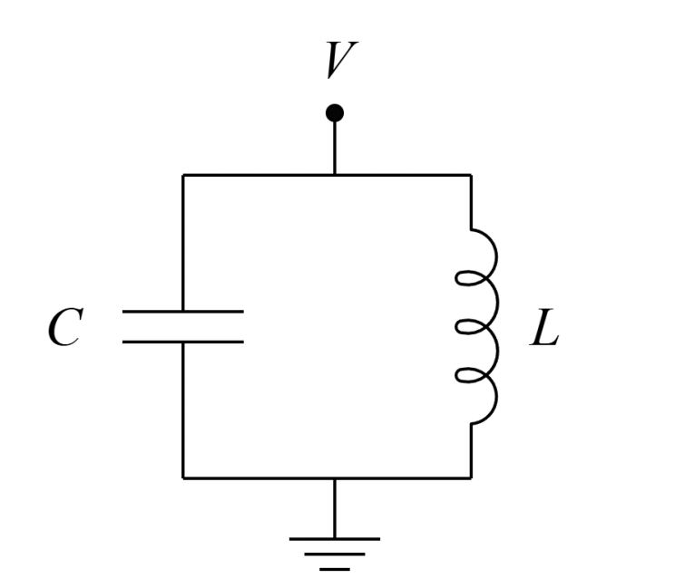
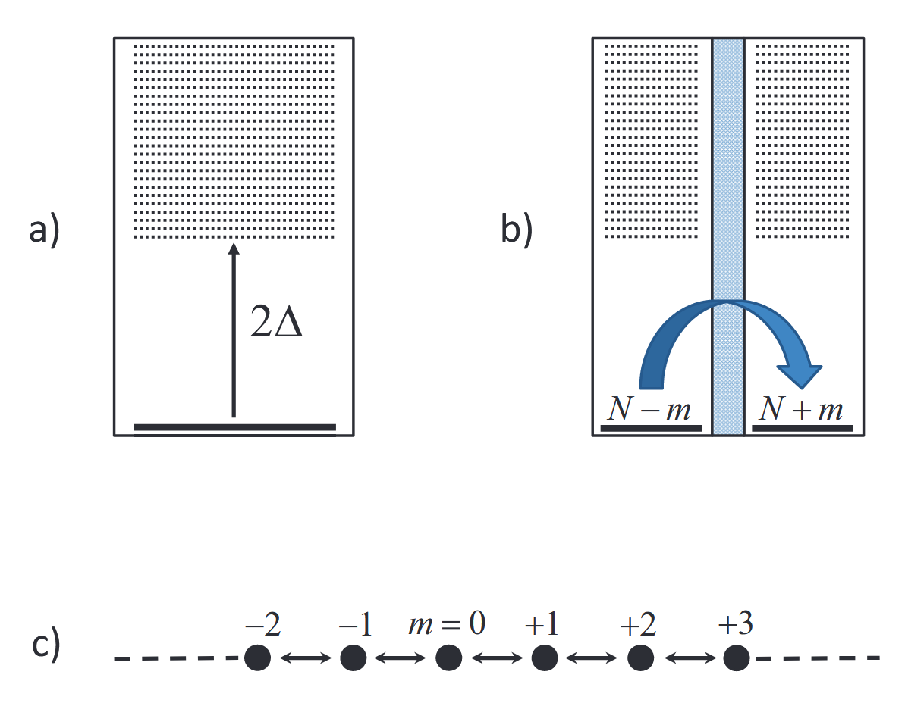
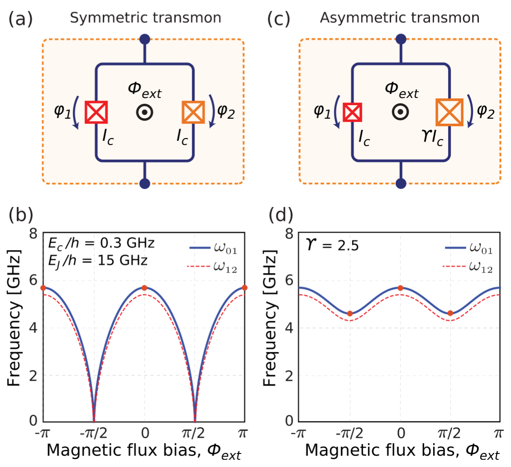
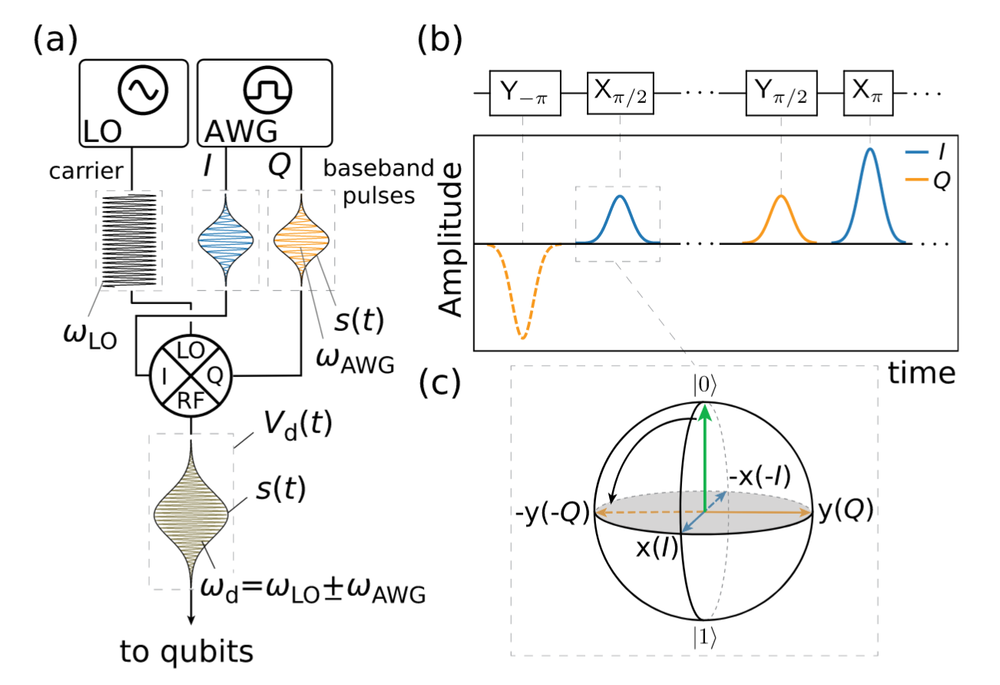
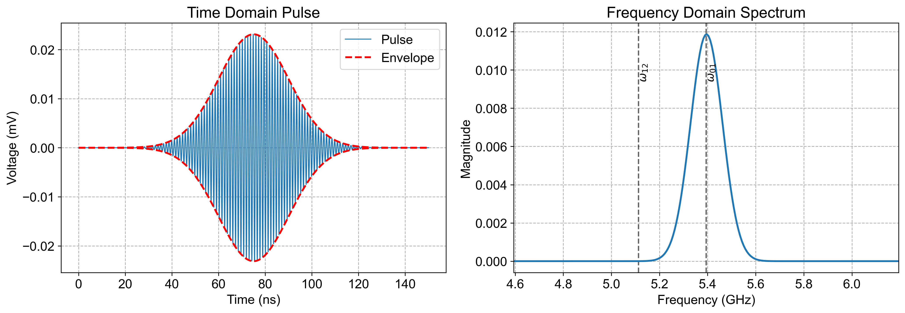
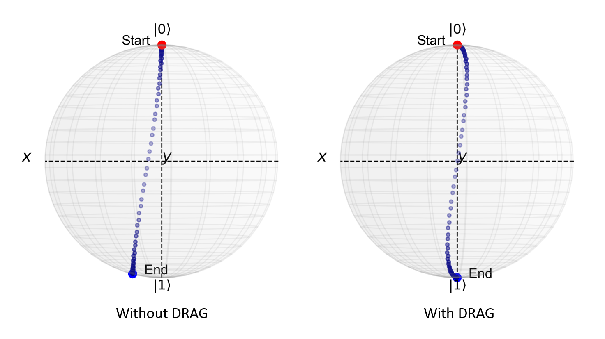
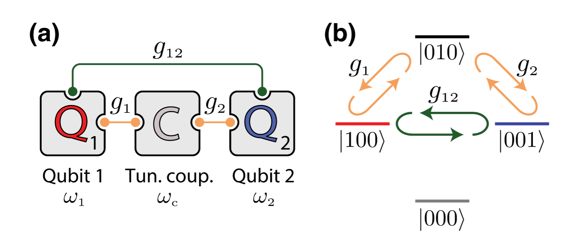
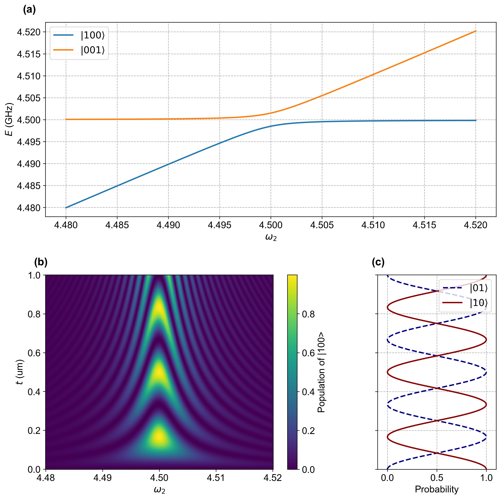
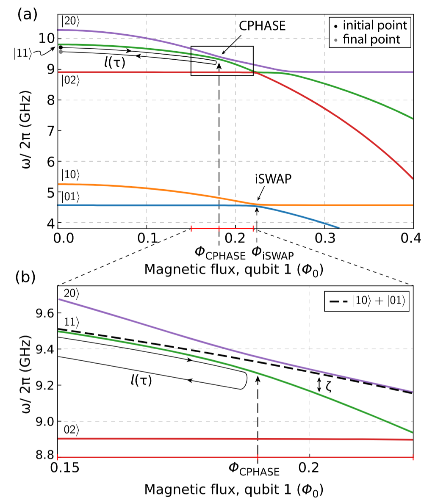
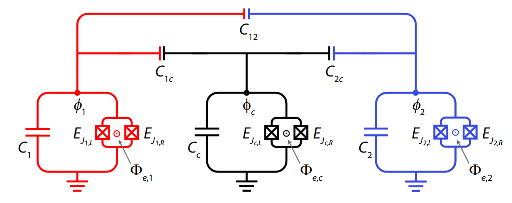

# 基础知识

## 1 电路量子化和 LC 谐振腔

本节通过正则量子化的方法，将经典的LC谐振子量子化，得到其哈密顿量，并引入湮灭算符。

上图是一个经典的 LC 谐振腔的示意图，它的 Languagian 为
$$
\newcommand \la \langle
\newcommand \ra \rangle
\newcommand \cal \mathcal
\newcommand \mr \mathrm
\newcommand \bm \boldsymbol
\newcommand \ds \displaystyle

L=\frac{1}{2}LI^2-\frac{q^2}{2C}=\frac{1}{2}L\dot{q}^2-\frac{q^2}{2C}
$$
将 $q$ 视为广义坐标，可以得到对应的广义动量为
$$
\phi=\frac{\partial L}{\partial \dot{q}}=L\dot{q}
$$
即电感上的磁通。系统的 Hamiltonian 为
$$
H = \phi\dot{q}-L\left(q,\dot{q}\right)=\frac{\phi^2}{2L}+\frac{q^2}{2C}
$$
根据正则量子化规则，将正则变量替换为正则算符 $\hat{\phi}$ 和 $\hat{q}$，得到量子化的哈密顿量
$$
\hat{H} = \frac{\hat{\phi}^2}{2L}+\frac{\hat{q}^2}{2C}
$$
两个正则算符满足下面的对易关系
$$
\left[\hat{\phi},\ \hat{q}\right]=i\hbar
$$
为求解谐振子的哈密顿量，我们引入两个算符：湮灭(annihilation)算符 $\hat{a}$ 和产生算符 $\hat{a}^\dagger$，它们被定义为
$$
\begin{aligned}\hat{a}&=\sqrt{\frac{1}{2\hbar Z}}\hat{\phi}+i\sqrt{\frac{Z}{2\hbar}}\hat{q}\\\hat{a}^\dagger&=\sqrt{\frac{1}{2\hbar Z}}\hat{\phi}-i\sqrt{\frac{Z}{2\hbar}}\hat{q}\end{aligned}
$$
其中 $Z=\sqrt{L/C}$ 称为特征阻抗。利用湮灭算符和产生算符，可以将哈密顿量写作
$$
\hat{H} = \hbar\omega(\hat{a}\hat{a}^\dagger+\frac{1}{2})
$$
其中$\omega=1/\sqrt{LC}$为谐振子的频率。求解能级的细节见 [一维谐振子](..\量子力学\一维谐振子.md)。

> [!note]
>
> LC 谐振子是一个能级等间距分布的**线性元件**，如果通过微波共振调控，则会**导致高能级的相干**。因此，想要构建超导量子比特，需要引入非线性元件。
>
> Transmon 量子比特就是由非线性元件——约瑟夫森结作为核心元件的量子比特。

## 2 约瑟夫森结和 transmon 量子比特

### 2.1 Hamiltonian

约瑟夫森结由两侧的超导体与中间夹层的绝缘体构成。超导体中的电子形成库伯对做整体运动，当库伯对由于量子隧穿效应从一侧的超导体经过绝缘体隧穿到另一侧时，就会形成隧穿电流。因此，约瑟夫森结的量子态可以由隧穿的库伯对的数目表示
$$
|m\rangle=|N_\mathrm{L}-m,N_\mathrm{R}+m\rangle
$$
$m$ 为从左侧隧穿到右侧的库伯对的数目。哈密顿量表示为
$$
 \hat{H} = -E_J\sum_{m}(|m\rangle\langle m+1|+|m+1\rangle\langle m|)
$$
其中 $E_J$ 称为约瑟夫森能量，表示一个库伯对发生隧穿需要的能量，它衡量了隧穿发生的难易程度。约瑟夫森结的哈密顿量与一维格点模型相同（图 c），对于一维格点模型，其波函数形式是一个平面波
$$
    |\varphi\rangle=\sum_{m=-\infty}^{+\infty}\mathrm{e}^{\mathrm{i}m\varphi}|m\rangle
$$
因此哈密顿量的本征值为
$$
\hat{H}|\varphi\rangle=E|\varphi\rangle=-E_J\cos\varphi|\varphi\rangle
$$
定义算符 $\hat{n}$ 表示库伯对隧穿的数目
$$
\hat{n} = \sum_{m} m |m\rangle\langle m|
$$

我们将约瑟夫森结并联上一个电容，就得到一个 transmon 量子比特。有 $\displaystyle\hat{n}=\frac{\hat{q}}{2e}$，$\hat{\varphi}=2\pi\frac{\phi}{\phi_0}$，其中$\phi_0=h/2e$ 为磁通量子。通过系统的总能量得到 transmon 量子比特的哈密顿量
$$
E=\frac{(2en)^2}{2C}-E_J\cos\varphi\Rightarrow\ \hat{H}=4E_C\hat{n}^2-E_J\cos\hat{\varphi}
$$
其中$\displaystyle E_C=\frac{e^2}{2C}$。通过数值方法，我们可以求出 LC 谐振子和 transmon 量子比特的能级。

> [!note]
>
> transmon 量子比特的能级间距随能级升高而减小（图 d），是一个非线性元件。

### 2.2 Hamiltonian 的近似解法

一般在transmon量子比特中，我们会选择 $E_J\gg E_C$ 以抑制电荷噪声。

> The qubit becomes highly sensitive to charge noise, which has proven more challenging to mitigate than flux noise, making it very hard to achieve high coherence.	—— 《A quantum engineer's guide to superconducting qubits》

在这种条件下，量子相位 $\varphi$ 一般较小，我们可以把哈密顿量展开为
$$
   \hat{H}=\underbrace{4E_C\hat{n}^2+\frac{1}{2}E_J\hat{\varphi}^2}_{\text{谐振子项}}-\underbrace{\frac{1}{24}E_J\hat{\varphi}^4}_{\text{非线性项}}
$$
同样，我们定义对应的湮灭算符 $\hat{b}$ 和产生算符 $\hat{b}$
$$
\hat{b}&=\left(\frac{E_J}{2E_C}\right)^{1/4}\hat{\varphi}+2\mathrm{i}\left(\frac{2E_C}{E_J}\right)^{1/4}\hat{n}\\\hat{b}^\dagger&=\left(\frac{E_J}{2E_C}\right)^{1/4}\hat{\varphi}-2\mathrm{i}\left(\frac{2E_C}{E_J}\right)^{1/4}\hat{n}
$$
将 $\hat{\varphi}$ 和 $\hat{n}$ 用湮灭和产生算符表示出
$$
    \hat{\varphi}&=\left(\frac{2E_C}{E_J}\right)^{1/4}(\hat{b}+\hat{b}^\dagger)\\\hat{n}&=\frac{\mathrm{i}}{2}\left(\frac{E_J}{2E_C}\right)^{1/4}(\hat{b}^\dagger-\hat{b})
$$
将其代入 Hamiltonian 中，对于谐振子项
$$
&4E_C\times\left(-\frac{1}{4}\sqrt{\frac{E_J}{2E_C}}\right)\times\left(\hat{b}+\hat{b}^\dagger\right)^2+\frac{1}{2}E_J\sqrt{\frac{2E_C}{E_J}}\times\left(\hat{b}^\dagger-\hat{b}\right)^2\\&=\sqrt{8E_JE_C}\left(\hat{b}^\dagger\hat{b}+\frac{1}{2}\right)
$$
它任然只带来线性能级。而非线性项则为
$$
&-\frac{1}{12}E_C\left(\hat{b}+\hat{b}^\dagger\right)^4\\&=-\frac{1}{12}E_C\left({\hat{b}}^4+4{\hat{b}}^3\hat{b}^\dagger+\underline{6{\hat{b}}^2{(\hat{b}^{\dagger})}^2 }+4\hat{b}{(\hat{b}^\dagger)}^3+{(\hat{b}^\dagger)}^4+6\left({\hat{b}}^2+{(\hat{b}^\dagger)}^2\right)+\underline{12\hat{b}^\dagger\hat{b}}+3\right)
$$
下面我们通过**旋波近似(RWA)** 的方法来化简这个式子。将系统变换到旋转参考系中，等价于作用一个旋转算符
$$
    U=\mathrm{e}^{-\mathrm{i}\frac{H}{\hbar}t}=\mathrm{e}^{-\mathrm{i}\omega\left(\hat{b}^\dagger\hat{b}+\frac{1}{2}\right)t}
$$
在旋转变换下，湮灭算符变为
$$
\hat{b}\rightarrow U\hat{b}U^\dagger=\mathrm{e}^{-\mathrm{i}\omega\left(\hat{b}^\dagger\hat{b}\right)t}\,\hat{b}\,\mathrm{e}^{\mathrm{i}\omega\left(\hat{b}^\dagger\hat{b}\right)t}
$$
利用 BH 公式
$$
\mathrm{e}^{A}B\mathrm{e}^{-A}=\sum_{n=0}^{\infty}\frac{1}{n!}\underbrace{[A,[A,\cdots[A,B]]]}_{\text{n次对易}}
$$
得到
$$
\begin{aligned}
    \hat{b}\rightarrow&\sum_{n=0}^{\infty}\frac{\left(-\mathrm{i}\omega t\right)^n}{n!}[\hat{b}^\dagger\hat{b},[\hat{b}^\dagger\hat{b},\cdots[\hat{b}^\dagger\hat{b},\hat{b}]]]\\&=\hat{b}\sum_{n=0}^{\infty}\frac{\left(\mathrm{i}\omega t\right)^n}{n!}\\&=\hat{b}\,\mathrm{e}^{\mathrm{i}\omega t}
\end{aligned}
$$
同理，可以得到 $\displaystyle \hat{b}^\dagger\rightarrow\hat{b}^\dagger\mathrm{e}^{-\mathrm{i}\omega t}$。因此在旋转参考系中，非线性项里，除了 $\hat{b}$ 和 $\hat{b}^\dagger$ 次数相同的两项（带下划线的两项），其余在旋转参考系中都会留下 $\displaystyle \mathrm{e}^{\pm\mathrm{i}\omega t}$ 的因子，使得在时间平均上为零。最终化简得到的哈密顿量为
$$
\begin{aligned}
    \hat{H}&\approx\hbar\omega\hat{b}^\dagger\hat{b}-\frac{E_C}{2}\hat{b}^\dagger\hat{b}^\dagger\hat{b}\hat{b}\\&=\hbar\omega_\mathrm{q}\left(\hat{b}^\dagger\hat{b}\right)\hat{b}^\dagger\hat{b}
\end{aligned}
$$
其中 $\hbar\omega=\sqrt{8E_JE_C}-E_C$，以及 $\displaystyle \omega_\mathrm{q}=\omega-\frac{E_C}{2\hbar}\left(\hat{b}^\dagger\hat{b}-1\right)$。从简化后的哈密顿量中可以直接得到系统的能级
$$
E_n=n\hbar\omega-\frac{E_C}{2}n(n-1)
$$
以及三个能级的间距
$$
\begin{aligned}
    \omega_{01}&=\omega\\
    \omega_{12}&=\omega-\frac{E_C}{\hbar}
\end{aligned}
$$
量子比特的非线性定义为
$$
\eta=\omega_{12}-\omega_{01}=-\frac{E_C}{\hbar}
$$

## 3 SQUID

在实验中，有时我们希望能够改变 transmon 量子比特的频率，一种广泛采用的技术是将单个约瑟夫森结替换为由两个相同结构成的环路，从而形成一个直流超导量子干涉器件(DC superconducting quantum interference device, DC-SQUID)。

对于图(a) 中所示的对称 SQUID，它的哈密顿量表示为
$$
\hat{H}=4E_C\hat{n}^2-2E_J|\cos\varphi_{e}|\cos\hat{\varphi}
$$
其中 $\displaystyle \varphi_e=\pi\frac{\Phi_{\text{ext}}}{\Phi_{0}}$，它的前两个能级间距如图(b) 所示。可以看到这种结构确实能够调控 qubit 的频率，但是在某些位置频率随磁通偏置变化太快，这会引入较大的磁通噪声。一种改进方式是使用图(c) 中的非对称 SQUID，它的哈密顿量为
$$
\hat{H}=4E_C\hat{n}^2-E_{J\Sigma}\sqrt{\cos^2\varphi_{e}+d^2\sin^2\varphi_e}\cos\hat{\varphi}
$$
其中，$\displaystyle E_{J\Sigma}=E_{J1}+E_{J2}$ 和 $\displaystyle d=\frac{\gamma-1}{\gamma+1}$，$\gamma=E_{J2}/E_{J1}$。当 $\gamma=1$ 就退化到对称情形。从图(d) 可以看出非对称结构下，频率随磁通偏置的变化更平缓。

## 4 单比特门

旋转算符为
$$
X_\theta=R_X(\theta)=\mathrm{e}^{-\mathrm{i}\frac{\theta}{2}\sigma_x}=\cos{\frac{\theta}{2}}\mathbb{I}-\mathrm{i}\sin\frac{\theta}{2}\sigma_x
$$
所有量子操作都可以通过一组量子门来实现。常见的一组通用量子门是
$$
\mathcal{G_0}=\{X_\theta,Y_\theta,Z_\theta,\text{Ph}_\theta,\text{CNOT}\}
$$
另一组常用的通用量子门是
$$
\mathcal{G_1}=\{H,S,T,\text{CNOT}\}
$$
为了实现量子计算，我们需要实现对量子比特的精准操控，在下面的内容将介绍如何使用微波脉冲对单比特进行调控。

### 4.1 电容耦合实现 XY 控制

在线路中，我们通过电容 $C_\mathrm{d}$ 将微波信号源 $V_\mathrm{d}$ 与 transmon 量子比特耦合在一起。记节点处的电势为$V_\mathrm{n}$，则约瑟夫森结上的磁通为
$$
\phi=\int_{-\infty}^{t}V_\mathrm{n}(\tau)\ \mathrm{d}\tau
$$
即 $\dot{\phi}=V_\mathrm{n}(t)$。在 transmon 上的能量（在只考虑二能级时，暂且将约瑟夫森结视作一个线性电感）
$$
E_\text{t}=\frac{1}{2}C\dot{\Phi}^2+\frac{1}{2L}\Phi^2
$$
在 $C_\text{d}$ 上的能量
$$
\begin{aligned}E_d&=\frac{1}{2}C_d\left(V_d-V_n\right)^2\\
&=\frac{1}{2}C_dV_d^2-C_dV_dV_n+\frac{1}{2}C_dV_n^2
\end{aligned}
$$
系统的拉格朗日量为
$$
L=\frac{1}{2}(C+C_\mathrm{d})\dot{\phi}^2-C_\mathrm{d}V_\mathrm{d}\dot{\phi}+\frac{1}{2L}\phi^2+\underbrace{\frac{1}{2}C_\mathrm{d}V_\mathrm{d}^2}_{\text{drop}}
$$
从中可以得到广义动量
$$
\tilde{Q}=\frac{\partial L}{\partial\dot{\phi}}=C_{\Sigma}\dot{\phi}-C_\text{d}V_\text{d}
$$
其中 $C_\Sigma=C+C_\text{d}$。通过勒让德变换即可得到哈密顿量
$$
    H=\underbrace{\frac{\tilde{Q}^2}{2C_{\Sigma}}+\frac{\Phi^2}{2L}}_{\text{QHO}}+\underbrace{\frac{C_\text{d}}{C_\Sigma}V_\text{d}\tilde{Q}}_{\text{coupling}}
$$
在弱耦合情况下，$C_\text{d}$为小量，有 $\tilde{Q}=\hat{Q}$，利用湮灭算符可将其表示为
$$
\hat{Q}=\mathrm{i}\,e\left(\frac{E_J}{2E_C}\right)^{1/4}(\hat{b}^\dagger-\hat{b})=\mathrm{i}Q_{\text{zpf}}(\hat{b}^\dagger-\hat{b})
$$
代入哈密顿量中
$$
\hat{H}=\hat{H}_{\text{transmon}}+\mathrm{i}\frac{C_\mr{d}}{C_{\mr{\Sigma}}}V_\mr{d}Q_{\text{zpf}}(\hat{b}^\dagger-\hat{b})
$$
当只考虑二能级时，$\hat{b}=\sigma^{-}$，$\hat{b}^{\dagger}=\sigma^{+}$，哈密顿量变为
$$
H=\underbrace{-\hbar\frac{\omega_\mr{q}}{2}\sigma_z}_{H_0}+\underbrace{\Omega V_\mr{d}(t)\sigma_y}_{H_\mr{d}}
$$
其中 $\displaystyle\Omega=\frac{C_\mr{d}}{C_{\mr{\Sigma}}}Q_{\mr{zpf}}$。为了具体展示出驱动项的作用，我们将哈密顿量变换到旋转参考系中，变换算符为
$$
U_{\mr{rf}}=U_{H_0}^{\dagger}=\mathrm{e}^{\mathrm{i}\frac{\omega_q}{2}\sigma_zt}
$$
变换后
$$
\begin{align}
H_0&\rightarrow U_{\mr{rf}}H_0U_{\mr{rf}}^{\dagger}+\mathrm{i}U_{\mr{rf}}^\dagger U_{\mr{rf}}=0\\
H_\mr{d}&\rightarrow U_{\mr{rf}}H_\mr{d}U_{\mr{rf}}^{\dagger}=\Omega V_\mr{d}(t)\left(\cos(\omega_\mr{q} t)\sigma_y-\sin(\omega_\mr{q}t)\sigma_x\right)
\end{align}
$$
一般 $V_\mr{d}(t)$ 是一个窄带的微波脉冲，可以写出 $V_\mr{d}(t)=V_0\nu(t)$ 的形式
$$
\begin{aligned}\nu(t)&=s(t)\sin(\omega_\mr{d}t+\phi)\\&=s(t)\big(\cos(\phi)  \sin(\omega_\mr{d}t) + \sin(\phi) \cos(\omega_\mr{d}t) \big)
\end{aligned}
$$
其中 $s(t)$ 是一个无量纲包络函数。定义
$$
\begin{align}
    I&=\cos\phi\quad\text{(同相分量)}\\
    Q&=\sin\phi\quad\text{(反相分量)}
\end{align}
$$
代入驱动项的哈密顿量中
$$
\tilde{H}_\mr{d}=\Omega V_0s(t)\big(I  \sin(\omega_\mr{d}t) + Q \cos(\omega_\mr{d}t) \big)\times\left(\cos(\omega_\mr{q} t)\sigma_y-\sin(\omega_\mr{q}t)\sigma_x\right)
$$
利用积化和差，舍弃高频项并假设 $\delta\omega=\omega_\mr{q}-\omega_\mr{d}=0$ 得到
$$
\tilde{H}_\mr{d}=-\frac{\Omega}{2}V_0s(t)(I\sigma_x+Q\sigma_y)
$$
对应的幺正演化算符为
$$
U_{\text{rf,d}}^{\phi}=\exp\left(\left[\mathrm{i}\frac{\Omega}{2\hbar}V_0\int_{0}^{t}s(\tau)\mathrm{d}\tau\right]\cdot(I\sigma_x+Q\sigma_y)\right)
$$
通过调整相位 $\phi$ 和脉冲包络 $s(t)$，即可控制量子比特在 Bloch 球上的旋转。在实验中，常选取高斯波形做脉冲

对上面这样的高斯脉冲做傅里叶变换可以得到它的频域图像

### 4.2 DRAG 方案

可以看见 XY 的 $\pi$ 脉冲的频率中包含一部分 $\omega_{12}$ 的分量，这会导致量子比特泄漏到高能级 $|2\rangle$ 上。为了避免这一问题，我们可以通过 DRAG (Derivative Reduction by Adiabatic Gate) 方案来修正脉冲。

DRAG方案通过修正脉冲的 IQ 分量实现对高能级泄露的抑制
$$
\begin{align}
s(t)\rightarrow s'(t)=
\begin{cases}
s(t)&\text{on }I\\\\
\displaystyle\alpha\frac{\dot{s}(t)}{\eta}&\text{on }Q
\end{cases}
\end{align}
$$
其中 $\eta$ 是量子比特的非线性，$\alpha$ 是正交分量的参数，可以通过实验上的优化得到。不使用/使用DRAG方案修正脉冲后，量子比特在Bloch球上的演化如下图所示

### 4.3 Virtual Z gate

任意意由任意波形发生器（AWG）信号产生的相位偏移与应用 Z 旋转之间存在类比关系，这种关系可用于实现“虚拟”Z 门。例如
$$
X_\theta^{(\phi_0)}X_\theta=\mathrm{e}^{-i\frac{\theta}{2}(\cos\phi_0\sigma_x+\sin\phi_0\sigma_y)}X_\theta=Z_{-\phi_0}X_\theta Z_{\phi_0}X_\theta
$$
这与应用一个旋转角度为 $\phi_0$ 的 $Z$ 门效果相同。由于测量通常是沿 z 轴进行的，最后的操作 $Z_{-\phi_0}$ 不会改变测量结果，因此它没有实际影响。

因此，如果想要实现如下门序列：

可以通过修改 AWG 控制软件中的门序列，并**改变后续脉冲的相位**来实现：

虚拟 Z 门是“完美的”，因为它们不需要额外的硬件脉冲，执行时间为“零”，因此其门保真度（Fidelity）在名义上为 1。

**属性**：任何单比特操作（在忽略全局相位的情况下）都可以写为：
$$
U(\theta,\phi,\lambda)=Z_{\phi-\frac{\pi}{2}}X_{\frac{\pi}{2}}Z_{\pi-\theta}X_{\frac{\pi}{2}}Z_{\lambda-\frac{\pi}{2}}
$$
例如：Hadamard gate
$$
H=Z_{\frac{\pi}{2}}X_{\frac{\pi}{2}}Z_{\frac{\pi}{2}}
$$

## 5 两比特门

前面我们提到，若干单比特操控门与一个两比特门可以构成一组通用的量子门集合，本节将介绍一种常用的两比特耦合结构 **q-c-q**，并讨论 iSWAP 和 CPHASE 门的实现

### 5.1 General Model

考虑上面这种 generic 系统，两个 qubits 频率分布为 $\omega_{1}$ 和 $\omega_2$，分别以耦合强度 $g_1$、$g_2$ 与中心的 coupler（频率 $\omega_c$）耦合，同时两者以 $g_{12}$ 直接耦合。这种情况下，仅考虑二能级的哈密顿量为
$$
H=\sum_{i=1,2}\frac{1}{2}\omega_i\sigma_{i}^{z}+\frac{1}{2}\omega_c\sigma_c^z+\sum_{i=1,2}g_{ic}(\sigma_i^{+}\sigma_c^{-}+\sigma_{i}^{-}\sigma_{c}^{+})+g_{12}(\sigma_1^{+}\sigma_2^{-}+\sigma_{1}^{-}\sigma_{2}^{+})
$$
上面的哈密顿量可以基于 [Schrieffer–Wolff transformation](https://doi.org/10.1016/j.aop.2011.06.004) 消去耦合项

----

#### **Details of Schrieffer–Wolff transformation**

将总哈密顿量分拆为
$$
H = H_0 + V
$$
我们想通过一个幺正变换消去哈密顿量中的 coupler 的项
$$
\tilde{H}=\mathrm{e}^{S}H\mathrm{e}^{-S}
$$
其中 $S^{\dagger}=-S$。通过 BCH 公式展开
$$
\tilde{H} = H_0 + V + [S, H_0] + [S, V] + \frac{1}{2}[S, [S, H_0]] + \frac{1}{2}[S, [S, V]] + \dots
$$
为了消除一阶非对角项 $V$，我们令所有包含一阶 $V$ 的项之和为零
$$
V + [S, H_0] = 0 \quad \implies \quad [H_0, S] = V
$$
将这个公式带回 BCH 展开式
$$
\begin{aligned}
\tilde{H} &= H_0 + \underbrace{V + [S, H_0]}_{=0} + [S, V] + \frac{1}{2}[S, \underbrace{[S, H_0]}_{-V}] + \dots\\
&\approx H_0 + [S, V] - \frac{1}{2}[S, V]\\
&=H_0 + \frac{1}{2}[S, V]
\end{aligned}
$$

下面需要求解 $S$ 的具体形式。在 $H_0$ 的本征基矢 $\{|m\rangle, |n\rangle\}$ 下，对应的本征能量为 $E_m, E_n$
$$
\langle m|[H_0,S]|n\rangle=\langle m|V|n\rangle\\
(E_m - E_n) \langle m | S | n \rangle = V_{mn}
$$
算符 $S$ 的矩阵元为
$$
S_{mn}=\frac{V_{mn}}{E_m-E_n}
$$
对于前面的二能级 q-c-q 哈密顿量，考虑 $|m\rangle=|10\rangle\otimes|0\rangle$ 和 $$|n\rangle=|01\rangle\otimes|0\rangle$$。于是
$$
S_{mn}=\frac{g_{1c}}{\omega_1-\omega_c}=\frac{g_{1c}}{\Delta_{1c}},\quad S_{nm}=-S_{mn}
$$
最后，可将算符 $S$ 表示为
$$
S = \frac{g_{1c}}{\Delta_{1c}}(a_1 a_c^\dagger - a_1^\dagger a_c) + \frac{g_{2c}}{\Delta_{2c}}(a_2 a_c^\dagger - a_2^\dagger a_c)
$$
将 $S$ 代入 $\frac{1}{2}[S, V]$ 中计算，最终得到变换后的哈密顿量
$$
\tilde{H} =\sum_{i=1,2}\frac{1}{2}\omega_i\sigma_{i}^{z}+ \tilde{g}(\sigma_1^{+}\sigma_2^{-}+\sigma_{1}^{-}\sigma_{2}^{+})
$$
其中
$$
\tilde{g}= g_{12} + \frac{g_{1c}g_{2c}}{2} \left( \frac{1}{\Delta_1} + \frac{1}{\Delta_2} \right)
$$

----

### 5.2 iSWAP Gate

将哈密顿量写为矩阵形式
$$
\tilde{H}=
\begin{pmatrix}
E_{00} & 0 & 0 & 0\\
0 & E_{} & \tilde{g} & 0\\
0 & \tilde{g} & E_{} & 0\\
0 & 0 & 0 & E_{11}\\
\end{pmatrix}
$$

得到对应的本征值和本征矢为（令 $\Delta=E_{10}-E_{01}$）未归一化
$$
\begin{array}{c}
\text{Eigen Energy:}&\quad E_{00}& \frac{1}{2}\left(E_{10}+E_{01}-\sqrt{4\tilde{g}^2+\Delta^2}\right)&\frac{1}{2}\left(E_{10}+E_{01}+\sqrt{4\tilde{g}^2+\Delta^2}\right)&E_{11}\\
\text{Eigen Vector:}&\quad\begin{pmatrix}1\\0\\0\\0\end{pmatrix}& \begin{pmatrix}0\\-\frac{\Delta+\sqrt{4\tilde{g}^2+\Delta^2}}{2\tilde{g}}\\1\\0\end{pmatrix} & \begin{pmatrix}0\\-\frac{\Delta-\sqrt{4\tilde{g}^2+\Delta^2}}{2\tilde{g}}\\1\\0\end{pmatrix} & \begin{pmatrix}0\\0\\0\\0\end{pmatrix}
\end{array}
$$

如果我们调控 qubits 的频率使得 $E_{10}=E_{01}=E$，则
$$
\begin{array}{c}
\text{Eigen Energy:} & \quad E_{00}& E-\tilde{g}&E+\tilde{g}&E_{11}\\
\text{Eigen Vector:}&\quad\begin{pmatrix}1\\0\\0\\0\end{pmatrix}& \frac{1}{\sqrt{2}}\begin{pmatrix}0\\-1\\1\\0\end{pmatrix} & \frac{1}{\sqrt{2}}\begin{pmatrix}0\\1\\1\\0\end{pmatrix} & \begin{pmatrix}0\\0\\0\\0\end{pmatrix}
\end{array}
$$
如果我们令 $E_{00}=0$，可以得到对应的演化算符
$$
U(t) = \begin{pmatrix} 1 & 0 & 0 & 0 \\ 0 & e^{-iEt/\hbar} \cos\left(\frac{\tilde{g}t}{\hbar}\right) & -i e^{-iEt/\hbar} \sin\left(\frac{\tilde{g}t}{\hbar}\right) & 0 \\ 0 & -i e^{-iEt/\hbar} \sin\left(\frac{\tilde{g}t}{\hbar}\right) & e^{-iEt/\hbar} \cos\left(\frac{\tilde{g}t}{\hbar}\right) & 0 \\ 0 & 0 & 0 & e^{-iE_{11}t/\hbar} \end{pmatrix}
$$
如果我们设置共振时间为 $t=\frac{\pi\hbar}{2\tilde{g}}$，并做 RWA 就可以得到
$$
U\left(\frac{\pi}{2\tilde{g}}\right)=
\begin{pmatrix} 1 & 0 & 0 & 0 \\ 0 & 0 & -i & 0 \\ 0 & -i & 0 & 0 \\ 0 & 0 & 0 & 1 \end{pmatrix}=i\text{SWAP}
$$

iSWAP 门的工作原理由下图看出，在 avoid crossing 点，如果系统初始时在 $|01\rangle$ 态，之后系统会在 $|01\rangle$ 和 $|10\rangle$ 态之间发生振荡

> [!note]
>
> iSWAP 门需要结合若干个单比特门才能实现 CNOT 门
>
> 

### 5.3 CPHASE gate

CPHASE gate 的幺正算符为
$$
U=
\begin{pmatrix}
1 & 0 & 0 & 0\\
0 & 1 & 0 & 0\\
0 & 0 & 1 & 0\\
0 & 0 & 0 & -1\\
\end{pmatrix}
$$
即当两个 qubits 处于 $|11\rangle$ 态时，累积一个 $\mathrm{e}^{\mathrm{i}\pi}=-1$ 的相位。类似 iSWAP 门在 $|01\rangle\leftrightarrow|10\rangle$ 之间振荡累积相位，我们可以考虑 $|11\rangle$ 与一个更高的能级（$|20\rangle$）之间发生振荡

考虑 $\{|00\rangle,\ |01\rangle, |10\rangle, |11\rangle, |02\rangle, |20\rangle\}$ 这组基矢，此时哈密顿量为
$$
H_{2 \text{ excitations}} = 
\begin{pmatrix}
E_{00} & 0 & 0 & 0 & 0 & 0 \\
0 & E_{01} & g & 0 & 0 & 0 \\
0 & g & E_{10} & 0 & 0 & 0 \\
0 & 0 & 0 & E_{11} & \sqrt{2}g & \sqrt{2}g \\
0 & 0 & 0 & \sqrt{2}g & E_{02} & 0 \\
0 & 0 & 0 & \sqrt{2}g & 0 & E_{20}
\end{pmatrix}
$$
将系统制备到 $|11\rangle$ 后，移动到 avoid crossing 点后等待一段时间 $\tau = \frac{\pi\hbar}{\sqrt{2}\tilde{g}}$，系统完成 $|11\rangle$ 和 $|02\rangle$ 之间一次完整的 Larmor 进动，累积 $\pi$ 的相位。

### 5.4 q-c-q 电容耦合结构

实现 q-c-q 的电容耦合结构如下所示

系统的 Lagrangian 为
$$
L=T-U
$$
其中
$$
\begin{aligned}
T=\frac{1}{2}[&C_1\dot{\phi}_1^2+C_c\dot{\phi}_c^2+C_2\dot{\phi}_2^2+C_{12}(\dot{\phi}_1-\dot{\phi_{2}})^2\\
&C_{1c}(\dot{\phi}_1-\dot{\phi_{c}})^2+C_{2c}(\dot{\phi}_2-\dot{\phi_{c}})^2]
\end{aligned}
$$

$$
\begin{aligned}
U=&E_{J1}\left[1-\cos\left(\frac{2\pi}{\Phi_0}\phi_1\right)\right]+E_{J2}\left[1-\cos\left(\frac{2\pi}{\Phi_0}\phi_2\right)\right]\\
&+E_{Jc}\left[1-\cos\left(\frac{2\pi}{\Phi_0}\phi_c\right)\right]

\end{aligned}
$$

令 $\displaystyle\hat{n}_i=\frac{\hat{q}_i}{2e}$，$\displaystyle\hat{\varphi}_i=2\pi\frac{\hat{\phi}_i}{\Phi_0}$，可以得到系统的哈密顿量
$$
\begin{aligned}
\hat{H} &= 4E_{C_1}(\hat{n}_1)^2 - E_{J_1} \cos\left(\frac{2\pi}{\Phi_0}\hat{\phi}_1\right)  \\
&\quad+ 4E_{C_2}(\hat{n}_2)^2 - E_{J_2} \cos\left(\frac{2\pi}{\Phi_0}\hat{\phi}_2\right)  \\
&\quad + 4E_{C_c}(\hat{n}_c)^2- E_{J_c} \cos\left(\frac{2\pi}{\Phi_0}\hat{\phi}_c\right)  \\
&\quad + 8 \frac{C_{1c}}{\sqrt{C_1 C_c}} \sqrt{E_{C_1} E_{C_c}} (\hat{n}_1 \hat{n}_c) \\
&\quad + 8 \frac{C_{2c}}{\sqrt{C_2 C_c}} \sqrt{E_{C_2} E_{C_c}} (\hat{n}_2 \hat{n}_c) \\
&\quad + 8 (1 + \eta) \frac{C_{12}}{\sqrt{C_1 C_2}} \sqrt{E_{C_1} E_{C_2}} (\hat{n}_1 \hat{n}_2)
\end{aligned}
$$
其中 $\ds E_{C_\lambda}=\frac{e^2}{2C_{\lambda}}$，$\ds\eta=\frac{C_{1c}C_{2c}}{C_{12}C_c}$。利用升降算符可以将哈密顿量写作
$$
\hat{H}=\underbrace{\hat{H}_1+\hat{H}_2+\hat{H}_c}_{\text{independent}}+\underbrace{\hat{H}_{1c}+\hat{H}_{2c}+\hat{H}_{12}}_{\text{coupling}}
$$
其中的 independent 项是独立的 transmon qubit 哈密顿量
$$
\hat{H}_{\lambda}=\hbar\omega_{\lambda}\hat{b}_{\lambda}^\dagger\hat{b}_{\lambda}+\frac{\alpha_{\lambda}}{2}\hat{b}_{\lambda}^\dagger\hat{b}_{\lambda}^\dagger\hat{b}_{\lambda}\hat{b}_{\lambda}
$$
其中
$$
\omega_{\lambda}=\sqrt{8E_{J_\lambda}E_{C_\lambda}}-E_{C_\lambda}
$$

$$
\alpha_{\lambda}=-E_{C_\lambda}
$$

三个耦合项分别是
$$
H_{jc}=g_{jc}(b_j-b_j^\dagger)(b_c-b_c^\dagger)\
$$

$$
H_{12}=g_{12}(b_1-b_1^\dagger)(b_2-b_2^\dagger)
$$

耦合强度为
$$
g_{jc}=\frac{1}{2}\frac{C_{jc}}{\sqrt{C_jC_c}}\sqrt{\omega_j\omega_c}
$$

$$
g_{12}=\frac{1}{2}(1+\eta)\frac{C_{12}}{\sqrt{C_1C_2}}\sqrt{\omega_1\omega_2}
$$

使用下面的考虑了反向旋转项的 Schrieffer–Wolff 变换算符
$$
\hat U
= \exp\left\{
\sum_{j=1,2}
\left[
\frac{g_{jc}}{\Delta_{jc}}
\left(\hat b_j^\dagger \hat b_c - \hat b_j \hat b_c^\dagger \right)
-
\frac{g_{jc}}{\Sigma_{jc}}
\left(\hat b_j^\dagger \hat b_c^\dagger - \hat b_j \hat b_c \right)
\right]
\right\}
$$
其中 $\Delta_{jc}=\omega_{j}-\omega_c$，$\Sigma_{jc}=\omega_j+\omega_c$。哈密顿量变为
$$
\begin{aligned}
\hat H &= \hat U \hat H \hat U^\dagger \notag\\
&= \tilde{\omega}_1 \hat b_1^\dagger \hat b_1
+ \frac{\tilde{\alpha}_1}{2} \hat b_1^\dagger \hat b_1^\dagger \hat b_1 \hat b_1
+ \tilde{\omega}_2 \hat b_2^\dagger \hat b_2
+ \frac{\tilde{\alpha}_2}{2} \hat b_2^\dagger \hat b_2^\dagger \hat b_2 \hat b_2 \notag\\
&\quad + \tilde g \left( \hat b_1^\dagger \hat b_2 + \hat b_1 \hat b_2^\dagger \right)
\end{aligned}
$$
其中
$$
\tilde{\omega}_1 \approx \omega_1 + g_1^2 \left( \frac{1}{\Delta_1} - \frac{1}{\Sigma_1} \right)
$$

$$
\tilde{\alpha}_1 \approx \alpha_1
$$

$$
\tilde{\omega}_2 \approx \omega_2 + g_2^2 \left( \frac{1}{\Delta_2} - \frac{1}{\Sigma_2} \right)
$$

$$
\tilde{\alpha}_2 \approx \alpha_2
$$

$$
\tilde g \approx \frac{g_1 g_2}{2}
\left(
\frac{1}{\Delta_1}
+ \frac{1}{\Delta_2}
- \frac{1}{\Sigma_1}
- \frac{1}{\Sigma_2}
\right)
+ g_{12}
$$

如果令 $\omega_{1}=\omega_2=\omega$，则
$$
\tilde{g}=\frac{1}{2}\left(\frac{\omega^2}{\omega^2-\omega_c^2}\eta+1\right)\frac{C_{12}}{\sqrt{C_1C_2}}\omega
$$
