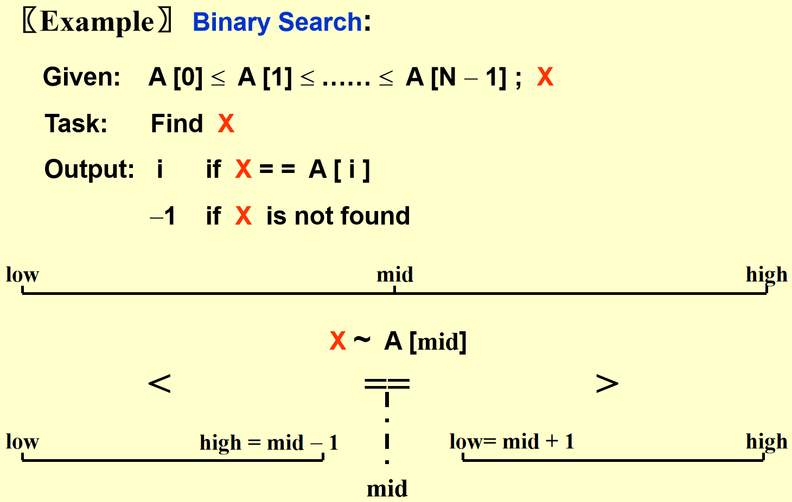

# 算法分析

## 1 基本概念

算法(Algorithm)：一组为了完成特定任务的指令集。所以算法都具有下面的特征

- 输入：0 个或多个
- 输出：至少要有 1 个输出
- 确定性：每条指令都是明确的
- 有限性：算法需要在经过有限步后终止
- 有效性：每条指令足够简单可行，原则上使用纸和笔便能表达出来

> [!note]
>
> - **程序**由编程语言书写，但不必在有限步内完成，比如操作系统的时钟
> - **算法**可以通过不同的形式表现：人类语言、流程图等

### 如何对算法进行分析

运行时间与编程语言和运行平台有关，因此我们需要分析算法的**时间和空间复杂度 (time & space complexity)**。分析之前我们做如下假设：

- 每条指令顺序执行
- 每条指令都足够简单，只花费一个单位时间
- 有无限的内存

通常，我们分析以下两种时间复杂度，输入规模均为 N：

- $T_{\text{avg}}(N)$：平均时间复杂度
- $T_{\text{worst}}(N)$：最差时间复杂度 $\bigstar$

## 2 Asymptotic Notation

### 2.1 定义

#### 2.1.1 $O$ 符号

$O$ 符号的定义：令 $f$ 和 $g$ 是从 $\mathbb{Z}$ 或 $\mathbb{R}$ 映射到 $\mathbb{R}$ 的函数，如果存在实数 $C$ 和 $k$ 使得任取 $x\geqslant k$ 时 $f(x)\leqslant C|g(x)|$，则称 $f(x)$ 是 $O(g(x))$ 的（更具体的说就是 $f(x)$ 的增长速度慢于 $g(x)$）。其中 $C$ 和 $k$ 称为 witnesses。


- 如果 $f(x)$ 是 $O(g(x))$ 且 $g(x)$ 是 $O(f(x))$，那么称 $f(x)$ 和 $g(x)$ 是**同阶 (same order)**的
- 如果 $f(x)$ 是 $O(g(x))$ 的，而 $g(x)$ 是 $O(h(x))$ 的，则 $f(x)$ 也是 $O(h(x))$ 的

**定理 1**：若 $f(x)=a_n x^n+a_{n-1}x^{n-1}+\cdots+a_0$，其中 $a_n,a_{n-1},\dots,a_0\in\mathbb{R}$，那么 $f(x)$ 是 $O(x^n)$，即多项式的**首项**控制整个多项式的增长速率

> [!note]
>
> 一些结论：
>
> - $n!$ 是 $O(n^n)$
> - $\log⁡ n!$ 是 $O(n\log⁡ n)$；$n\log⁡ n$ 是 $O(\log ⁡n!)$
> - $\log ⁡n$ 是 $O(n^\alpha),\alpha>0$
> - 当 $d>c>1$ 时，$n^c$  是 $O(n^d)$，反之不成立
> - 当 $d>c>1$ 且 $b>1$ 时，$(\log⁡_b n)^c$ 是 $O(n^d)$，反之不成立
> - 当 $c>b>1$ 时，$b^n$ 是 $O(c^n)$，反之不成立
> - 当 $c>1$ 时，$c^n$  是 $O(n!)$，反之不成立
> - $1^k+2^k+⋯+n^k$ 是 $O(n^{k+1})$
> - 对于所有实数 $a>1,b>1$，如果 $f(x)$ 是 $O(\log⁡_b x)$，则 $f(x)$ 是 $O(\log⁡_a x)$
> - **调和级数 (Harmonic number)**：$H_n=1+\frac{1}{2}+\cdots+\frac{1}{n}$ 是 $O(\log ⁡n)$ 

各个函数增长速度比较


#### 2.1.2 复合函数的增长

**定理 2**：如果 $f_1(x)$ 是 $O(g_1(x))$ 的，$f_2(x)$ 是 $O(g_2(x))$ 的，则 $(f_1+f_2)(x)$ 是 $O(g(x))$ 的，其中 $g(x)=\max\big(|g_1(x)|,|g_2(x)|\big)$

证明：由 $O$ 符号的定义，$\exist C_1,C_2,k_1,k_2$ 使得 $\forall x>k_1,\ f_1(x)\leqslant C_1|g_1(x)|$，$\forall x>k_2,\ f_2(x)\leqslant C_2|g_2(x)|$，于是 $\forall x>\max(k_1,k_2)$
$$
\begin{aligned}
f_1(x)+f_2(x)&\leqslant C_1|g_1(x)|+C_2|g_2(x)|\\
&\leqslant (C_1+C_2)\max\big(|g_{1}(x)|,|g_2(x)|\big)\\
&=C |g(x)|
\end{aligned}
$$
**定理 3**：如果 $f_1(x)$ 是 $O(g_1(x))$ 的，$f_2(x)$ 是 $O(g_2(x))$ 的，则 $(f_1 f_2)(x)$ 是 $O(g_1(x)g_2(x))$ 的

#### 2.1.2 $\Omega$ and $\Theta$ Notation

$O$ 符号表示函数增长上界，而 $\Omega$ 符号则定义下界

**$\Omega$ 符号定义**：令 $f$ 和 $g$ 是从 $\mathbb{Z}$ 或 $\mathbb{R}$ 映射到 $\mathbb{R}$ 的函数，如果存在实数 $C$ 和 $k$ 使得任取 $x\geqslant k$ 时 $f(x)\geqslant C|g(x)|$，则称 $f(x)$ 是 $\Omega(g(x))$ 的（具体的说就是 $f(x)$ 的增长速度快于 $g(x)$）


**用 $\Theta$ 符号表示同阶的情况**：如果 $f(x)$ 是 $\Omega(g(x))$ 的，且 $g(x)$ 是 $O(f(x))$ 的，则称 $f(x)$ 和 $g(x)$ 是同阶的，记作 $f(x)=\Theta(g(x))$

### 2.2 通用规则

- **for 循环**：for 循环的运行时间不超过“循环体内部语句 $\times$ 迭代次数”

- **嵌套 for 循环**：在一组嵌套循环内的一条语句的执行时间为 “该语句 $\times$ 所有的 for 循环规模的乘积”

- **连续的语句**：简单地相加

- **条件语句**：对于下面代码块

  ```python
  if (condition) S1;
  else S2
  ```

  它的运行时间不会超过“测试条件 + S1 和 S2 中运行时间的最长者”

- **递归**：我们从斐波那契数的例子分析：

  
  
  准确的时间复杂度
  $$
  T(n)=\Theta\left(\left(\frac{1+\sqrt{5}}{2}\right)^n\right)
  $$
  利用**线性齐次递推关系**求解

## 3 Algorithm Compare

求**最大连续子列和**：对于一个序列 $A$，求 $\displaystyle\sum_{0\leqslant i<N}^{i\leqslant j<N}A_{i}$ 的最大值

### 3.1 算法 1：$O(N^3)$

直接遍历求解

```c
int MaxSeqSum(int A[], int N)
{
    int ThisSum, MaxSum, i, j, k;
    
    MaxSum = 0;
    for (i = 0; i < N; i++){
        for (j = i; j < N; j++){
            ThisSum = 0; // 不需要每次重新计算
            for (k = i; k <= j; k++)
            	ThisSum += A[k];
        
            if (ThisSum > MaxSum){
                MaxSum = ThisSum;
            }
        }
    }
    
    return MaxSum;
}
```

### 3.2 算法 2：$O(N^2)$

```c
int MaxSeqSum(int A[], int N)
{
    int ThisSum, MaxSum, i, j;
    
    MaxSum = 0;
    for (i = 0; i < N; i++){
        ThisSum = 0; 
        for (j = i; j < N; j++){
            ThisSum += A[j];
           	if (ThisSum > MaxSum){
            	MaxSum = ThisSum;
        	}
        }
    }
    
    return MaxSum;
}
```

### 3.3 算法 3：$O(N\log N)$

采用**分治(divide-and-conquer)**算法，只需处理**左侧子列，右侧子列和横跨两侧的子列**，选择三者的最大值作为最大值。


```c
int MaxSeqSum(int A[], int Left, int Right)
{
    int MaxLeft, MaxRight;
    int MaxCrossLeft, MaxCrossRight;
    int LeftCrossSum, RightCrossSum;
    int MaxCross;

    if (Left == Right)
        if (A[Left] > 0)
            return A[Left];
        else
            return 0;

    int Center = (Left + Right) / 2;
    MaxLeft = MaxSeqSum3(A, Left, Center);
    MaxRight = MaxSeqSum3(A, Center+1, Right);

    // 处理左侧部分
    LeftCrossSum = 0;
    MaxCrossLeft = 0;
    for (int i=Center; i >= Left; i--){
        LeftCrossSum += A[i];
        if (LeftCrossSum > MaxCrossLeft)
            MaxCrossLeft = LeftCrossSum;
    }

    // 处理右侧部分
    RightCrossSum = 0;
    MaxCrossRight = 0;
    for (int i=Center+1; i <= Right; i++){
        RightCrossSum += A[i];
        if (RightCrossSum > MaxCrossRight)
            MaxCrossRight = RightCrossSum;
    }

    MaxCross = MaxCrossLeft + MaxCrossRight;

    // 返回三者中的最大值
    return (MaxLeft > MaxRight) ? 
           ((MaxLeft > MaxCross) ? MaxLeft : MaxCross) :
           ((MaxRight > MaxCross) ? MaxRight : MaxCross);
}
```

时间复杂度计算：
$$
\text{Base condition: }T(1)=1\\
\begin{aligned}
T(N) &= 2 T(N/2)+cN\\
&=2\left[2T(N/4)+cN/2\right]+cN\\
&=2^kT(N/2^k)+ckN
\end{aligned}
$$
递推 $k=\log_2N$ 次
$$
T(N)=N+cN\log N
$$
因此 $T(N)=O(N\log N)$


### 3.4 算法 4：$O(N)$

采用**在线(on-line)算法**：随着程序的运行，在任意时间阶段内计算当前情况下的解

```c
int MaxSubsequenceSum(const int A[ ], int N)
{
    int ThisSum, MaxSum, j;

    ThisSum = MaxSum = 0;
    for (j = 0; j < N; j++)
    {
        ThisSum += A[j];

        if (ThisSum >= MaxSum)
            MaxSum = ThisSum;
        else if (ThisSum < 0)
            ThisSum = 0;
    }
    return MaxSum;
}
```

## 4 Logarithm in the Running Time

### 4.1 Binary Search

条件：列表已经按顺序排好



```c
int BinarySearch(int A[], int X, int Left, int Right)
{
    int Center = (Left + Right) / 2;
    if (Left == Right)
        if (X == A[Center])
        	return Center;
    	else 
            return -1 //NotFound
    else if (X < A[Center])
        return BinarySearch(A, X, Left, Center);
    else 
        return BinarySearch(A, X, Center+1, Right);
}
```

### 4.2 Euclid’s Algorithm

又称**辗转相除法**，用于求解两个数的**最大公约数(greatest common divisor, gcd)**。

要求解两个数 $M,N(M≥N)$ 的最大公约数，先算出两者相除得到的余数，然后用小的数 $N$ 除以余数得到新的余数，以此类推，当较小数为 0 时结束。此时剩下的非 0 数（即较大数）即为最大公约数。

```c
int Euclid_gcd(int M, int N)
{
    int Bigger, Smaller, Rem;
    if (M == N){
        return M;
    }else if (M > N){
        Bigger = M;
        Smaller = N;
    }else{
        Bigger = N;
        Smaller = M;
    }
    
    while (Smaller != 0){
        Rem = Bigger % Smaller;
        Bigger = Smaller;
        Smaller = Rem;
    }
    
    return Bigger
}
```

### 4.3 指数计算

```c
long Pow(long X, unsigned int N)
{
    if (N == 0)
        return 1;

    if (IsEven(N))  // int IsEven(int N){return N % 2 == 0}
        return Pow(X * X, N / 2);
    else
        return Pow(X * X, N / 2) * X;
}
```

## 5 Checking Your Analysis

如果程序过于复杂，无法直接看出时间复杂度（这种情况常常发生），那么下面的方法会帮到我们：
$$
\text{When } T(N)=O(f(N)),\ \text{Check if }\lim_{N\to\infty}\frac{T(N)}{f(N)}\approx\text{Const}
$$
如果是常数的话，说明我们估计的时间复杂度基本正确。
