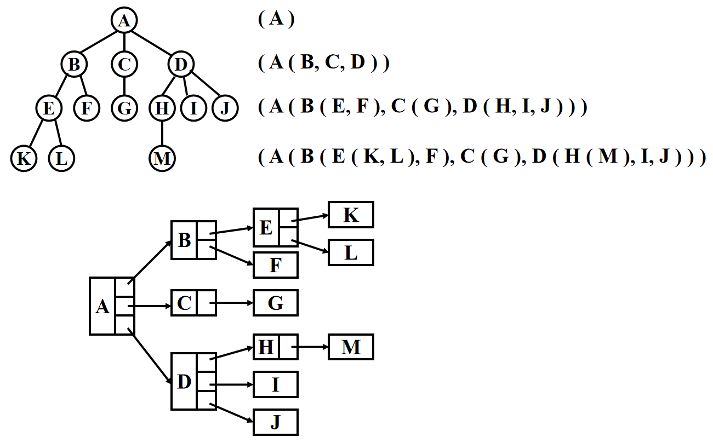
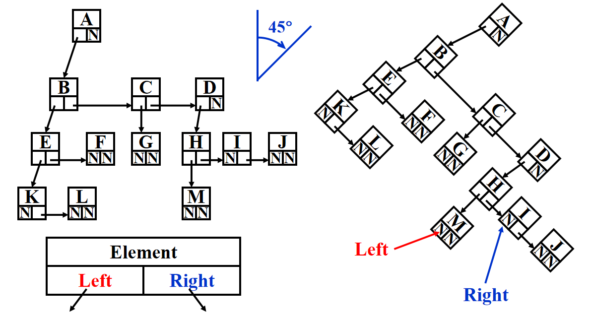
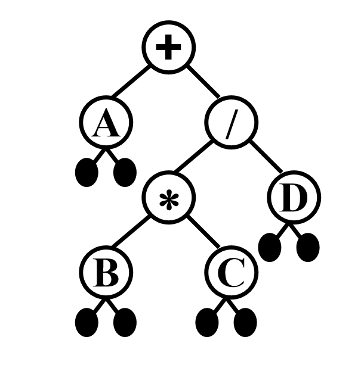

# Trees

树（Tree）是一种**非线性**的数据结构，它模拟了自然界中树的分支层次，与数组、链表这种一个接一个的线性结构不同，树中的数据元素（称为**节点**）之间存在明确的一对多的层次关系。

## 1 Preliminaries

### 1.1 Definition

树：是一组节点的集合，它可以为空，如果不为空则：

- 包含一个**根节点(root)** $\boldsymbol{r}$
- 包含 0 个或多个子树(subtrees) $T_1,\ T_2,\dots,\ T_k$，每颗子树的根节点通过以条边与 $\boldsymbol{r}$ 相连

> [!note]
>
> - 子树之间不会相互连接，即没有环
> - 如果一棵树总共有 $N$ 个节点，那么它有 $N-1$ 条边

树中的概念：

| **Concepts**             | **Meanings**                                                 |
| ------------------------ | ------------------------------------------------------------ |
| degree of node           | 一个节点所有子树的数目                                       |
| degree of tree           | $\max\limits_{\text{node}\in\text{tree}}\{\text{degree}(\text{node})\}$ |
| parent                   | 子树根节点上面连接节点                                       |
| children                 | parent 子树的根节点                                          |
| sibling                  | 有共同 parent 的 children                                    |
| leaf                     | degree of node 为 0 的节点                                   |
| path from $n_1$ to $n_k$ | 一个包含节点 $n_1,n_2,…,n_k$ **唯一**的序列，满足 $n_i$ 是 $n_{i+1}$ 的父节点 $(1\leqslant i\leqslant k)$ |
| length of path           | 路径中边的数目                                               |
| depth of $n_i$           | 从根节点到 $n_i$ 的路径长度，规定 $\text{depth(root)}=0$     |
| height of $n_i$          | 从 $n_i$ 到叶子结点的**最长**路径长度，规定 $\text{height(leaf)}=0$ |
| height (depth) of a tree | $\text{height(root) = depth(deepest leaf)}$                  |
| ancestor                 | 从该节点到根节点的路径上所有的节点                           |
| descendant               | 该节点所有子树的节点                                         |

### 1.2 Implementation

#### 1.2.1 List Implementation



缺点：每个节点的空间大小取决于它有多少个子树，这样实现比较麻烦

#### 1.2.2 FirstChild-NextSibling Representation

每个节点有两个指针，一个指向第一个 Child，另一个指向下一个 Sibling


这种表示方式方便动态调整

> [!note]
>
> 对于同一棵树，这种表示并**不唯一**，因为 Children 的顺序可以是任意的

## 2 Binary Trees

**二叉树 (binary tree)**：每个节点拥有不超过两个 Children



### 2.1 Tree Traversals

对于树的遍历一般有两种：深度优先搜索(DFS) 和广度优先搜索(BFS)

- 深度优先有：前序(Pre-order)、中序(In-order)、后序(Post-order)
- 广度优先有：层序(Level-order)

#### 2.1.1 Preorder

**逻辑：**访问根节点 -> 遍历左子树 -> 遍历右子树。**应用场景：**常用于复制一颗二叉树。

```c
void preOrder(struct Node* root) {
    if (root == NULL) return;
    
    printf("%d ", root->data);  // 1. 访问根节点
    preOrder(root->left);       // 2. 递归遍历左子树
    preOrder(root->right);      // 3. 递归遍历右子树
}
```

#### 2.1.2 Inorder

**逻辑：**遍历左子树 -> 访问根节点 -> 遍历右子树。**应用场景：**对于二叉搜索树（BST），中序遍历的结果是一个升序序列。

```c
void inOrder(struct Node* root) {
    if (root == NULL) return;
    
    inOrder(root->left);        // 1. 递归遍历左子树
    printf("%d ", root->data);  // 2. 访问根节点
    inOrder(root->right);       // 3. 递归遍历右子树
}
```

#### 2.1.3 Postorder

**逻辑：**遍历左子树 -> 遍历右子树 -> 访问根节点。**应用场景：**常用于删除树（先删子节点，再删根）或计算文件夹大小。

```c
void postOrder(struct Node* root) {
    if (root == NULL) return;
    
    postOrder(root->left);      // 1. 递归遍历左子树
    postOrder(root->right);     // 2. 递归遍历右子树
    printf("%d ", root->data);  // 3. 访问根节点
}
```

#### 2.1.4 Levelorder

**逻辑：**从树的第一层（根节点）开始，从上到下、从左到右逐层访问每一个节点。为实现层序遍历，我们需要使用到**队列(Queue)** 数据结构

- 访问根节点（或者其他节点）
- 将根节点（或其他节点）的所有 Children 从队列后入队
- 将队列第一个出队，回到第一步
- 直到队列为空

```c
void levelOrder(struct Node* root) {
    if (root == NULL) return;

    // 1. 将根节点入队
    enqueue(root);

    while (!isQueueEmpty()) {
        // 2. 出队并访问当前节点
        struct Node* current = dequeue();
        printf("%d ", current->data);

        // 3. 将左孩子入队
        if (current->left != NULL) {
            enqueue(current->left);
        }

        // 4. 将右孩子入队
        if (current->right != NULL) {
            enqueue(current->right);
        }
    }
}
```

### 2.2 Expression Trees (syntax trees)

在 [List, Stacks and Queues](.\List, Stacks and Queues.md) 里提到过，前缀和后缀表达式的计算使用栈实现，而中缀表达式则可以转化为前缀/后缀形式。这里我们会发现中缀表达式可以用树来求解。例如对于表达式
$$
A + B * C / D
$$
它的表达式树为



#### 2.2.1 Construct Expression Trees

最常用的构建表达式树的算法是，先将表达式转为**后缀性质**，从左向右扫描后缀表达式

- 遇到操作数就直接压入栈中
- 遇到运算符，就以运算符为根节点，弹出栈内的两个元素，分别作为左子树和右子树，构建一颗新的树，再将这颗树压入栈中
- 直到扫描结束，弹出栈中剩下的一颗树

<video src="./assets/expr_tree.mp4" controls width="500" />

#### 2.2.2 Calculate the Expression

计算表达式树的值是一种后序遍历的过程：

- 从根节点出发
- Base Case：遇到 Leaf，就返回该节点的数值
- 递归计算过程：
  - 计算左子树的结果 $L$
  - 计算右子树的结果 $R$
  - 根据根节点的运算符，对 $L$ 和 $R$ 进行运算
- 返回运算结果

```c
double evaluate(tree_ptr node) {
    if (node->left == NULL && node->right == NULL) {
        return (double)(node->element - '0');
    }
    
    double L = evaluate(node->left);
    double R = evaluate(node->right);
    
    switch (node->element) {
        case '+': return L + R;
        case '-': return L - R;
        case '*': return L * R;
        case '/': 
            if (R != 0) return L / R;
            else return 0; 
        default: return 0;
    }
}
```

#### 2.2.3 Tree --> Expression

从表达式树到表达式是非常容易的，只需要对树做一次遍历即可

- 前序遍历 -> 前缀表达式
- 中序遍历 -> 中缀表达式
- 后序遍历 -> 后缀表达式

代码实现：[Expression Tree](.\codes\Tree\Binary Tree\Expression_trees)

### 2.3 Threaded Binary Trees

对于一般的二叉树，它的叶子节点的左右指针指向 `NULL`，这浪费了很多空间。而**线索二叉树 (threaded binary trees)**很好地利用了闲置的节点，具体规则如下：

- 如果 `Tree->Left` 为空，将它指向**中序**遍历中的**前一个节点**
- 如果 `Tree->Right` 为空，将它指向**中序**遍历中的**后一个节点**
- 有一个**头节点**(dummy node)，使得*最左边*和*最右边*孩子分别指向这个节点的左右孩子

```c
// 结构声明
typedef struct ThreadedTreeNode *PtrTo ThreadedNode;
typedef struct PtrToThreadedNode ThreadedTree;
struct ThreadedTreeNode
{
    int LeftThread;      // if it is True, then Left
    TreadedTree Left;    // is a thread, not a child ptr
    ElementType Element;
    int RightThread;     // if it is True, then Right
    ThreadedTree Right;  // is a thread, not a child ptr
}
```


可以看到，我们从 dummy head node 出发，重复“左线索 -> 右线索 -> 左线索 -> 右线索 ……”的遍历过程，最后回到 dummy head node ，这样我们可以对整棵树进行一趟完整的中序遍历。

> [!note]
>
> 虽然这里默认使用中序遍历的定义，但我们也可以将其修改成**前序**或者**后序**遍历的版本 ( 比如对于后序遍历版的线索二叉树，某个节点空出来的左子树指向它在后序遍历中的前一个节点，空出来的右子树指向它在后序遍历中的后一个节点 )
