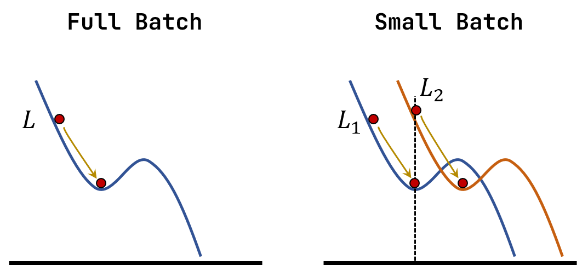
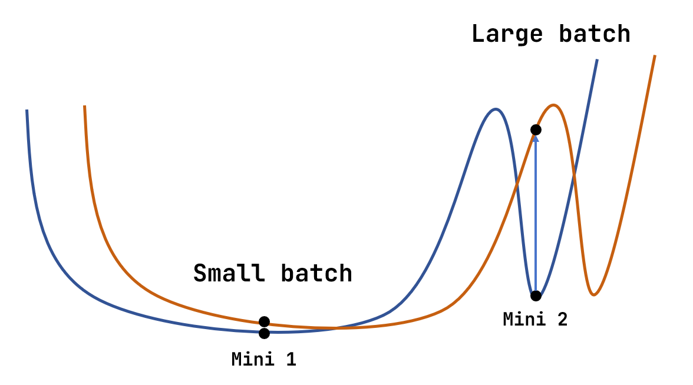
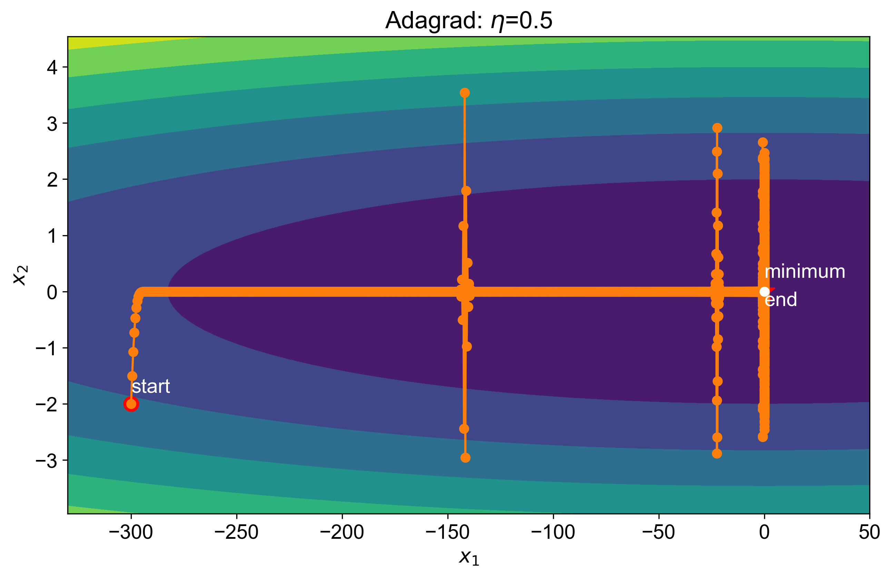
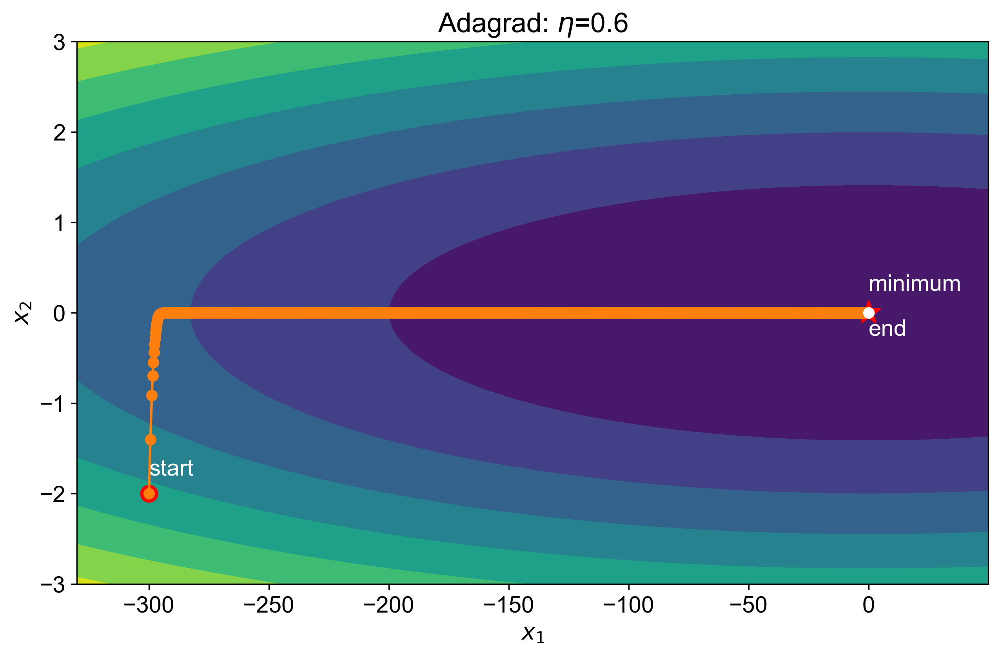

# 优化

## 1 Critical Point

在训练模型的时候，我们可能会遇到模型的损失无法进一步减小，也就是无法继续优化的情况。以梯度下降法为例，当**梯度接近 0 **的时候就会出现这种情况。从数学的角度看，梯度为 0 一般对应下面三种情况

即**局部最小值，局部最大值和鞍点**，这三种情况统称为 critical point。

> [!note]
>
> 判断三种情况的方法：将误差函数 $L(\boldsymbol{\theta})$ 在此时的参数 $\boldsymbol{\theta}'$ 处展开
> $$
> \newcommand \bm \boldsymbol
> 
> L(\bm{\theta})=L(\bm{\theta}')+(\bm{\theta}-\bm{\theta}')^{\rm{T}}\bm{g}(\bm{\theta}')+\frac{1}{2}(\bm{\theta}-\bm{\theta}')^{\rm{T}}\bm{H}(\bm{\theta}')(\bm{\theta}-\bm{\theta}')+\cdots
> $$
> 其中：$\bm{g}$ 是梯度，$\bm{H}$ 是 Hessian 矩阵
> $$
> H_{ij}=\frac{\partial ^2 L}{\partial\theta_i\partial \theta_j}
> $$
> 在 critical point 处 $\bm{g}=0$，因此
> $$
> L(\bm{\theta})-L(\bm{\theta}')\approx\frac{1}{2}(\bm{\theta}-\bm{\theta}')^{\rm{T}}\bm{H}(\bm{\theta}')(\bm{\theta}-\bm{\theta}')
> $$
> 对应三种情况：
>
> - 局部最小值：$\bm{H}$ 是正定的，即所有特征值都大于 0
> - 局部最大值：$\bm{H}$ 是负定的，即所有特征值都小于 0
> - 鞍点：$\bm{H}$ 是不定的，即特征值有正有负
>
> 对于鞍点，Hessian 矩阵还给出了继续优化的方向，即选择 $\bm{\theta}-\bm{\theta}'=c\lambda_{\text{neg}}$，其中 $c>0$，$\lambda_{\text{neg}}$ 表示 $\bm{H}$ 负的特征值对于的特征向量。

实际上，由于计算量的原因（Hessian 矩阵需要计算到二阶导数），我们在训练中一般不会计算 Hessian 矩阵。

-----

鞍点和局部最小值哪个更容易遇到？

从上面的图片可以看出，在低维度一个局部最小值的点，在高维度就可能是鞍点。而我们实际训练的模型通常有较多的参数，即处于一个高维度的参数空间，这样看来，鞍点更有可能出现。

横坐标为：Hessian 矩阵 负的特征值个数/总的特征值个数。可以看到即使我们不断的降低 Loss，也难以走到真正的局部最小值（Minimum Ratio = 1）。

## 2 Batchs

对于参数量很大的训练，我们会分批(batch)进行优化，即

下面我们讨论为什么要用 batchs 进行处理。对于两种极端的情况，一次处理所有数据和一次只处理一笔数据

- 大批量：update 的时间更长，但更稳健
- 小批量：update 的时间较短，但优化的噪声较大

实际上我们训练中使用的 GPU 有很多的 cores，可以进行大规模**并行运算**，因此对于优化的时间需要重新进行考虑：

从图中可以看到

- 一次 update 中：较大批量的时间在达到 GPU 并行运算的极限之前不会太大
- 一次 epoch 中：较小批量由于需要做多次 updates 反而时间会更长

因此小批量在优化时间上并没有优势，它实际的优势在于能确保训练模型的精度，使模型具备更好的表现。例如

这可以从两个方面来解释

1. 小批量更不容易被困住局部最小值

   
   
   - 对于大批量，如果遇到了 critical point，那么就很容易卡住不动
   - 对于小批量，每一个 batch 有不同的 Loss 曲线，某一条 Loss 走到 critical point 后，在另一条 Loss 曲线上可能仍能够优化
   
2. 小批量更可能找到平坦的局部最小值

   
   
   - 对于右侧的尖锐的一个局部最小值，它在进行测试时表现不好，因为 Loss 曲线一点点的偏移就会较大的改变。较大批次容易进入这个最小值
   - 对于较小的批次，由于它每个 batch 的 Loss 曲线都有一定的差异，不容易训练到右侧尖锐的局部最小值，而容易进入左侧平坦的最小值

**总结：**

| Propoties                           | Small batch       | Large batch          |
| ----------------------------------- | ----------------- | -------------------- |
| Speed for one update (no parallel)  | Fast              | Slow                 |
| Speed for one epoch (with parallel) | Fast              | Fast (not too large) |
| Speef for one epoch                 | Slow              | Fast                 |
| Gradient                            | Noisy             | Stable               |
| Optimization                        | Better $\bigstar$ | Worse                |
| Generalization                      | Batter $\bigstar$ | Worse                |

## 3 Better Gradient Descent

在前一章中，我们发现单纯的梯度下降法有两个缺点：

-   学习率不好选择：学习率太小则训练慢，学习率太大则严重发散
-   梯度为 0 就停止训练，容易停在局部最小值

下面给出常用的改善方法

### 3.1 Momentum

从物理的角度来理解，如果将损失函数看作某种场，SGD相当于是用加速度更新位置，但实际的物理中，应该**用速度更新位置，加速度更新速度**。因此可以在优化过程中引入动量(momentum)机制。

**带动量的梯度下降**
$$
v_{n}=\gamma v_{n-1}+(1-\gamma)\nabla_{\theta} L(\theta)\\
\theta_{n}=\theta_{n-1}-v_{n}
$$
在动量机制下，就算一开始的学习率比较小，因为速度v是加速度（梯度）的逐步累加，所以参数更新很快。同时由于小球有惯性，在梯度为 0 的点也不会立刻停下，会有一定的几率逃出局部极小值或鞍点。

-   引入中等动量，原来会发散的学习率能够正确找到最小值
-   引入过大动量，则会引入新的震荡（小球在谷底因惯性导致的左右摇摆）

一般选择较小的学习率和较大的动量，能让损失快速稳定收敛

### 3.2 Adagrad

SGD 的一个缺点是步长对各个方向都是同一个常数。这就导致在梯度大的方向更新快，梯度小的方向更新慢。引起在梯度大的方向的剧烈震荡。Adagrad 算法对更新快的方向使用小学习率，更新慢的方向使用大学习率，实现更光滑的更新。
$$
g(\theta_t) = \nabla_\theta L(\theta_t)\\{\sigma_t}^2 =\frac{1}{t}\sum_{i=1}^{t}(g_t)^2 \\\theta_{t+1} = \theta_t-\frac{\eta}{\sqrt{{\sigma_t}^2+\epsilon}}g(\theta)
$$
$\epsilon$ 则用来防止除零错误。

可以看到，引入 Adagrad 后，原来会发散的学习率也能够正确找到最小值。但是 Adagrad 算法任然存在一些问题，例如：Adagrad 在更新参数的时候会不断累积之前的梯度，那么如果在训练开始的时候，梯度就非常大的话，那么 $\sigma$ 也变得非常大，所以没走几步就走不下去了，影响训练的效果。

### 3.3 RMSProp

为了改善 Adagrad 算法的问题，RMSProp 算法中引入动态调整
$$
g(\theta) = \nabla_\theta L(\theta)\\
E = \gamma E+(1-\gamma)g^2(\theta)\\
\theta = \theta-\frac{\eta}{\sqrt{E+\epsilon}}g(\theta)
$$
通过改变 $\gamma$ 的值，可以决定当前梯度和累积梯度的权重

- $\gamma$ 大：之前累积的梯度权重更大
- $\gamma$ 小：当前的梯度权重更大

### 3.4 Adam

动量机制与适配步长是两种完全不同的思路，Adam 将两者的优点合二为一。更新公式为
$$
\theta = \theta-\frac{\hat{m}}{\sqrt{\hat{n}}+\epsilon}\\
m_t=\beta_1m_{t-1}+(1-\beta_1)g(\theta)\\
n_t=\beta_2n_{t-1}+(1-\beta_2)g^2(\theta)\\
\hat{m}=\frac{m_t}{1-{\beta_1}^t},\quad \hat{n}=\frac{n_t}{1-{\beta_2}^t}
$$
由于一开始 $m_0 = n_0 = 0$，前几步会偏小，因此 Adam 使用偏差修正 $\hat{m}$，$\hat{n}$。Adam 论文中给出默认参数

| 超参数     | 意义       | 默认值 |
| ---------- | ---------- | ------ |
| $\eta$     | 学习率     | 1e-3   |
| $\beta_1$  | 一阶矩衰减 | 0.9    |
| $\beta_2$  | 二阶矩衰减 | 0.999  |
| $\epsilon$ | 防止除零   | 1e-8   |

Adam 算法收敛效果非常好，且步长更为均匀。即使是非常大的学习率 Adam 的更新轨迹也只是围绕极小值点附近做S形环绕，而不是像其他算法一样直接发散。

减小第一个参数 $\beta_1$，会缩小极小值附近S形曲线的环绕区域，使结果更接近极小值点。

### 3.5 Learning Rate Scaling

之前的 Adagrad 算法仍可能出现一些问题，例如

优化路径在到达局部最小值之前和到达最小值之后会出现振荡，这是由于梯度在较小的地方不断积累，使得总的方均根近似为 0，从而使得学习率过大。为了改进这个方法，我们使用 Learning Rate Scaling 的方法，即让学习率不仅与梯度有关，还与时间有关：

1. **学习速率衰减**(learning rate decay)：由于随着训练的深入，模型逐渐靠近最合适的参数目标，因此学习速率会随迭代次数的增加而下降，例如
   $$
   \eta(t)=\frac{\eta}{\log(t)}
   $$
   在上面的例子中，使用该方法后

   

2. **热身**(warm up)：随着迭代次数的增加，学习速率先增后减。之所以这样设计，是因为开始时我们并不知道误差曲面的形状，我们希望模型现在初始点附近缓慢探索一段时间，之后再进行训练。
   例如：RAdam -> Adam + 热身

> [!note]
>
> 之前的所有优化方法可以总结为：
>
> 
>
> $\sigma$ 和 $\bm{m}$ 都与梯度有关，但一个是标量，一个是向量，两种的效果不会相互抵消。

