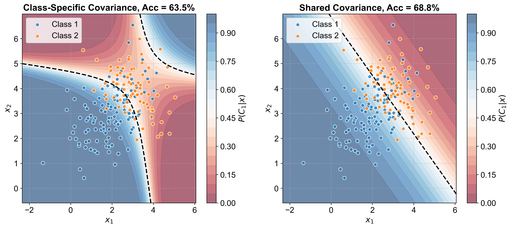

# 分类

## 1 Models

问题：有若干的已经打上标签 (class) 的数据 (training data)，我们希望从这些数据中训练出一个函数，当输入一组未知标签的数据 (feature) 时，它能够输出这组数据属于的类别

> [!note]
>
> 例如，对于一只 Pokémon，它有
>
> | ＨＰ | 攻击 | 防御 | 特攻 | 特防 | 速度 |
> | ---- | ---- | ---- | ---- | ---- | ---- |
> 
> 这样一些个体数值。我们希望能够以这些个体数值作为输入（6维向量），能够输出这只 Pokémon 对应的属性
>
> 

----

我们能否将分类问题转化为之前的**回归**问题呢？在回归问题中，$y$ 和 $\hat{y}$ 都是实数，一种直观的设想是：例如对于三个类别
$$
\newcommand \la \langle
\newcommand \ra \rangle
\newcommand \cal \mathcal
\newcommand \mr \mathrm
\newcommand \bm \boldsymbol
\newcommand \ds \displaystyle

\hat{y}=\begin{cases}
0&\text{class } 1\\
1&\text{class } 2\\
2&\text{class } 3
\end{cases}
$$
但这样假设的问题是 $\hat{y}_1$ 与 $\hat{y}_2$ 更加接近，可能意味着这两个类别更为相似，而 $\hat{y}_1$ 与 $\hat{y}_3$ 相隔更远，暗示它们更为不同。但实际上可能三种类别并没有明显的联系。

----

下面我们以两个 classes 为例，引入 Generative 和 Discriminative 两种模型

### 1.1 Generative Model

#### 1.1.1 Naive Bayes

根据 **Bayes 公式**，当我们获得一个样本 $\bm{x}$，它来自 $C_1$ 的概率为
$$
P(C_1|x)=\frac{P(x|C_1)P(C_1)}{P(x|C_1)P(C_1)+P(x|C_2)P(C_2)}
$$
其中 $P(C_1)$ 称为**先验概率(Prior)**，$P(C_1|x)$ 称为**后验概率(Posterior)**。根据 Bayes 公式，为了计算 $P(C_1|x)$，我们需要计算 $P(x|C_i)$ 和 $P(C_i)$，这种模型称为**生成式模型(Generative Model)**

> [!note]
>
> [生成式模型](https://en.wikipedia.org/wiki/Generative_model)的含义：
>
> - 生成式模型即对联合概率 $P(x,y)$ 进行建模的模型，在得到联合概率后，我们就完全掌握了数据的统计信息，之后就可以根据这个概率分布进行**采样（Sampling）**，创造符合该分布的新样本
> - 根据公式 $P(x,y)=P(x|y)P(y)$，在学习到 $P(x|C_i)$ 和 $P(C_i)$ 之后就可以得到联合概率
>   1. 以概率 $P(C_i)$ 生成某一个类别
>   2. 以概率 $P(x|C_i)$ 生成一个样本

#### 1.1.2 Prior

对于先验概率 $P(C_i)$ 的估计是直观的，如果测试集的总样本数为 $N$，两个类的样本数分别为 $N_1$ 和 $N_2$
$$
P(C_1)\approx\frac{N_1}{N},\quad P(C_2)\approx\frac{N_2}{N}
$$

#### 1.1.3 Probability from Class 

计算 $P(x|C_i)$ 不一定很容易，因为样本 $x$ 不一定出现在训练集中，这时我们就无法直接计算概率。这时候我们需要通过训练样本寻找样本的概率分布。例如：假设样本分布满足 Gaussian 分布，概率密度
$$
f_{\bm{\mu},\Sigma}(\bm{x})=\frac{1}{(2\pi)^{D/2}}\frac{1}{|\Sigma|^{1/2}}\exp\left\{-\frac{1}{2}(\bm{x}-\bm{\mu})^{\mathrm{T}}\Sigma^{-1}(\bm{x}-\bm{\mu})\right\}
$$
对于其中的参数 $\bm{\mu}$ 和 $\Sigma$ 采用极大似然估计
$$
L(\bm{\mu},\Sigma)=f_{\bm{\mu},\Sigma}(\bm{x}_1)\cdot f_{\bm{\mu},\Sigma}(\bm{x}_2)\cdots f_{\bm{\mu},\Sigma}(\bm{x}_n)
$$
估计参数为
$$
\bm{\mu}^*,\Sigma^*=\text{arg}\max\limits_{\bm{\mu,\Sigma}} L(\bm{\mu},\Sigma)
$$
对于 Gaussian 分布，有结果
$$
\bm{\mu}^*=\frac{1}{N_1}\sum_{i=1}^{N_1}\bm{x_i},\quad\Sigma^*=\frac{1}{N_1}\sum_{i=1}^{N_1}(\bm{x}_i-\bm{\mu}^*)(\bm{x}_i-\bm{\mu}^*)^{\mathrm{T}}
$$
得到样品的分布之后，计算后验概率时，可以将 $P(x|C_1)$ 替换为 $f^{1}_{\bm{\mu}^*,\Sigma^*}(x)$。在计算出后验概率后，如果 $P(C_1|x)>0.5$ 则认为这样样本属于类型 1 。

例如对于随机生成的 Gaussian 分布数据：

#### 1.1.4 Shared Sigma

当样本数较少时，上面的方法会产生较大的误差。假设我们总共有 $M$ 个类别，每一个样本是 $D$ 维度，在上面的方法中，我们总共需要估计 $\displaystyle M\times\frac{D(D+1)}{2}$ 个协方差参数，每个类别的样本可能不足以估计这么多的参数，会产生较大的误差。

为了改善这种情况，我们引入**同方差假设(Homoscedasticity)**，即假设不同的类型都具有相同的协方差矩阵，这样我们就只需要估计 $\displaystyle \frac{D(D+1)}{2}$ 个协方差参数，极大地增加了计算协方差时的有效样本量。

> [!note]
>
> 这样的改变的最直接的数学结果是：在贝叶斯分类中，当我们比较两类 $C_1$ 和 $C_2$ 的概率时
>
> - 如果不共享 $\Sigma$： 每个类别都有自己的 $\Sigma_k$，对数似然函数中会出现关于 $x$ 的二次项 $x^T \Sigma_k^{-1} x$。这会导致分类边界是一个二次曲面（抛物线、双曲线等），这种模型称为 **QDA（二次判别分析）**。
>
> - 如果共享 $\Sigma$： 在计算概率比值时，二次项 $x^T \Sigma^{-1} x$ 会在等式两边**相互抵消**。最终剩下的项只包含 $x$ 的一次方。
>
> **结论：** 共享 $\Sigma$ 使得模型的决策边界变成了一条**直线（或超平面）**。线性边界更简单，不容易过拟合，在样本量较少时表现更稳健。

此时的计算公式变为
$$
\bm{\mu}_1^*=\frac{1}{N_1}\sum_{i=1}^{N_1}\bm{x_i},\quad\Sigma^*=\frac{N_1}{N}\Sigma_1+\frac{N_2}{N}\Sigma_2
$$
对前面同样的数据，结果为

可以看到，分类的准确率确实有所提高。

在实际应用中，很多不同类别的样本确实是由相似的机制产生的，只是均值不同。例如：区分不同人的手写数字，虽然每个数字的中心位置不同，但由于都是用同一种笔、在同一种纸上书写，其特征之间的相关性（即协方差结构）往往是高度相似的。此时强制共享 $\Sigma$ 能够滤除单个类别中的随机干扰。

#### 1.1.5 Summary

三个步骤：

- Function Set (Model):
  $$
  x\Rightarrow P(C_1|x)=\frac{P(x|C_1)P(C_1)}{P(x|C_1)P(C_1)+P(x|C_2)P(C_2)},\ \text{output}\begin{cases}
  \text{Class 1}&\text{if }P(C_1|x)>0.5\\
  \text{Class 2}&\text{else}
  \end{cases}
  $$

- Goodness of a function:
  参数 $\bm{\mu}^*$ 和 $\Sigma^*$ 应使得 $L(\bm{\mu},\Sigma)$ 最大

- Find the best function: easy

### 1.2 Discriminative Model

#### 1.2.1 Deduce

对 Bayes 公式做一些变换
$$
\begin{aligned}
P(C_1|x)&=\frac{P(x|C_1)P(C_1)}{P(x|C_1)P(C_1)+P(x|C_2)P(C_2)}\\
&=\frac{1}{1+\displaystyle\frac{P(x|C_2)P(C_2)}{P(x|C_1)P(C_1)}}\\
&=\frac{1}{1+\mathrm{e}^{-z_1}}\\
&=\text{sigmoid}(z_1)
\end{aligned}
$$
其中
$$
z_1=\ln\left(\frac{P(x|C_1)P(C_1)}{P(x|C_2)P(C_2)}\right)
$$
代入 Gaussian 分布并应用同方差假设
$$
z_1=\underbrace{(\bm{\mu}_1-\bm{\mu}_2)^{\mathrm{T}}\Sigma^{-1}}_{\bm{w}^{\mathrm{T}}}\bm{x}\underbrace{-\frac{1}{2}\bm{\mu}_1^{\mathrm{T}}\Sigma^{-1}\bm{\mu}_1+\frac{1}{2}\bm{\mu}_2^{\mathrm{T}}\Sigma^{-1}\bm{\mu}_2+\ln\left(\frac{N_1}{N_2}\right)}_{b}
$$
于是上面的模型变为
$$
P(C_1|x)=\text{sigmoid}(\bm{w}^{\mathrm{T}}\bm{x}+b)
$$

#### 1.2.2 Cross Entropy Loss

令 $f^1_{\bm{w},b}(x)=P(C_1|x)$，假设我们现在有 4 个训练样本

| Sample | $x_1$ | $x_2$ | $x_3$ | $x_4$ |
| ------ | ----- | ----- | ----- | ----- |
| Class  | 1     | 1     | 2     | 1     |

如果我们令 Class 1 对应 $\hat{y}=1$，Class 2 对应 $\hat{y}=0$，则可定义极大似然函数
$$
L(\bm{w},b)=f^1_{\bm{w},b}(x_1)\cdot f^1_{\bm{w},b}(x_2)\cdot(1-f^1_{\bm{w},b}(x_3))\cdot f^1_{\bm{w},b}(x_4)
$$
取 $-\ln L$ 得到 
$$
-\ln L=-\big(\ln f^1_{\bm{w},b}(x_1)+\ln f^1_{\bm{w},b}(x_2)+\ln (1-f^1_{\bm{w},b}(x_3))+\ln f^1_{\bm{w},b}(x_4)\big)
$$
上式可以写作
$$
-\ln L=-\sum_{i}\big[\hat{y}(x_i)\ln f^1_{\bm{w},b}(x_i)+(1-\hat{y}(x_i))(1-\ln f^1_{\bm{w},b}(x_i))\big]
$$
实际上上面的公式就是二元 Bernoulli 分布的交叉熵

> [!note]
>
> 为什么不使用 MSE 作为损失函数？可以从下面两个方面来考虑
>
> 1. 考虑 sigmoid 函数在 MSE 下的梯度
>     Step 1：概率为 sigmoid 函数
> 	$$
>     f_{w,b}(x) = \sigma \left( \sum_{i} w_i x_i + b \right)
> 	$$
>
>   Step 2：训练数据： $(x^n, \hat{y}^n)$，$\hat{y}^n$: **1** 代表类别 1，**0** 代表类别 2，得到的损失函数的表达式为
> 	$$
>   L(f) = \frac{1}{2} \sum_{n} (f_{w,b}(x^n) - \hat{y}^n)^2
> 	$$
>
>   Step 3：Loss 的梯度
> $$
>   \begin{aligned} \frac{\partial (f_{w,b}(x)-\hat{y})^2}{\partial w_i} &= 2(f_{w,b}(x) - \hat{y}) \frac{\partial f_{w,b}(x)}{\partial z} \frac{\partial z}{\partial w_i} \\ &= 2(f_{w,b}(x) - \hat{y}) f_{w,b}(x) (1 - f_{w,b}(x)) x_i \end{aligned}
> $$
>   **分析：**当 $\hat{y}^n = 1$ 时：
> 
>   - 如果 $f_{w,b}(x^n) = 1$ （接近目标） $\Rightarrow \partial L / \partial w_i = 0$
>  - 如果 $f_{w,b}(x^n) = 0$ （远离目标） $\Rightarrow \partial L / \partial w_i = 0$
>  当预测值距离目标值非常远（处于 Sigmoid 函数的平点）时，其梯度（$\partial L / \partial w_i$）依然趋近于 0，这会导致模型无法通过梯度下降进行有效的参数更新。
>
> 2. 绘制 Cross Entropy 和 MSE 的误差曲面
>    
>    
>    可以看到 MSE 的误差曲面在远离 critical point 的位置非常平坦，此时模型很难通过梯度进行优化，而 Cross Entropy 则没有这个问题。

### 1.3 Comparation

| Steps        | Generative   | Discriminative      |
| ------------ | ------------ | ------------------- |
| Model        | Native Bayes | Sigmoid             |
| Loss         | MSE          | Cross Entropy       |
| Optimization | Formulas     | Logistic Regression |

## 2 Multi Classes

