# 卷积神经网络

卷积神经网络(convolutional neural network, CNN) 是一种专为影像处理设计的神经网络结构，但实际上这种结构对其他的具有图像特征的任务也很有效

## 1 Introduction

- **目标**：我们现在的目标是训练一个模型，它以一张图片作为输入，并且能够识别图像的内容（对图像内容进行分类）

  
  
- **图像表示**：对于一张彩色图像，它实际上可以由一个三维张量来表示，三个维度分别是**长度、宽度、RGB通道**。为了将这个图像输入给我们的模型，可以采用的一个方式是将三维张量“**拉直**”，变成一个一维向量

  

- 将图片用一个一维向量表示出后，就可以传入一个全连接网络中进行训练

  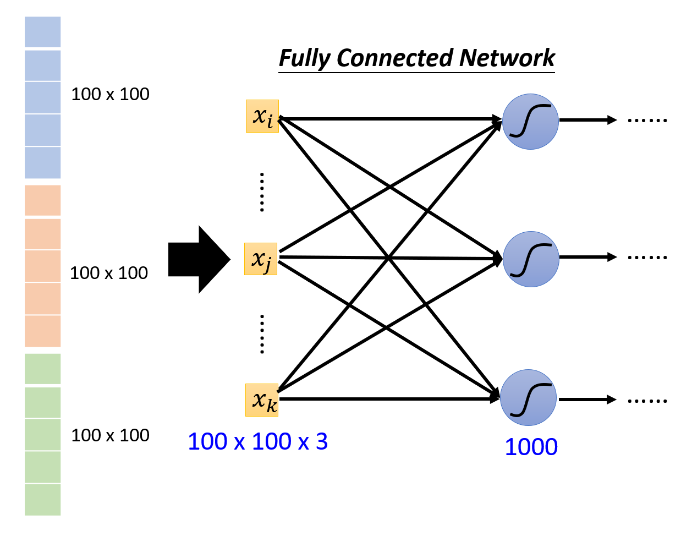

然而，按上面的步骤用全连接网络训练时，会发现需要训练的参数太多了（ $\sim 10^{7}$ ），这会导致模型非常容易过拟合到训练集上。因此我们不得不考虑，我们真的需要这么大的一个全连接网络吗？

## 2 Features of Image Recognition

下面我们通过观察图像识别任务的特征寻找简化模型的方法

### 2.1 Important Patterns

我们真的需要让每一个神经元都“看到”整张图片才能做识别吗？实际上，识别图像只需要根据一些**关键的 patterns** 就可以做到，例如当我们观察到图片上出现了鸟喙、鸟爪等图样，就可以设别出这是一只鸟

而这些关键的 pattern 远小于整张图片，因此一个 neuron 只需要看一个小区域可以，这样小区域称为**感受野(Receptive field)**

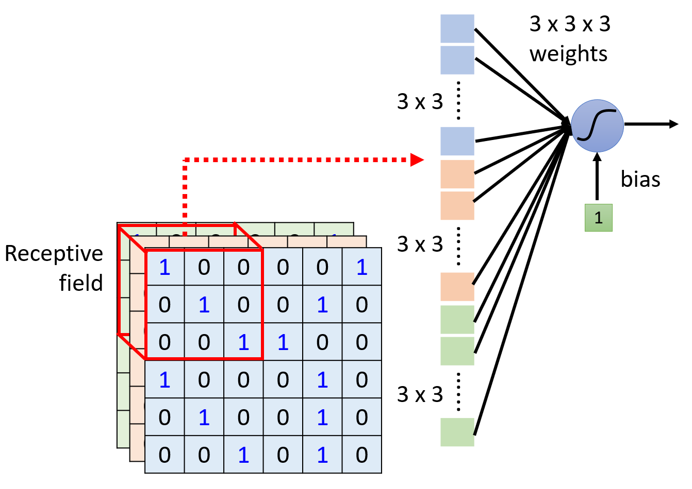

> [!note]
>
> - 不同神经元的感受野可以重叠
> - 同一个感受野可以由多个神经元守备
>   - 但由于不同神经元的权重和偏移不同，因此即使对于相同的一块区域，输出也是不一样的
>
> 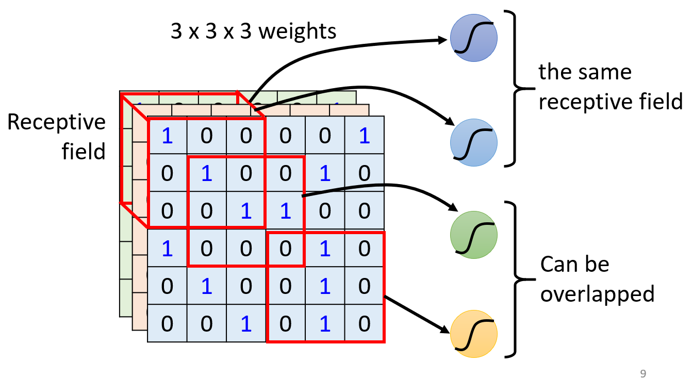

为了确保我们的模型可以检测到图片的所有区域，我们会上下移动感受野，使其覆盖整个图片，移动有确定的**步幅(stride)**。在超出边界的地方还会做 **padding**

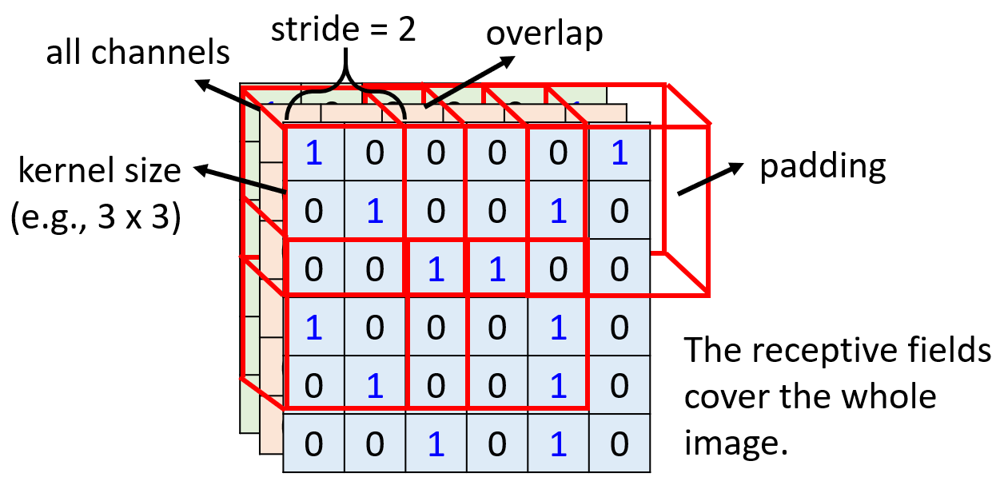

Typical Setting：

- 感受野会包括所有 channels
- kernel size 取 $3\times3$（不会太大）
- 一个 reciptive field 会有多个 neurons
- stride 取 1 或 2
- 超出图片范围 padding 0

> [!note]
>
> 一些问题：
>
> - 不同的神经元可以有不同大小的感受野吗？
>
>   可以的（而且也很常见）。比如不同的模式可能有不同的大小，因此神经元需要用不同大小的感受野来检测对应的模式。
>
> - 感受野可以仅包含部分通道吗？
>
>   可以。在其他的网络架构中会有这样的调整，但在一般的 CNN 中不会考虑。
>
> - 感受野可以不是方的（可以是矩形或其他形状）吗？一定是一块邻近的连续区域吗？
>
>   可以。根据自己对任务的理解，可以确定不同形状的感受野。

### 2.2 Same Patterns in Different Position

对于不同的图像而言，相同的 pattern 可能出现在图像的不同位置上。例如下面两图中鸟喙的位置

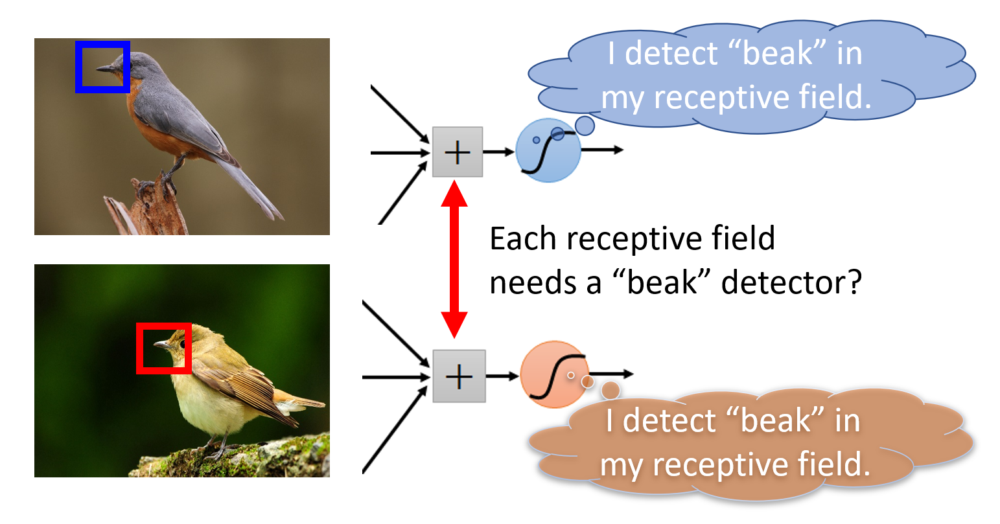

上图中在不同位置检测鸟喙的 neuron 完全可以使用相同的参数。前面提到，每一个感受野都由一组神经元守备，我们可以让这些神经元之间**共享参数**，共享的一组参数称为**滤波器(filter)**。

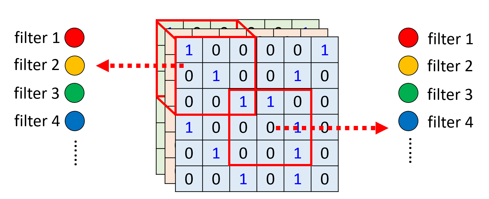

> [!note]
>
> 总结一下上面两步简化后的作用
>
> 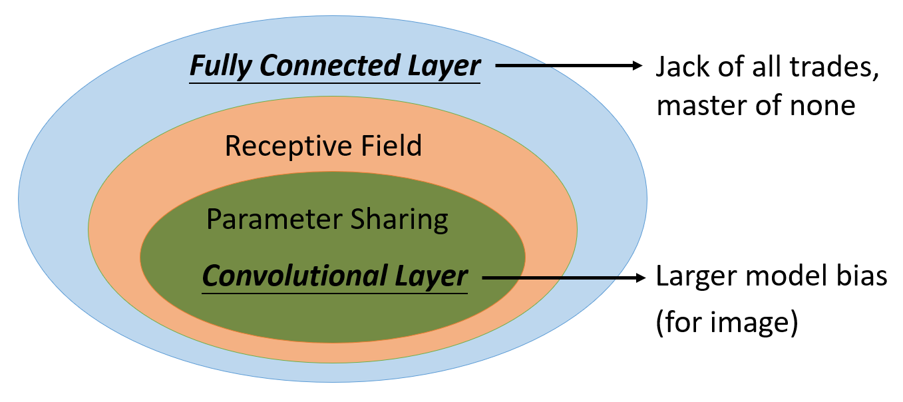
>
> - 经过这两项简化技术后，卷积层的 model bias 会变得更大，但是相比全连接层而言，它更适合用于图像处理的任务
> - 全连接层的模型偏移较小，意味着灵活性高，可以胜任各种各样的任务，但这也意味着它没有特别擅长的事

## 3 Filter

下面我们具体地讨论 filters 是如何识别出图像中重要的 patterns 的？为了简化讨论我们做如下假设：

- channel 数量为 1（黑白图像）
- 每个像素上的值只能为 1 或 0

现在考虑下面两种 filters

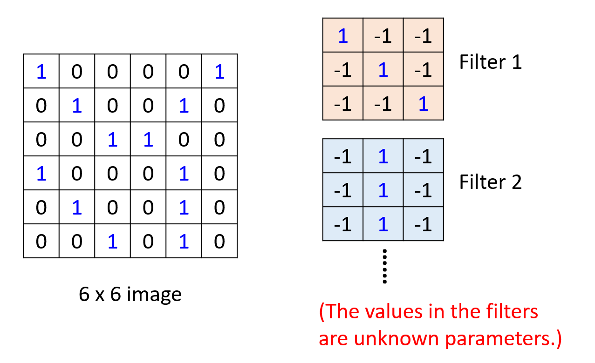

stride 取 1 进行计算（实际上卷积计算就是把 filter 的值与 receptive field 对于的值相乘再相加）

----

### Filter 1：

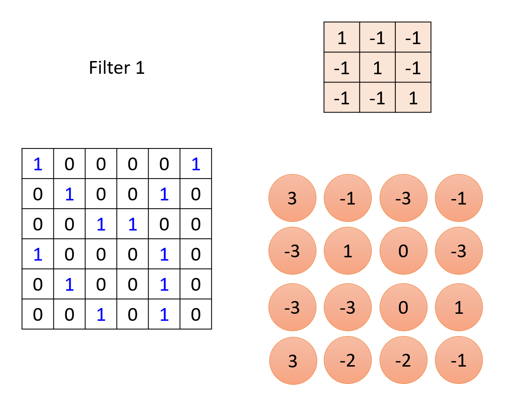

观察第 1 个滤波器的特征，发现对角线上的值都是 1，这也就意味着这个滤波器寻找的是图像上对角线均为 1 的 patterns。

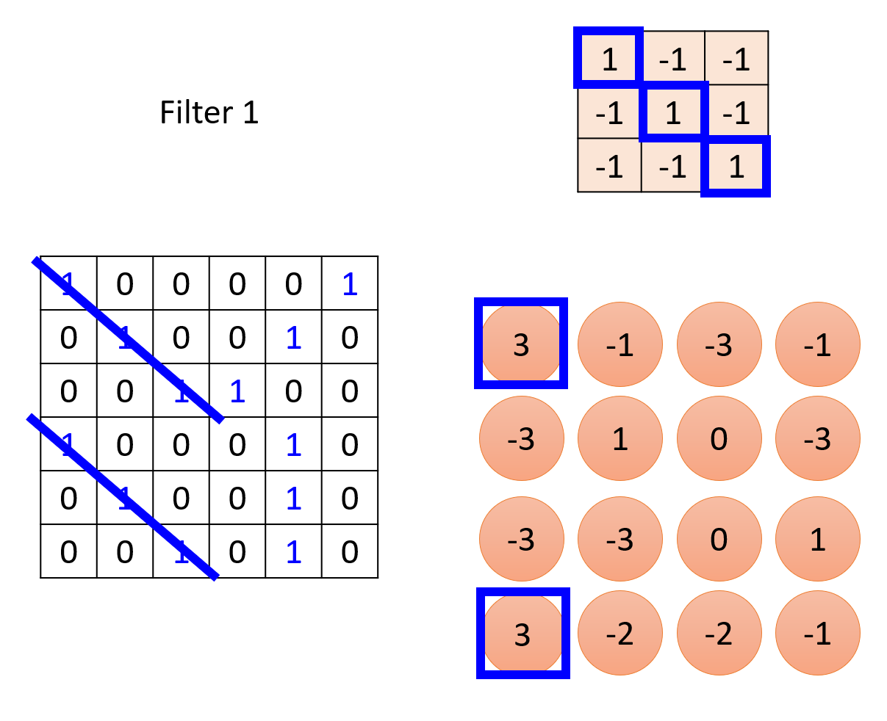

### Filter 2：

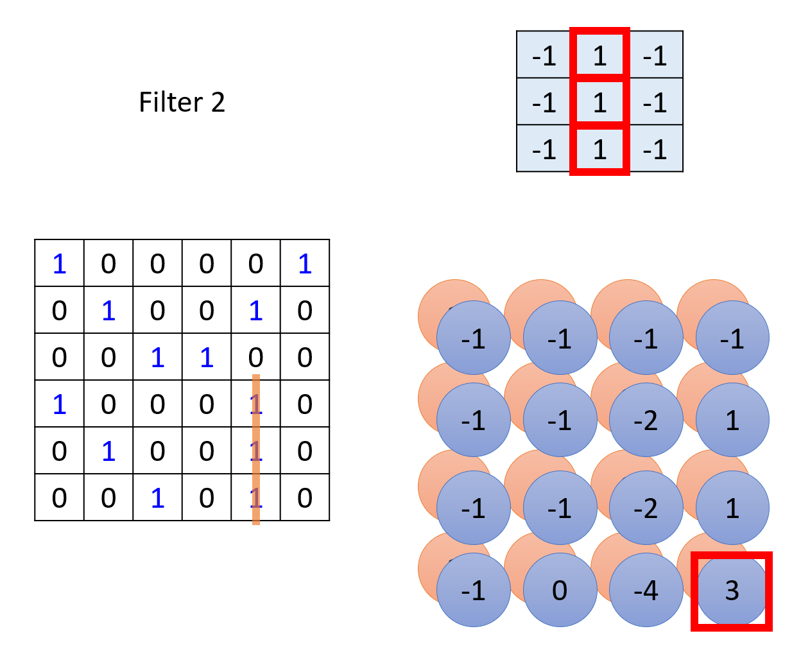

观察第 2 个滤波器的特征，发现中间列上的值都是 1，这也就意味着这个滤波器寻找的是图像上中间列均为 1 的 patterns。

----

我们将所有使用滤波器得到的结果汇总在一起，构成了一张**特征图(feature map)**，有多少个滤波器，这张特征图就有多少个通道。

实际上一个神经网络可以有多个卷积层，第一层得到的特征图可以看作一张新的“图像”，作为第二层的输入。如果第一层有 64 个 filters，最终得到 64 个 channels 的特征图，第二层的 filters 就是 3×3×64 大小的张量。

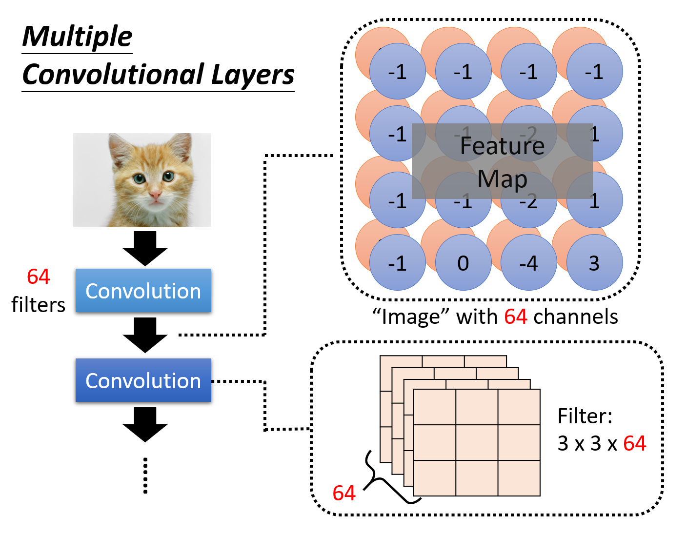

> [!note]
>
> 为什么一般使用 3x3 大小的滤波器就够了？
>
> 假设每一层的 filters 的长宽都是 3×3，在第一层得到的特征图上再应用 filter 时，实际对应于原图片上 5×5 的范围。因此随着层数的加深，一个 neuron 对原图的覆盖范围会越来越大
>
> 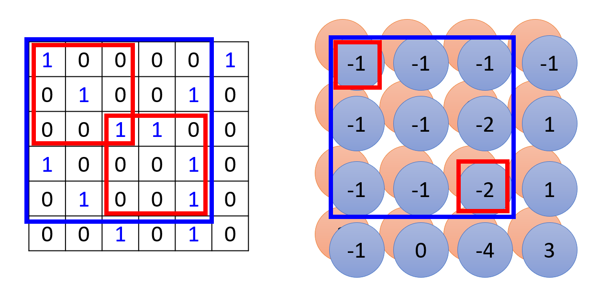

## 4 Pooling

图像识别还有一个特点，就是进行 subsampling 并不会对识别产生太大影响（重要的 patterns 不会被破坏），例如

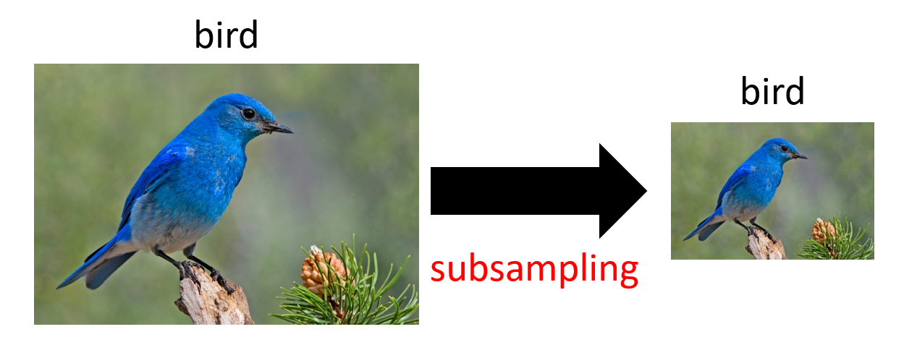

基于这个特征，我们可以引入池化(Pooling) 的概念。池化的方法有很多种，例如 MaxPooling 就是将特征图按固定大小划分为多个组，然后取每个组中的最大值。Pooling 里没有任何参数需要学习，因此它算不上一个 layer。

对于我们之前的例子

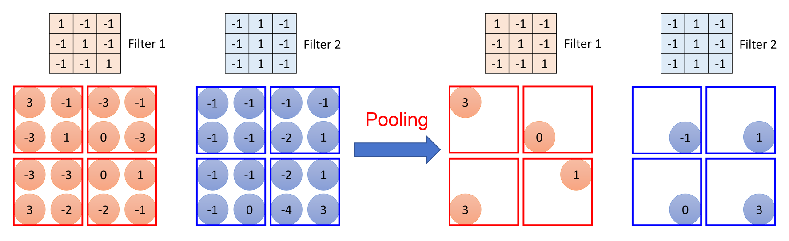

于是对整个神经网络而言，做了池化之后

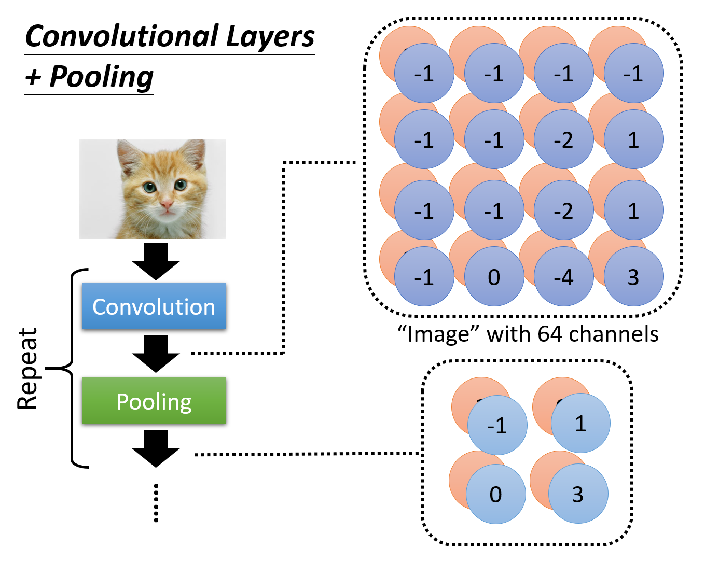

> [!note]
>
> 完整的一个 CNN 框架
>
> 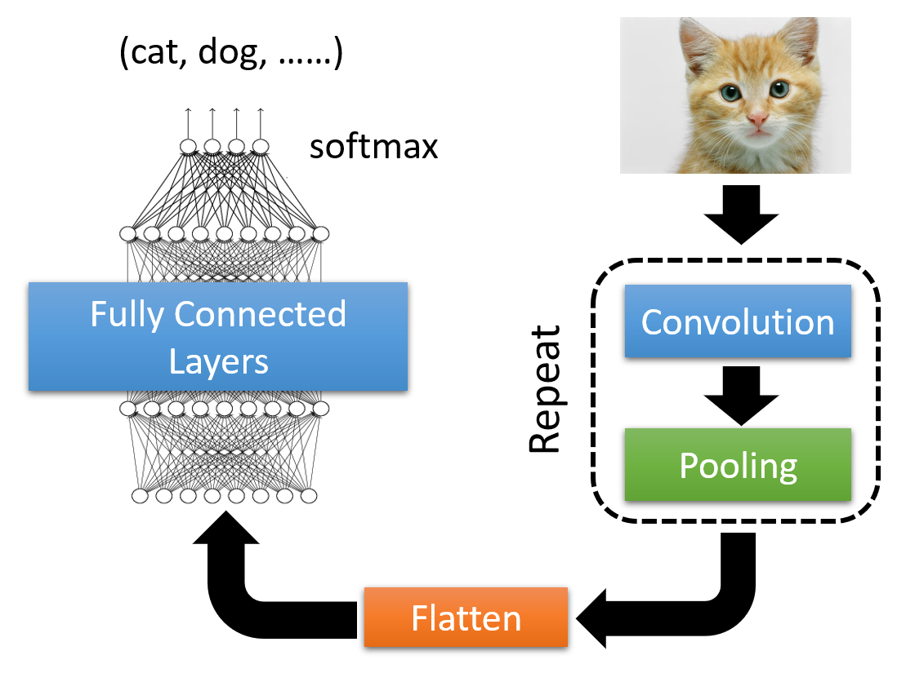

使用池化的最大原因是降低特征图的空间维度，减少计算量。但现代计算机的算力越来越强，因此有时不必使用池化操作，而且过多的池化操作有可能会破坏原图像的特征。

## 5 Application: Alpha Go

围棋问题：围棋棋盘 19×19 个格点，根据现在棋盘上的图样，输出下一步应该下子的位置

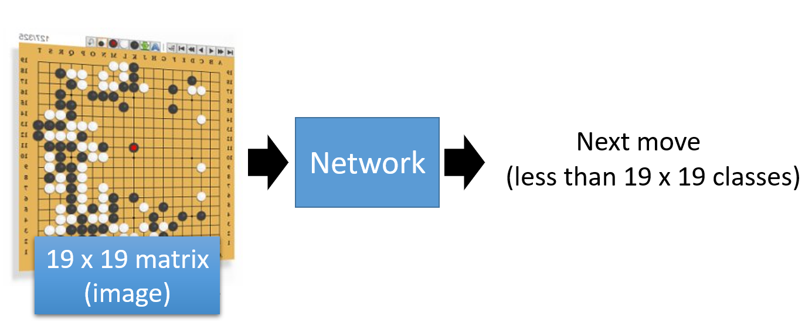

为什么 CNN 在围棋问题上有效？围棋也具有一些图像的特征：

- 整个棋盘上存在一些局部的 patterns

  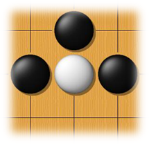
  
  Alpha Go 选择 5×5 的感受野
- 相同的 patterns 可能会出现在棋盘的不同区域上
  
  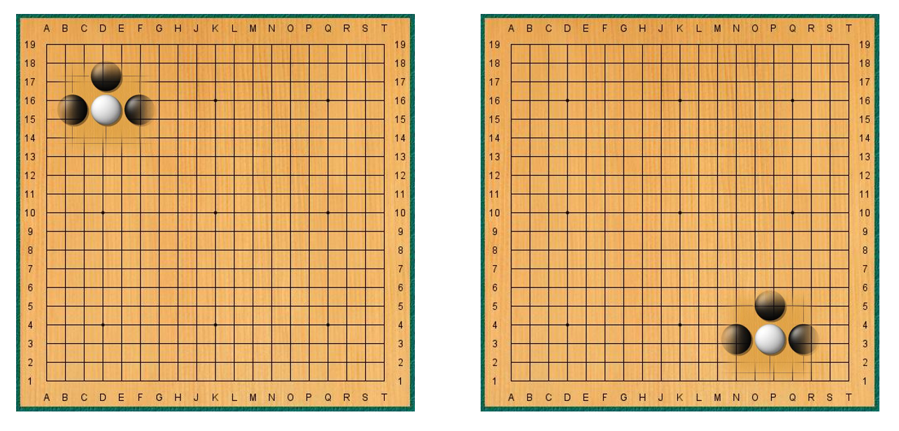
  
  

- 但显然不能在棋盘上进行 subsampling，因为随便抽走某一列或某一行，棋局就可能会发生很大的变化。因此 Alpha Go 的 CNN 并没有使用池化。

----

> [!caution]
>
> 如果对同一张图像进行缩放、旋转等操作，CNN 就无法识别出这些变换后的图像。因此需要在训练过程中使用**数据增强**(data augmentation) 的方法，将这些变换后的图像也作为训练资料喂给神经网络。
>
> 不过也有另一种方法：空间变换层 (spatial transformer layer) 能够解决这一问题。
