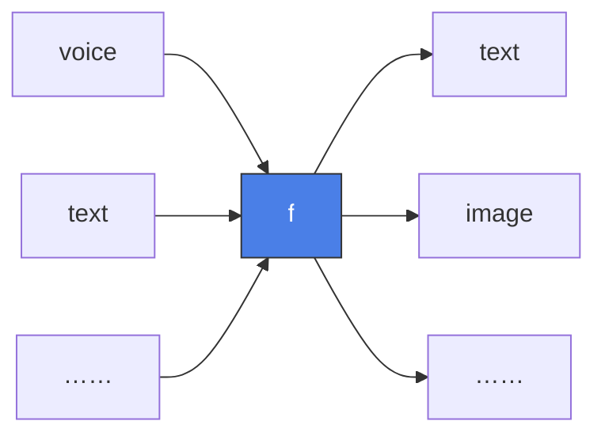
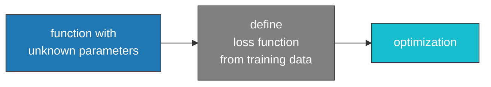

# 基础知识

## 1 Introduction

机器学习的本质是根据需要**寻找函数**，典型的函数类型有：

-   **回归**(regression)：输出一个标量的函数

    ```mermaid
    flowchart LR
        A[PM2.5 today<br/>temperature<br/>concentration of O3] --> B[f]
        B --> C[PM2.5 of tomorrow]
    
        style B fill:#4a7fe7,stroke:#333,stroke-width:1px,color:#fff
    
    ```

-   **分类**(classification)：给定一组选项（类别 (classes)），能够输出正确选项的函数

    ```mermaid
    flowchart LR
        A[An email] --> B[f]
        B --> C[Junk mail or not]
    
        style B fill:#4a7fe7,stroke:#333,stroke-width:1px,color:#fff
    ```

实际上，回归和分类只是机器学习的一小部分，它们的共同特点是输出量比较简单。对于更复杂，具有结构特征的输出，比如图像、文档等，我们把这种情况称为**结构化学习**(structured learning)。



## 2 Training

机器学习的核心：**寻找函数函数**的步骤，这些步骤称为**训练(training)**。一般训练分为三个步骤：



### 2.1 构造带有未知参数的函数

-   根据领域知识构造函数，构造的函数称为**模型(model)**

-   以简单的线性模型为例
    $$
    y=b+wx
    $$
    其中已知的 $x$ 称为**特征(feature)**，未知参数 $w$ 和 $b$ 分别称为**权重(weight)**和**偏移(bais)**

### 2.2 定义损失函数

**损失(Loss)**：关于未知参数的函数，一般写作 $L(w,b)$，用来评估模型和好坏。

-   对于一组 $(w,b)$ 的值，代入已知数据 $x$，计算出预测值 $y$；并且记真实值为 $\hat{y}$（称为**标签**(label)），那么对应的误差
    -   绝对误差：$e=|y-\hat{y}|$
    -   平方误差：$e=(y-\hat{y})^2$

-   对于总共 $N$ 个数据，一般采用误差的均值作为损失
    $$
    L=\frac{1}{N}\sum_i e_i
    $$

-   如果 $y,\hat{y}$ 是按概率分布的，那么常用[交叉熵](https://en.wikipedia.org/wiki/Cross-entropy) (cross-entropy) 计算

对于简单的模型，我们可以直接对参数做搜索，计算损失 $L$，得到一张误差曲面(error surface)


### 2.3 优化

优化(optimization)的目标是找到一组 $(w^*,b^*)$ 使得损失最小，即
$$
w^*,b^*=\arg\big(\min_{w,b} L\big)
$$

#### 2.3.1 梯度下降法

最常使用的方法是**梯度下降法(gradient descent)**。以最简单的单参数优化为例：对于函数 $L(w)$

-   寻找一个初始值 $w_0$。注意初始化过程并不随意，[参数初始化可以防止梯度消失和梯度爆炸](http://www.deeplearning.ai/ai-notes/initialization/?utm_source=email&utm_medium=newsletter&utm_campaign=BlogAINotesInTextMay082019)
-   计算梯度 $\displaystyle g(w_0)=\left.\frac{\partial L}{\partial w}\right|_{w=w_0}$
-   更新参数 $w\longleftarrow w_0+\eta g(w_0)$。其中 $\eta$ 称为学习速率(learning rate)，是一个很小的参数，事先人为确定（超参数）
-   迭代上述步骤，直到
    -   找到最小值（全局/局域）
    -   达到最大迭代次数

下面对一个简单的损失函数 $L(x)=x^2$ 上，采用不同的学习速率展示梯度下降的过程


-   学习率比较小，可以成功找到极小值点
-   学习率比较大，参数左右跳动，表现为训练、验证误差震荡
-   学习率太大，导致发散

前面我们提到对于多个极值的损失函数，梯度下降可能找到局部最小值，这不是我们期望的


现在将参数扩展为二维，考虑 $\displaystyle L(x_1,x_2)=0.1{x_1}^2+2{x_2}^2$，直接使用梯度下降法


-   学习率较小时，难以在有限步数达到最小值
-   学习率较大时，出现严重发散

可见原始的梯度下降算法(SGD)有两个缺点：

-   学习率不好选择：太小则训练慢，太大则严重发散
-   梯度为 0 就停止训练，容易停在局部最小值

#### 2.3.2 Momentum

从物理的角度来理解，如果将损失函数看作某种场，**SGD相当于是用加速度更新位置**。但实际的物理中，应该用速度更新位置，加速度更新速度。因此可以在优化过程中引入动量(momentum)机制。

**带动量的梯度下降**
$$
v_{n}=\gamma v_{n-1}+(1-\gamma)\nabla_{\theta} L(\theta)\\
\theta_{n}=\theta_{n-1}-v_{n}
$$
在动量机制下，就算一开始的学习率比较小，因为速度v是加速度（梯度）的逐步累加，所以参数更新很快。同时由于小球有惯性，在梯度为 0 的点也不会立刻停下，会有一定的几率逃出局部极小值或鞍点。


-   引入中等动量，原来会发散的学习率能够正确找到最小值
-   引入过大动量，则会引入新的震荡（小球在谷底因惯性导致的左右摇摆）

一般选择较小的学习率和较大的动量，能让损失快速稳定收敛


#### 2.3.3 RMSProp

SGD 的一个缺点是步长对各个方向都是同一个常数。这就导致在梯度大的方向更新快，梯度小的方向更新慢。引起在梯度大的方向的剧烈震荡。适配步长算法对更新快的方向使用小学习率，更新慢的方向使用大学习率，实现更光滑的更新。

**RMSProp**
$$
g(\theta) = \nabla_\theta L(\theta)\\
E = \gamma E+(1-\gamma)g^2(\theta)\\
\theta = \theta-\frac{\eta}{\sqrt{E+\epsilon}}g(\theta)
$$
其中 $E$ 是梯度平方的滑动平均，$\epsilon$ 则用来防止除零错误


#### 2.3.4 Adam

动量机制与适配步长是两种完全不同的思路，Adam 将两者的优点合二为一。更新公式为
$$
\theta = \theta-\frac{\hat{m}}{\sqrt{\hat{n}}+\epsilon}\\
m_t=\beta_1m_{t-1}+(1-\beta_1)g(\theta)\\
n_t=\beta_2n_{t-1}+(1-\beta_2)g^2(\theta)\\
\hat{m}=\frac{m_t}{1-{\beta_1}^t},\quad \hat{n}=\frac{n_t}{1-{\beta_2}^t}
$$
由于一开始 $m_0 = n_0 = 0$，前几步会偏小，因此 Adam 使用偏差修正 $\hat{m}$，$\hat{n}$。Adam 论文中给出默认参数

| 超参数     | 意义       | 默认值 |
| ---------- | ---------- | ------ |
| $\eta$     | 学习率     | 1e-3   |
| $\beta_1$  | 一阶矩衰减 | 0.9    |
| $\beta_2$  | 二阶矩衰减 | 0.999  |
| $\epsilon$ | 防止除零   | 1e-8   |


Adam 算法收敛效果非常好，且步长更为均匀。即使是非常大的学习率 Adam 的更新轨迹也只是围绕极小值点附近做S形环绕，而不是像其他算法一样直接发散。


减小第一个参数 $\beta_1$，会缩小极小值附近S形曲线的环绕区域，使结果更接近极小值点。


## 3 Activation Functions

除了简单的线性模型，我们还可以构造更为复杂的模型，例如
$$
y = b+\sum_{i}w_ix_i
$$
随着特征点的增多，损失会逐渐减小直到一个极限。这种模型都是**线性模型**(linear models)，是一类最简单的模型。

### 3.1 sigmoid

由于过于简单，线性模型存在很严重的局限性（称为**模型偏移**(model bias)），无法表征所有的情况。因此我们需要一些更灵活、更精密的模型。

一种常用的模型是 sigmoid 函数
$$
y = c\frac{1}{1+\mathrm{e}^{b+wx}} = c\cdot\text{sigmoid}(b+wx)=c\cdot\sigma(b+wx)
$$

>   [!note]
>
>   在论文 [Cybenko(1989)](https://link.springer.com/article/10.1007/BF02551274) 中给出了 sigmoid 函数完备性的证明，表述为:
>
>   对任意的连续函数 $f:[0,1]^n\rightarrow \mathbb{R}$ 和任意 $\epsilon>0$，存在一个神经网络
>   $$
>   f_\theta(x)=\sum_{i=1}^{N}\alpha_i\sigma(w^\mathrm{T}x+b)
>   $$
>   使得
>   $$
>   ||f-f_\theta||<\epsilon
>   $$
>   表明 sigmoid 线性组合可以逼近所有连续函数。

>   [!note]
>
>   **通用逼近定理（Universal Approximation Theorem）**：使用某个激活函数构成的前馈神经网络可以以任意精度逼近任意连续函数。即**存在一层隐藏层 + 足够多的神经元，就能逼近任意连续函数 f(x)。**

改变不同的 sigmoid 可以观察到


