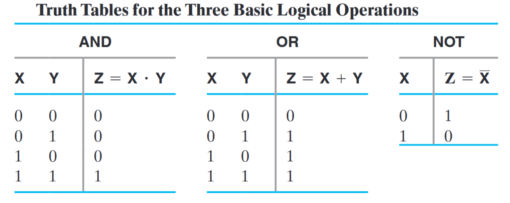
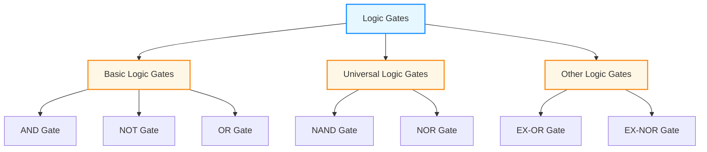
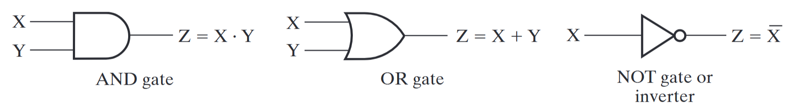
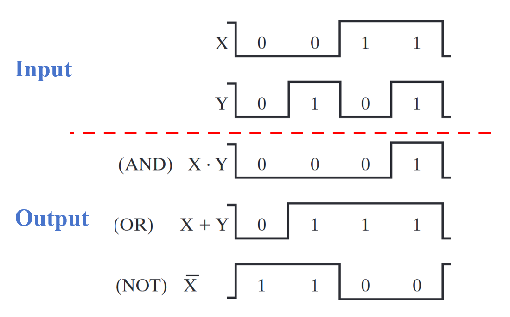
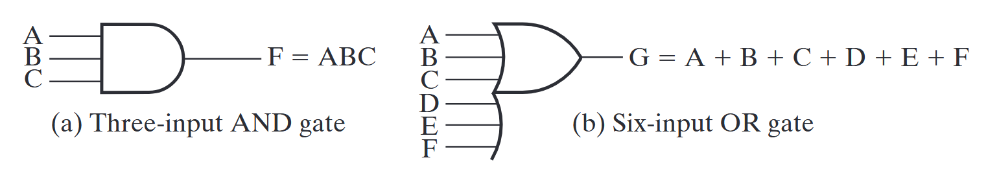
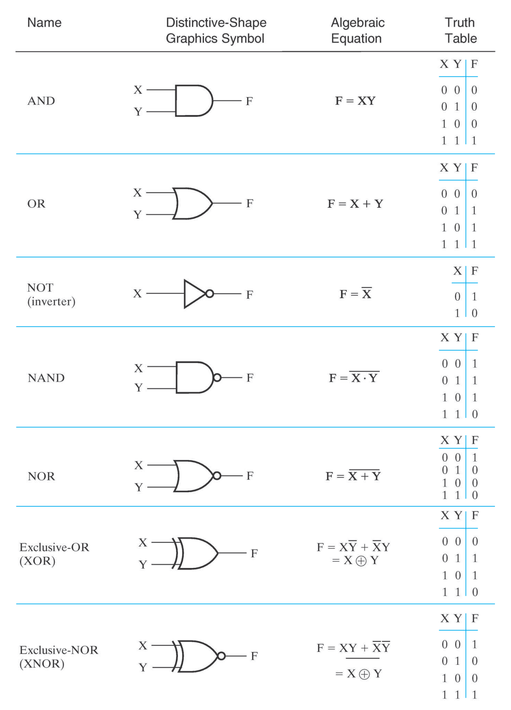
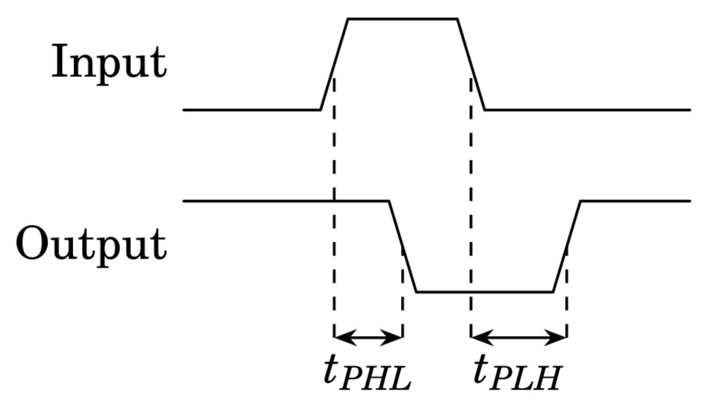

# Combinational Logic Circuit

## 1 Gate Circuit and Boolean Equations

### 1.1 Binary Logic and Gates

- 二进制变量(binary variables)：由两个值之间的一个表示，例如 True/False, On/Off, Yes/No, 1/0 ...

- 逻辑运算符(logical operators)：在二进制值和二进制变量上运算。基本的逻辑运算符包括逻辑

  - 与(AND)，记作 $A\cdot B$
  - 或(OR)，记作 $A+B$
  - 非(NOT)，记作 $\overline{A}$ ，有时也写作 $A',\ ^\neg A,\ \sim A$
- 真值表(truth tables)：一张列出函数所有可能参数与结果对于的表。例如对于上面三种基本逻辑操作

  

### 1.2 Logic Gates

逻辑门是将一个逻辑操作函数表示成一个符号的逻辑单元。一般的逻辑门类型有

上面三种基本逻辑操作的门符号是

时序图

逻辑门也有一些扩展的类型

常见逻辑门和真值表

能够实现所有可能的布尔函数的门类型被称为**通用门 (universal gate)**，这种门是*功能完全的 (functionally complete)*。上面的*与非门 (NAND)* 和*或非门 (NOR)* 便是通用门。

> [!note]
>
> 由于是物理层面的实现，所以会有一些逻辑运算层面不会出现的问题，比如 [**延时(delay)**](https://en.wikipedia.org/wiki/Propagation_delay#Electronics)
>
> 
>
> 当电路复杂度很大时，门之间的延迟会累积到可观的地步，这会决定系统的最高工作频率。
>
> - 如何设计电路
> - 如果优化电路，降低延迟

逻辑操作的表达方式有：真值表、布尔方程、逻辑图、波形图。其中**真值表和波形图是唯一的**，而布尔方程和逻辑图并不是唯一的，这为实现函数提供一定的灵活性（优化）。

### 1.3 Boolen Algebra

**代数结构(algebraic structure)** 由两个元素的集合 $B={0,1}$，以及三种运算符（与、或、非）构成。

**基本恒等方程：**

$$
\begin{array}{llclll}
1. & X + 0 = X & \quad & 2. & X \cdot 1 = X &\\
3. & X + 1 = 1 & \quad & 4. & X \cdot 0 = 0 &\\
5. & X + X = X & \quad & 6. & X \cdot X = X &\\
7. & X + \overline{X} = 1 & \quad & 8. & X \cdot \overline{X} = 0 &\\
9. & \overline{\overline{X}} = X & & & \\
\hline
10. & X + Y = Y + X & \quad & 11. & XY = YX & (\text{Commutative}) \\
12. & (X + Y) + Z = X + (Y + Z) & \quad & 13. & (XY)Z = X(YZ) & (\text{Associative}) \\
14. & X(Y + Z) = XY + XZ & \quad & 15. & X + YZ = (X + Y)(X + Z) & (\text{Distributive}) \\
16. & \overline{X + Y} = \overline{X} \cdot \overline{Y} & \quad & 17. & \overline{X \cdot Y} = \overline{X} + \overline{Y} & (\text{DeMorgan's}) \\
\end{array}
$$

从上面这些基本公式可以导出其他一些恒等式

$$
\begin{array}{ll}
1. & X + XY = X \cdot 1 + XY = X(1 + Y) = X \cdot 1 = X \\
2. & XY + X\overline{Y} = X(Y + \overline{Y}) = X \cdot 1 = X \\
3. & X + \overline{X}Y = (X + \overline{X})(X + Y) = 1 \cdot (X + Y) = X + Y \\
4. & X(X + Y) = X \cdot X + X \cdot Y = X + XY = X(1 + Y) = X \\
5. & (X + Y)(X + \overline{Y}) = X + Y\overline{Y} = X + 0 = X \\
6. & X(\overline{X} + Y) = X\overline{X} + XY = 0 + XY = XY \\
\end{array}
$$

> [!note]
>
> 对比前三个和后三个恒等式，我们再次发现，**与** 和 **或** 在逻辑上是对称的。

#### 1.3.1 Precedence

布尔运算的优先级为：

1. 括号
2. NOT
3. AND
4. OR

#### 1.3.2 Duality Rules

布尔运算的对偶(Dual) 规则为：

- AND $\Leftrightarrow$ OR 对换
- 1 $\Leftrightarrow$ 0 对换
- 变量保持不变
- 对偶应保持运算优先级不变，因此需要添加括号

如果一个表达式的对偶 = 它自身，则称它是**自对偶(self-dual)** 的。

> [!important]
>
> - $F=(A+\overline{C})\cdot B+0$ 对偶为 $(A\cdot\overline{C}+B)\cdot 1$
> - $H=A\cdot B+B\cdot C+A\cdot C$ 是自对偶的

#### 1.3.3 Complementing Functions

对于逻辑函数 $F$，取它的**反函数(inverse function) **$\overline{F}$ 的步骤为：

- AND $\Leftrightarrow$ OR 对换
- 对每一个**常变量**和**字面量**取补

> [!important]
>
> - 原函数 $F=\overline{A}B+\overline{B}C$
> - 对偶函数 $F=(\overline{A}+B)\cdot(\overline{B}+C)$
> - 反函数 $\overline{F}=(A+\overline{B})\cdot(B+\overline{C})$

#### 1.3.4 Consensus Theorem

在简化逻辑表达式的时候，**一致性定理(Consensus Theorem)** 也很有用：
$$
AB+\overline{A}C+BC=AB+\overline{A}C
$$
证明过程：
$$
\begin{aligned}
AB+\overline{A}C+BC&=AB+\overline{A}C+BC(A+\overline{A})\\
&=AB+\overline{A}C+ABC+\overline{A}BC\\
&=AB(1+C)+\overline{A}C(1+B)\\
&=AB+\overline{A}C
\end{aligned}
$$
