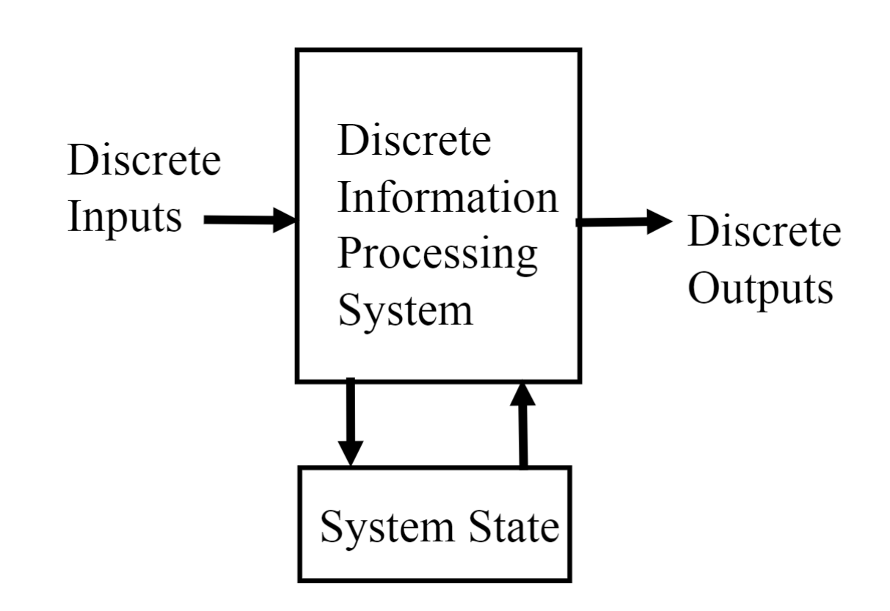
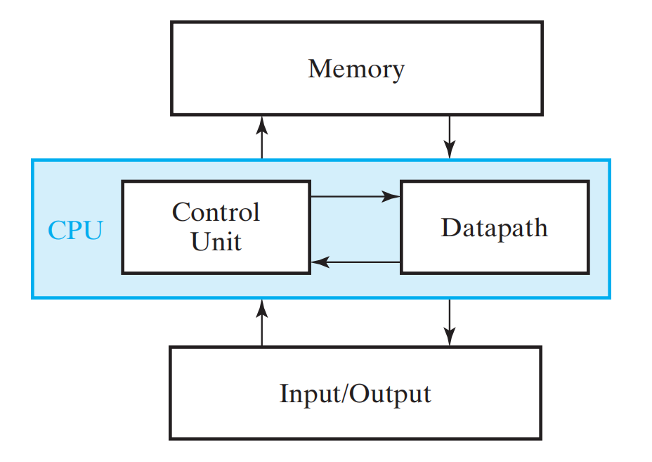
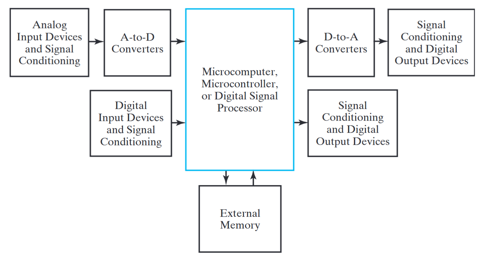
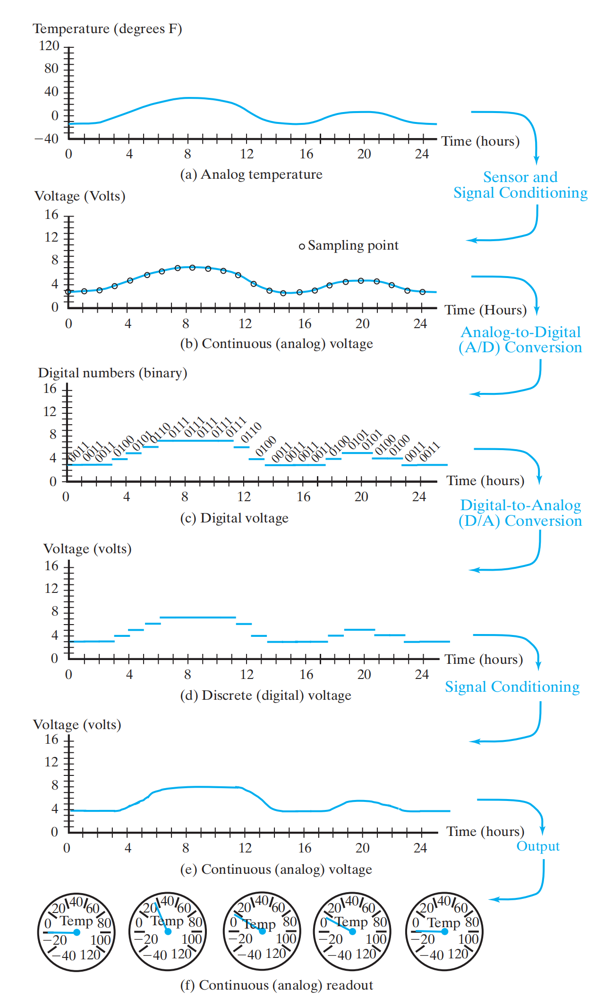
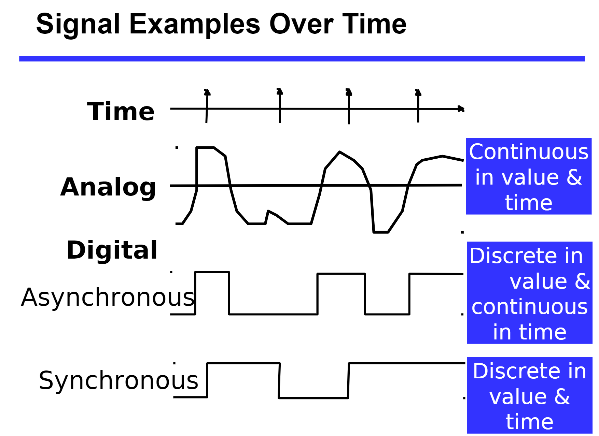
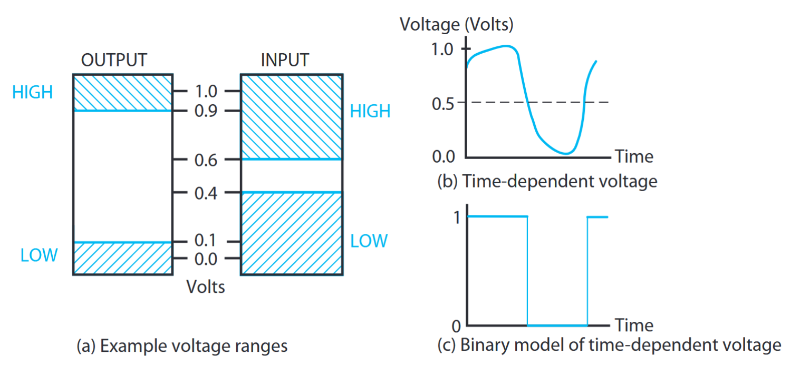
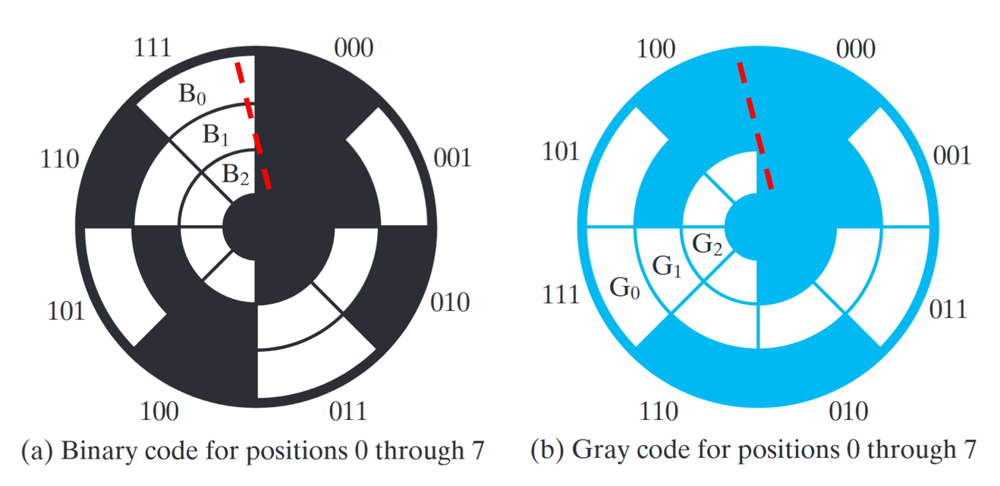
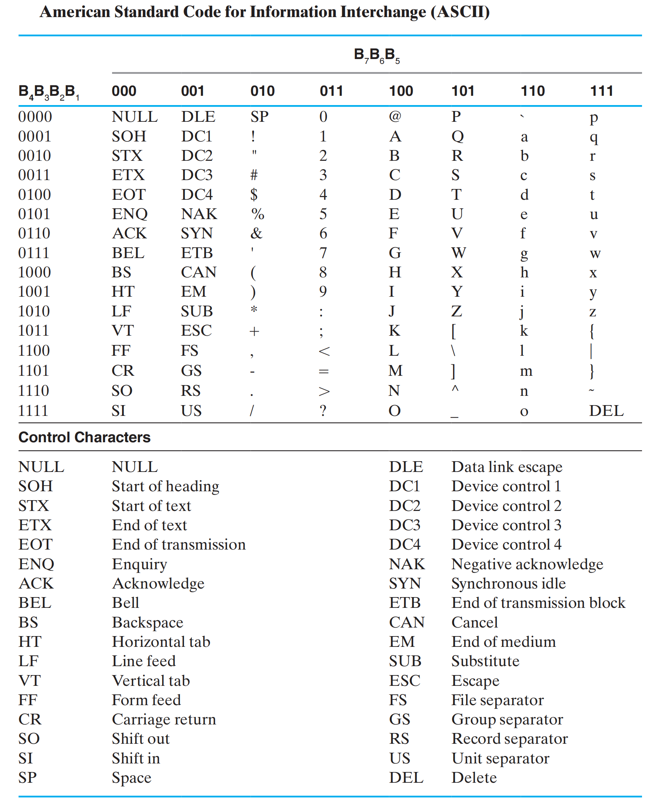

# Digital Systems and Information

## 1 Digital System

### 1.1 Types of Digital System

**数字系统**：接收一组离散信息输入和离散内部信息（系统状态），并生成一组离散信息输出

- 无内部状态：组合逻辑系统(Combinational Logic System)
  - 只有一个函数：Output=Function(Input)
- 有内部状态：时序系统(Sequential System)
  - 状态只在离散的时间更新：同步时序系统(Synchronous)
  - 状态在任意时间都可以更新：异步时序系统(Asynchronous)
  - 有两个函数：State=Function(input, state)，Output = Function(State) 或 Function(State, Input)

> [!important]
>
> Digital Computer
>
> 
>
> 计算机是一个**同步时序系统**。每个计算机有自己的**时钟频率**（也称为**主频**），它是 CPU 执行操作的最小时间单位，CPU 完成一条指令通常需要一个或多个时钟周期。

### 1.2 Embedded Systems

处理一般的计算机之外，实际上更小、通常功能较弱的单芯片计算机（称为 microcomputers 或 microcontrollers）以及专用计算机（称为 digital signal processors）在我们的生活中更为普遍。这里计算机称为嵌入式系统(Embedded systems)。

相较于一般的数字系统，嵌入式系统由于需要与真实物理世界交换，因此多了模数转换的步骤，即 ADC 和 DAC。以下面的一个温度系统为例

#### ADC

模拟信号到数字信号(Analog-to-Digita) 过程主要有两个参数要确定：

- 采样频率：即确定时域上两个采样点之间的间隔。

  > [!note]
  >
  > 根据**香农(Shannon)采样定理**：如果一个连续信号  $x( t )$ 的频谱中最高频率为 $f_{\text{max}}$ ，那么只要采样频率 $f_{\text{s}}$ 大于信号最高频率的两倍
  > $$
  > f_{\text{c}}\geqslant 2 f_{\text{max}}
  > $$
  > 采样后的离散序列就能完整地保留原始信号的所有信息，并且可以通过低通滤波器完美地还原出原始的连续信号
  
- 采样精度（量化）：将模拟信号的范围分为若干等分，得到若干个离散点，每一个采样点的值都近似到距离最近的离散点上

#### DAC

DAC 芯片接收数字信号，通过内部电阻网络或电流源，生成阶梯状的模拟电压。然而急剧变化的阶梯边缘会引起大量的高频谐波噪声，因此会使用一个低通滤波器去除这些高频成分，得到平滑的模拟信号曲线。

## 2 Information Representation

在数字系统中，**二进制 (binary)** 值是最流行的表示方法，它可以表示物理量的值或值的范围。它通常被表示为：

- 数字 0 和 1
- 符号 False(F) 和 True(T)
- 符号 Low(L) 和 High(H)
- Off 和 On

信号的分类

> [!note]
>
> 为什么使用二进制？能更好地**对抗数据传输中的干扰**
>
> 
>
> 信号在传输中会出现畸变，在上面的二进制下，有 0.3V 的噪声容限，而如果使用更高的进制，噪声容限会变小

二进制的物理表示：

- CPU：晶体管电压高低
- Disk：磁性材料的极性
- CD：Surface Pit
- Dynamic RAM：电容有无电荷
- SSD：浮栅晶体管有无电荷

## 3 Number Systems

### 3.1 Representation

对一个 $r$ 进制数，它一般表示为
$$
A_{n-1}A_{n-2}\cdots A_{1}A_{0}.A_{-1}\cdots A_{-m}, \quad 0\leqslant A_{i}<r 
$$
注："." 被称为*分隔符(radix point)*，$A_{n−1}$ 被称为**最高位(most significant digit, msd)**，$A_{-m} $ 被称为**最低位(least significant digit, lsd)**。

幂级数形式
$$
(\text{Number})_{r}=\underbrace{\left(\sum_{i=0}^{n-1}A_{i}r^i\right)}_{\text{Integer Portion}}+\underbrace{\left(\sum_{j=-m}^{-1}A_{j}r^j\right)}_{\text{Fraction Portion}}
$$

|                     |  General   | Decimal | Binary  |
| :------------------ | :--------: | :-----: | :-----: |
| **Radix (Base)**    |     $r$     |   10    |    2    |
| **Digits**          | 0 => $r - 1$ | 0 => 9  | 0 => 1  |
| **Powers of Radix** |            |         |         |
| 0                   |   $r^0$    |    1    |    1    |
| 1                   |    $r^1$     |   10    |    2    |
| 2                   |    $r^2$     |   100   |    4    |
| 3                   |    $r^3$     |  1000   |    8    |
| 4                   |    $r^4 $    | 10,000  |   16    |
| -1                  |  $  r^{-1}  $   |   0.1   |   0.5   |
| -2                  |  $  r^{-2} $    |  0.01   |  0.25   |
| -3                  |  $  r^{-3} $    |  0.001  |  0.125  |
| -4                  |  $  r^{-4} $    | 0.0001  | 0.0625  |

特殊的 2 次幂：

- 
  $2^{10}=1024$ is Kilo, denoted "K"
- $2^{20}$ is Mega, denoted "M"
- $2^{30}$ is Giga, denoted "G"
- $2^{40}$ is Tera, denoted "T"

### 3.2 Binary Arithmetic

#### 3.2.1 Single Bit Addition with Carry

两个二进制bit (X,Y) 带进位 Z 相加，得到和 S 和进位 C：
$$
\text{Carry in Z of 0}\qquad 
\begin{array}{r} \text{Z} \\ \text{X} \\ + \text{Y} \\ \hline \text{C S} \end{array} \quad
\begin{array}{c} 0 \\ 0 \\ +0 \\ \hline 00 \end{array} \quad
\begin{array}{c} 0 \\ 0 \\ +1 \\ \hline 01 \end{array} \quad
\begin{array}{c} 0 \\ 1 \\ +0 \\ \hline 01 \end{array} \quad
\begin{array}{c} 0 \\ 1 \\ +1 \\ \hline 10 \end{array}
$$

$$
\text{Carry in Z of 1}\qquad
\begin{array}{r} \text{Z} \\ \text{X} \\ + \text{Y} \\ \hline \text{C S} \end{array} \quad
\begin{array}{c} 1 \\ 0 \\ +0 \\ \hline 01 \end{array} \quad
\begin{array}{c} 1 \\ 0 \\ +1 \\ \hline 10 \end{array} \quad
\begin{array}{c} 1 \\ 1 \\ +0 \\ \hline 10 \end{array} \quad
\begin{array}{c} 1 \\ 1 \\ +1 \\ \hline 11 \end{array}
$$

#### 3.2.2 Single Bit Subtraction with Borrow

两个二进制bit (X,Y) 带借位 Z 相加，得到差 S 和借位 B：
$$
\text{Borrow in Z of 0}\qquad 
\begin{array}{r} \text{Z} \\ \text{X} \\ - \text{Y} \\ \hline \text{B S} \end{array} \quad
\begin{array}{c} 0 \\ 0 \\ -0 \\ \hline 00 \end{array} \quad
\begin{array}{c} 0 \\ 0 \\ -1 \\ \hline 11 \end{array} \quad
\begin{array}{c} 0 \\ 1 \\ -0 \\ \hline 01 \end{array} \quad
\begin{array}{c} 0 \\ 1 \\ -1 \\ \hline 00 \end{array}
$$

$$
\text{Borrow in Z of 1}\qquad 
\begin{array}{r} \text{Z} \\ \text{X} \\ - \text{Y} \\ \hline \text{B S} \end{array} \quad
\begin{array}{c} 1 \\ 0 \\ -0 \\ \hline 11 \end{array} \quad
\begin{array}{c} 1 \\ 0 \\ -1 \\ \hline 10 \end{array} \quad
\begin{array}{c} 1 \\ 1 \\ -0 \\ \hline 00 \end{array} \quad
\begin{array}{c} 1 \\ 1 \\ -1 \\ \hline 11 \end{array}
$$

#### 3.2.3 Binary Multiplication

二进制乘法非常简单
$$
0\times0=0\quad |\quad 0\times1=0\quad |\quad 1\times0=0\quad |\quad 1\times1=1 
$$

多位数相乘

$$
\begin{array}{ll@{\quad}r}
\text{Multiplicand} & & 1011 \\
\text{Multiplier} & &  \underline{\times\phantom{0}101} \\
\text{Partial Products} & & 1011 \\
& & 0000\text{-} \\
& & \underline{1011\text{--}} \\
\text{Product} & & 110111 \\
\end{array}
$$

### 3.3 Convert between Bases

- 二进制 --> 十进制：直接使用幂展开式计算
- 十进制 --> 二进制：
  - 整数部分：重复用新的基底**除**该数，并**保存余数**。该数转化为新基底的形式即为刚才所得余数的**逆序**。
  - 小数部分：重复用新的基底**乘**该数，并**保存整数部分**。该数转化为新基底的形式即为刚才所得余数的**顺序**。
  - 用分隔符（小数点）将前面的结果结合起来
  
  > [!important]
  >
  > 将 $(725.678)_{10}$ 用二进制表示
  >
  > 
  >
  > 在十进制下有限的小数在二进制下可能是无穷的，需要根据精度确定截断位数

- 八进制 (Octal) <-> 二进制：1 位八进制 <-> 3 位二进制

- 十六进制 (Hexadecimal) <-> 二进制：1 位十六进制 <-> 4 位二进制

  >  [!note]
  >
  > 二进制转八 / 十六进制的时候可能需要在二进制数里填充 0

- 八进制 <-> 十六进制：将二进制作为过渡的平台

| Decimal (base 10) | Binary (base 2) | Octal (base 8) | Hexadecimal (base 16) |
| :---------------- | :-------------- | :------------- | :-------------------- |
| 00                | 0000            | 00             | 0                     |
| 01                | 0001            | 01             | 1                     |
| 02                | 0010            | 02             | 2                     |
| 03                | 0011            | 03             | 3                     |
| 04                | 0100            | 04             | 4                     |
| 05                | 0101            | 05             | 5                     |
| 06                | 0110            | 06             | 6                     |
| 07                | 0111            | 07             | 7                     |
| 08                | 1000            | 10             | 8                     |
| 09                | 1001            | 11             | 9                     |
| 10                | 1010            | 12             | A                     |
| 11                | 1011            | 13             | B                     |
| 12                | 1100            | 14             | C                     |
| 13                | 1101            | 15             | D                     |
| 14                | 1110            | 16             | E                     |
| 15                | 1111            | 17             | F                     |

## 4 Binary Coding

信息类型：

- 数字：用来表示需要的数据范围，进行简单直接的计算（比如算术运算），与二进制数联系紧密
- 非数字：更大的灵活性（无需算术运算），不与二进制紧密联系。因此，我们可以用任意二进制的组合（被称为编码），使任意的数据得到唯一的编码。

有 $M$ 个元素需要用二进制编码，则需要 $n$ 个 bits，满足
$$
2^{n-1}<M\leqslant 2^{n}
$$

> [!note]
>
> 表示 4 个元素 可以是 (00, 01, 10, 11), 也可以是 (0001, 0010, 0100, 1000)。第二种编码方式称为**独热码**(one hot)

对 $0\sim 9$ 的十进制数字进行编码，下面是一些常见的方式

| Decimal | 8,4,2,1 | Excess3 | 8,4,-2,-1 | Gray |
| :-----: | :-----: | :-----: | :-------: | :--: |
|    0    |  0000   |  0011   |   0000    | 0000 |
|    1    |  0001   |  0100   |   0111    | 0100 |
|    2    |  0010   |  0101   |   0110    | 0101 |
|    3    |  0011   |  0110   |   0101    | 0111 |
|    4    |  0100   |  0111   |   0100    | 0110 |
|    5    |  0101   |  1000   |   1011    | 0010 |
|    6    |  0110   |  1001   |   1010    | 0011 |
|    7    |  0111   |  1010   |   1001    | 0001 |
|    8    |  1000   |  1011   |   1000    | 1001 |
|    9    |  1001   |  1100   |   1111    | 1000 |

- **8421**：Binary Code Decimal(BCD 码)，每个码都有位权
- **Excess3(余3码)**：8421 + 3 得到 Excess3 的值，编码互补
- **84-2-1**：类似 8421 码，编码互补
- **Gray code**：相邻两个码之间只有一位不同

### 4.1 BCD Code

BCD 码又称**8421 码**(8, 4, 2, 1 是权重)，即将 $0\sim 9$ 的数字按十进制到二进制进行转换，每个码都有位权。

> [!caution]
>
> 编码与进制转换不同，编码是对每一位的数字单独编码。

BCD 码主要在**需要频繁进行人机交互**以及**对十进制精确度要求极高**的场景下使用，例如

- 数字显示设备
- 金融和商业
- 实时时钟

BCD 码的简单计算：相加时超过 9 的加 6

> [!important]
> $$
> 1897_{\text{BCD}} + 2905_{\text{BCD}} = 4802_{\text{BCD}}\\
> \begin{array}{c} \\
> \begin{array}{r} \text{Carries:} \\ \text{Augend} \\ + \text{Addend} \\ \hline \text{Sum} \\ + \text{Correction} \\ \hline \text{Result} \end{array} \quad
> \begin{array}{r} 1 \\ 0001 \\ + \underline{0010} \\ 0100 \\ + \underline{0000} \\ 0100 \end{array} \quad
> \begin{array}{r} 1 \\ 1000 \\ + \underline{1001} \\ 10010 \\ + \underline{0110} \\ 1000 \end{array} \quad
> \begin{array}{r} 1 \\ 1001 \\ + \underline{0000} \\ 1010 \\ + \underline{0110} \\ 0000 \end{array} \quad
> \begin{array}{r} 0 \\ 0111 \\ + \underline{0101} \\ 1100 \\ + \underline{0110} \\ 0010 \end{array} \quad
> \begin{array}{l} \color{green}{1897_{\text{BCD}}} \\ \color{green}{2905_{\text{BCD}}} \\ \\ \color{blue}{\leftarrow \text{add 6}} \\  \end{array}
> \end{array}
> $$

### 4.2 Excess3 Code and (8, 4, -2, -1) Code

余三码(Excess3) 的核心思路是在 BCD 码的基础上，增加一个大小为 3 的偏移量。这样的好处有两个

- 十进制下能进位的两个数，在余三码下相加也刚好进位
- 十进制下能进位的两个数编码正好互补，保证了信息中 0 和 1 的平衡

(8,4,-2,-1)码改变了个码位的权重，使得编码也变成了**互补码**。

### 4.3 Gray Code

**格雷码(Gray code)** 的特殊之处在于：**相邻**的两个数只有 **1 位**的差异，这一特性使得它能够有效的**消除物理状态转换瞬间的错误**。

> [!important]
>
> Gray 码的一个经典应用场景是**旋转编码器**(Rotary Encoders)
>
> 
>
> 当转盘顺时针旋转时，由于机械误差的存在：
>
> - 对于 BCD 码，传感器输出是：000 -> 100 -> 110 -> 111。会读到错误的中间状态
> - 而 Gray 码相邻编码之间只有一位的差距，因此不会出现中间状态

**Binary code -> Gray code:**

- Gray 码的最高有效位 (MSB) 始终等于给定二进制码的最高有效位
- 输出 Gary 码的其他位通过将该索引处的二进制码位与前一个索引处的二进制码位进行异或运算得到

**Gray code -> Binary code:**

- 二进制码的最高有效位 (MSB) 始终等于给定 Gray 码的最高有效位
- 输出二进制码的其他位通过当前索引处的 Gray 码位和前一个索引的二进制码位进行异或运算得到

### 4.4 ASCII Codes

**ASCII(American Standard Code for Information Interchange)** 字符码：用 7 位表示字符数据，包括：

- 94 个图形打印字符

- 34 个非打印字符：分为 3 类

  - 格式控制字符 (format effector)

  - 信息分隔字符 (information separators)

  - 通信控制字符 (communication control characters)

ASCII 码的第 8 位（最高位）用来表示**奇偶 (parity) 校验码**

一些特别的位置

- 字符 0-9 的十六进制值对应十六进制的 $(30)_{16}−(39)_{16}$
- 大写字母 A-Z 对应 $(41)_{16}−(5A)_{16}$
- 小写字母 a-z 对应 $(61)_{16}−(7A)_{16}$

### 4.5 Unicode

随着不同语言的符号加入，简单的 ASCII 码已经远不足以表示了，现在最常用的编码是 [Unicode](https://en.wikipedia.org/wiki/Unicode)

> [!note]
>
> 对于只需要 7 个 bits 就足以表示的西文字符，如果全部采用 Unicode 编码则会造成内存浪费。对于这种情况可以使用**变长编码**，例如 [UTF-8(8-bit Unicode Transformation Format)](https://en.wikipedia.org/wiki/UTF-8)

