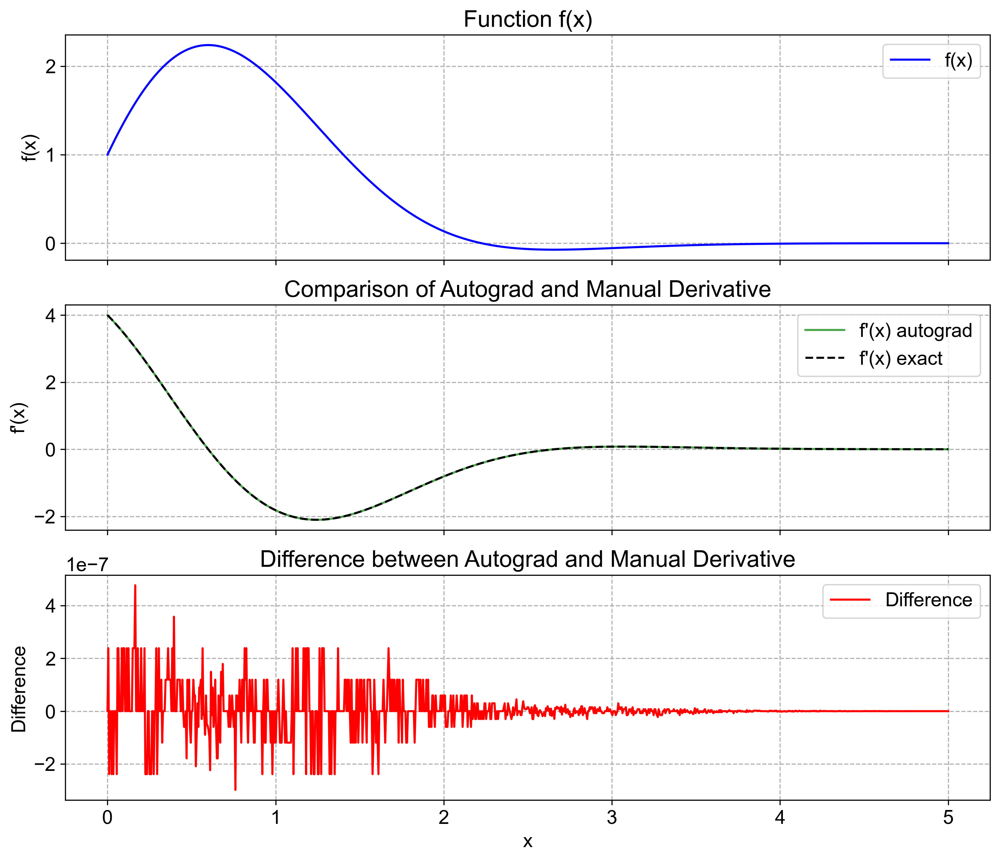

# 计算机的微分

## 1. 有限差分近似

有限差分近似的核心是 Taylor 展开
$$
f(x+h)=f(x)+f'(x)h+\frac{1}{2}f''(x)h^2+\frac{1}{6}f^{(3)}(x)h^3+\cdots
$$
最直观的公式
$$
f'(x)=\frac{f(x+h)-f(x)}{h}+O(h^2)
$$
当然也可采用中心差分的公式
$$
f(x-h)=f(x)-f'(x)h+\frac{1}{2}f''(x)h^2-\frac{1}{6}f^{(3)}(x)h^3+\cdots
$$

$$
\Rightarrow f'(x)=\frac{f(x+h)-f(x-h)}{2h}+O(h^2)
$$

为了得到更高的精度，我们则需要利用更多的数据点
$$
\begin{align}
f(x+2h)&=f(x)+2f'(x)h+2f''(x)h^2+\frac{4}{3}f^{(3)}(x)h^3+\cdots\\
f(x-2h)&=f(x)-2f'(x)h+2f''(x)h^2-\frac{4}{3}f^{(3)}(x)h^3+\cdots
\end{align}
$$
联立(1)(3)(5)(6)式，消去 $f^{(3)}(x)$，得到
$$
f'(x)=\frac{8f(x+h)-f(x+2h)-8f(x-h)+f(x-2h)}{12h}+O(h^4)
$$
在边界处的形式需要根据展开式进行修改

> [!caution]
>
> 注意，并不是 $h$ 越小精度越高。以中心差分为例
> $$
> f'(x)=\frac{f(x+h)-f(x-h)}{2h}+O(h^2)
> $$
> 当 $h$ 很小时，分母上为两个相近的数之差，在数值计算中应当避免这种情况的出现

## 2 自动微分

自动微分（Automatic Differentiation, 简称 AD 或 AutoDiff）是现代深度学习框架（如 PyTorch, TensorFlow, JAX）的基石。自动微分的核心思想是：将复杂的数学运算分解为一系列简单的基本运算（加减乘除、三角函数等），并通过链式法则（Chain Rule）精确地计算导数。

三种微分方法的比较：

|方法|精度|计算复杂度|优点|缺点|
|----|----|----|----|----|
|数值微分|受限于步长选择|低|实现简单|精度有限，易受舍入误差影响|
|符号微分|精确|高|提供解析表达式|计算复杂度高，可能出现表达式膨胀|
|自动微分|精确|适中|高效计算导数，适用于复杂函数|需要构建计算图，初始实现复杂|

自动微分主要有两种模式：前向模式（Forward Mode）和反向模式（Reverse Mode）。前向模式适用于输入变量较少的情况，而反向模式则更适合于输出变量较少的情况，这也是深度学习中常用的反向传播算法的基础。

### 2.1 前向模式

前向模式与程序中的计算顺序一致，在计算每个中间变量的值时，同时计算其导数。

 - **原理**：在计算某个中间变量 $v_i$ 时，同时计算该变量对某个输入变量 $x_j$ 的导数。
 - 设计方法：对偶数（Dual Numbers），对每一个变量 $v_i$，程序同时维护一个二元组 $(v_i, \dot{v}_i)$，其中 $\dot{v}_i=\displaystyle\frac{\partial v_i}{\partial x_j}$。 

我们以下面一个函数计算为例
$$
y = (x_1 + x_2) *  x_3
$$
假设我们想计算导数 $\displaystyle\frac{\partial y}{\partial x_1}$，则设置种子为 $\dot{x}_1 = 1, \dot{x}_2 = 0, \dot{x}_3 = 0$，计算过程如下：
1. 计算中间变量 $v_1 = x_1 + x_2$，同时计算 $\dot{v}_1 = \dot{x}_1 + \dot{x}_2 = 1 + 0 = 1$。
2. 计算输出变量 $y = v_1 * x_3$，同时计算 $\dot{y} = \dot{v}_1 * x_3 + v_1 * \dot{x}_3 = 1 * x_3 + v_1 * 0 = x_3$。

最终结果为 $\displaystyle\frac{\partial y}{\partial x_1} = \dot{y} = x_3$。如果需要计算 $y$ 对其他输入变量的导数，则需要重新设置种子并重复计算过程。因此，前向模式在输入变量较少时效率较高。

如果输入变量维度为 $n$，输出变量维度为 $m$，函数计算步数为 $C$ ，则前向模式的计算复杂度为 $O(nC)$。

### 2.2 反向模式

反向模式的计算方向与函数求值相反。

- **原理**：先进行一次前向传播计算并缓存所有中间变量的值，然后从输出节点开始，利用链式法则向后传播“伴随变量”（Adjoint）。
- 设计方法：对每一个变量维护一个二元组 $(v_i, \overline{v}_i)$，其中 $\displaystyle\overline{v}_i=\frac{\partial y}{\partial v_i}$

同样以之前的函数为例，计算流程为：

1. 先进行一次前向传播计算，保存所有中间变量和结果 $v_1=x_1+x_2,\ y=v_1\cdot x_3$
2. 设置种子 $\displaystyle\overline{y}=\frac{\partial y}{\partial y}=1$
3. 反向传播：

    $y=v_1\cdot x_3\Rightarrow \overline{v}_1=x_3,\overline{x}_3=v_1$

    $v_1=x_1+x_2\Rightarrow \overline{x}_1=\overline{v}_1,\overline{x}_2=\overline{v}_1$

如果有多个输出变量，则对每个输出变量都需要做反向传播。并且由于需要储存所有中间变量的值，内存开销大。

| 特性        | 前向模式 (Forward Mode)                                 | 后向模式 (Reverse Mode)                                  |
| ---------------- | ------------------------------------------------------------ | ------------------------------------------------------------ |
| 计算方向    | 输入 $\to$ 输出                                              | 输出 $\to$ 输入                                              |
| 主要计算     | 雅可比向量积 (Jacobian-Vector Product, JVP)                  | 向量雅可比积 (Vector-Jacobian Product, VJP)                  |
| 适用场景     | 输入少，输出多 (如 $f: \mathbb{R} \to \mathbb{R}^{100}$) | 输入多，输出少 (如 $f: \mathbb{R}^{100万} \to \mathbb{R}$) |
| 深度学习应用 | 较少使用（用于某些特定优化或二阶导）                         | 核心算法 (Backpropagation)                               |
| 内存占用     | 低 (不需要存中间值)                                          | 高 (需要存前向图的中间值)                                    |

### 2.3 PyTorch 中的自动微分

PyTorch 提供了强大的自动微分功能，通过操作符重载实现，通常也称为“动态计算图”（Dynamic Computational Graph）。

#### 2.3.1 标量函数导数

下面是自动微分的最简单示例，计算标量函数的导数：
$$
f(x) = (-2x^2 + 4x + 1)\mathrm{e}^{-x^2/2}\\
f'(x) = (-4x + 4 - x(-2x^2 + 4x + 1)) \mathrm{e}^{-x^2/2}
$$

```python
import torch as th
import matplotlib.pyplot as plt


def f(x):
    return (-2*x**2 + 4*x + 1) * th.exp(-0.5*x**2)


x = th.linspace(0, 5, 1000, requires_grad=True)
y = f(x)
dydx = th.autograd.grad(
    y, 
    x, 
    grad_outputs=th.ones_like(y), 
    create_graph=True
)[0]
```


可以看到自动微分具有很高的精度。

#### 2.3.2 Jacobian 矩阵

定义：若 $f: \mathbb{R}^n \to \mathbb{R}^m$，则雅可比矩阵（Jacobian Matrix）定义为
$$
J = \left\{\frac{\partial y_i}{\partial x_j}\right\}
$$

Jacobian 矩阵在科学计算和机器学习中有广泛应用，例如在优化问题中用于描述函数的局部线性近似。自动微分可以高效地计算雅可比矩阵，尤其是在反向模式下。

```python
import torch as th
from torch.autograd.functional import jacobian


def f(x):
    return th.stack([x[0]**2 + x[1], x[1]*x[2]])
    # stack 不会中断计算图


x = th.tensor([1.0, 2.0, 3.0], requires_grad=True)  # n=3

J = jacobian(f, x)
print("Jacobian shape:", J.shape)  # (2,3)
print(J)
```

结果为
```python
Jacobian shape: torch.Size([2, 3])
tensor([[2., 1., 0.],
        [0., 3., 2.]])
```

> [!note]
>
> PyTorch 的自动微分功能还有更多用处，在之后遇到具体问题时还会使用到