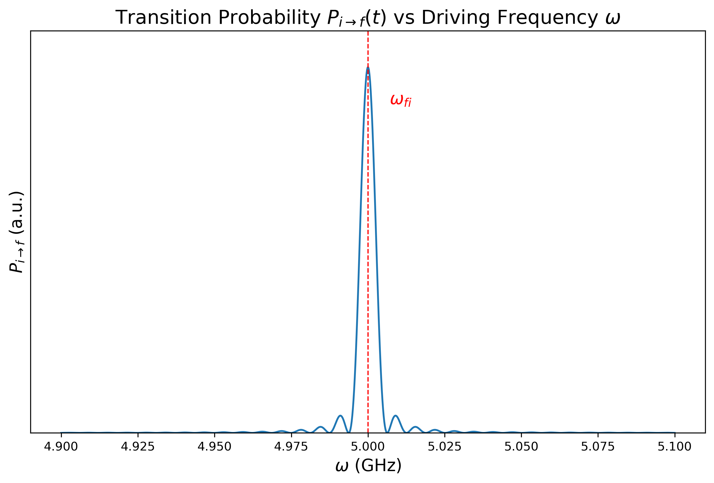

# 含时微扰理论

## 1 问题梗概

考虑哈密顿算符为 $H_0$ 的系统的本征方程
$$
\newcommand \la \langle
\newcommand \ra \rangle
\newcommand \cal \mathcal
\newcommand \mr \mathrm
\newcommand \bm \boldsymbol
\newcommand \ds \displaystyle

H_0|\varphi_n\ra=E_n|\varphi_n\ra
$$
简单起见，假设 $H_0$ 的谱是离散的，且没有简并。在 $t=0$ 的时刻，加入微扰
$$
H=H_0+W(t)=H_0+\lambda \hat{W}(t)
$$
加入微扰后，系统的演化方程变为
$$
\mr{i}\hbar\frac{\partial}{\partial t}|\psi(t)\ra=\big[H_0+\lambda\hat{W}(t)\big]|\psi(t)\ra
$$
我们想要解决的问题是：系统在 $t=0$ 的时刻处于 $|\varphi_i\ra$ 态，求在 $t$ 时刻，系统处于 $H_0$ 的本征矢 $|\varphi_f\ra$ 的概率，即
$$
P_{if}(t)=|\la\varphi_f|\psi(t)\ra|^2
$$
一般来说，这个问题难以直接求解，但如果 $\lambda$ 充分小，那么我们可以使用幂次展开的方法近似求解。

## 2 Schrodinger 方程的近似解

### 2.1 $\{|\varphi_n\ra\}$ 表象下的薛定谔方程

在 $\{|\varphi_n\ra\}$ 表象下，态 $|\psi(t)\ra$ 可以展开为
$$
|\psi(t)\ra=\sum_{n}c_n(t)|\varphi_n\ra
$$
代入 Schrodinger 方程中并利用 $H_0$ 的本征方程得到系数的微分方程
$$
\mr{i}\hbar\frac{\mr{d}}{\mr{d}t}c_n(t)=E_nc_n(t)+\sum_{k}\lambda\hat{W}_{nk}(t)c_k(t)
$$
可以看到，微扰使得不同本征态的系数之间相互耦合。在微扰项为零时，上面的方程的解非常简单
$$
c_n(t)=b_n\mr{e}^{-\mr{i}E_nt/\hbar}
$$
其中 $b_n$ 是一个常数。当存在微扰但 $\lambda\ll 1$ 时，方程的解应与上面的结果非常接近，因此可以考虑函数变换
$$
c_n(t)=b_n(t)\mr{e}^{-\mr{i}E_nt/\hbar}
$$
$b_n(t)$ 是关于时间的缓变函数。将这个表达式代入微分方程中，并令
$$
\omega_{nk}=\frac{E_n-E_k}{\hbar}
$$
可以得到 $b_n(t)$ 的微分方程
$$
\mr{i}\hbar\frac{\mr{d}}{\mr{d}t}b_n(t)=\lambda\sum_{k}\mr{e}^{\mr{i}\omega_{nk}t}\hat{W}_{nk}(t)b_k(t)
$$

### 2.2 微扰方程

在 $\lambda$ 充分小的情况下，我们可以猜测 $b_n(t)$ 可以展开为 $\lambda$ 的幂级数形式
$$
b_n(t)=b_n^{(0)}(t)+\lambda b_n^{(1)}(t)+\lambda^2 b_n^{(2)}(t)+\cdots
$$
将展开式代入上面的方程中

1. 对于 $r=0$
   $$
   \mr{i}\hbar\frac{\mr{d}}{\mr{d}t}b_n^{(0)}(t)=0
   $$
   零阶项是一个常数，由 $t=0$ 时的初始态确定

2. 对于 $r\neq0$
   $$
   \mr{i}\hbar\frac{\mr{d}}{\mr{d}t}b_n^{(r)}(t)=\sum_{k}\mr{e}^{i\omega_{nk}t}\hat{W}_{nk}(t)b_n^{(r-1)}(t)
   $$
   在求出 $b_n^{(r-1)}(t)$ 之后，便可不断递推得到后面任意阶的解 

### 2.3 一阶结果

1. **体系在 $t$ 时刻的态**：假设系统在 $t=0$ 时处于 $H_0$ 的本征态 $|\varphi_i\ra$
   $$
   \begin{aligned}
   b_n^{(0)}(t=0)&=\delta_{ni}\\
   b_n^{(r)}(t=0)&=0\ \text{for } r\geqslant1
   \end{aligned}
   $$
   当 $\lambda=0$ 的时候应该始终保持在这个定态。因此
   $$
   b_n^{(0)}(t)=\delta_{ni}
   $$
   将上面的条件代入 $r=1$ 的方程
   $$
   \mr{i}\hbar\frac{\mr{d}}{\mr{d}t}b_n^{(1)}(t)=\sum_{k}\mr{e}^{i\omega_{nk}t}\hat{W}_{nk}(t)\delta_{ni}=\mr{e}^{i\omega_{ni}t}\hat{W}_{ni}(t)
   $$
   利用初始条件
   $$
   b_n^{(1)}(t)=\frac{1}{\mr{i}\hbar}\int_{0}^{t}\mr{e}^{i\omega_{ni}\tau}\hat{W}_{ni}(\tau)\ \mr{d}\tau
   $$

2. **跃迁概率**：根据前面的定义
   $$
   P_{if}(t)=|b_{f}(t)|^2
   $$
   其中 
   $$
   b_f(t)=b_f^{(0)}(t)+\lambda b_f^{(1)}(t)+\lambda^2 b_f^{(2)}(t)+\cdots
   $$
   假设 $|\varphi_f\ra$ 与 $|\varphi_{i}\ra$ 是两个不同的态，则 $b_{f}^{(0)}(t)=0$，从而
   $$
   P_{if}(t)=\lambda^2|b_{f}^{(1)}(t)|^2
   $$
   最终得到
   $$
   \boxed{P_{if}(t)=\frac{1}{\hbar^2}\left|\int_{0}^{t}\mr{e}^{i\omega_{fi}\tau}{W}_{ni}(\tau)\ \mr{d}\tau\right|^2}
   $$

   > [!caution]
   >
   > 这个概率只近似到了 $\lambda$ 的一阶，这在 $t$ 较小时是合理的，但随着 $t$ 增大，我们必须考虑二阶、三阶、…… 的修正

## 3 正弦型微扰或恒定微扰

### 3.1 普遍公式

考虑 $\hat{W}(t)$ 具有下面的形式
$$
\hat{W}(t)=\hat{W}
\left\{\begin{matrix}
\cos\omega t\\
\sin\omega t
\end{matrix}\right\}
$$
这种情况在物理中是常见的，例如电磁波对系统的扰动。例如对于正弦形式的微扰
$$
\hat{W}(t)=\hat{W}\sin\omega t=\frac{\hat{W}}{2\mr{i}}\left(\mr{e}^{\mr{i}\omega t}-\mr{e}^{-\mr{i}\omega t}\right)
$$
代入 $b_n^{(1)}(t)$ 的表达式
$$
\begin{aligned}
b_n^{(1)}(t)&=-\frac{\hat{W}_{ni}}{2\hbar}\int_{0}^{t}\mr{e}^{\mr{i}\omega_{ni}\tau}\left(\mr{e}^{\mr{i}\omega \tau}-\mr{e}^{-\mr{i}\omega \tau}\right)\ \mr{d}\tau\\
&=\frac{\hat{W}_{ni}}{2\mr{i}\hbar}\left(\frac{1-\mr{e}^{\mr{i}(\omega_{ni}+\omega)t}}{\omega_{ni}+\omega}-\frac{1-\mr{e}^{\mr{i}(\omega_{ni}-\omega)t}}{\omega_{ni}-\omega}\right)

\end{aligned}
$$
代入跃迁概率的公式
$$
P_{if}(t,\omega)=\frac{|{W}_{fi}|^2}{4\hbar^2}\left|\frac{1-\mr{e}^{\mr{i}(\omega_{fi}+\omega)t}}{\omega_{fi}+\omega}-\frac{1-\mr{e}^{\mr{i}(\omega_{fi}-\omega)t}}{\omega_{fi}-\omega}\right|^2
$$
如果微扰为余弦形式，则
$$
P_{if}(t,\omega)=\frac{|{W}_{fi}|^2}{4\hbar^2}\left|\frac{1-\mr{e}^{\mr{i}(\omega_{fi}+\omega)t}}{\omega_{fi}+\omega}+\frac{1-\mr{e}^{\mr{i}(\omega_{fi}-\omega)t}}{\omega_{fi}-\omega}\right|^2
$$
若取 $\omega=0$ 则余弦形式的微扰变为恒定微扰
$$
\begin{aligned}
P_{if}(t)&=\frac{|W_{fi}|^2}{\hbar^2}\frac{|1-\mr{e}^{\mr{i}\omega_{fi}t}|^2}{\omega_{fi}^2}\\
&=\frac{|W_{fi}|^2}{\hbar^2}F(t,\omega_{fi})
\end{aligned}
$$
其中
$$
F(t,\omega_{fi})=\left(\frac{\sin(\omega_{fi}t/2)}{\omega_{fi}/2}\right)^2
$$
后面将研究末态分别为离散谱和连续谱的情况：对于离散谱，系统将在 $|\varphi_i\ra$ 和 $|\varphi_f\ra$ 之间振荡；对于连续谱，系统将脱离 $|\varphi_i\ra$ 态。

### 3.2 耦合两个离散能级：共振现象

#### 3.2.1 共振特性

将时间固定为 $t$，此时跃迁概率 $P_{if}$ 变为 $\omega$ 的函数，绘制出 $P_{if}(t,\omega)$ 的函数图像

可以看到 $P_{if}(t,\omega)$ 在 $\omega_{fi}$ 处有最大值。从 $P_{if}$ 的表达式出发，两项复数项
$$
A_{+}=\frac{1-\mr{e}^{\mr{i}(\omega_{fi}+\omega)}}{\omega_{fi}+\omega}=-\mr{i}\mr{e}^{\mr{i}(\omega_{fi}+\omega)t/2}\frac{\sin\left[(\omega_{fi}+\omega)t/2\right]}{(\omega_{fi}+\omega)/2}\\
A_{-}=\frac{1-\mr{e}^{\mr{i}(\omega_{fi}-\omega)}}{\omega_{fi}-\omega}=-\mr{i}\mr{e}^{\mr{i}(\omega_{fi}-\omega)t/2}\frac{\sin\left[(\omega_{fi}-\omega)t/2\right]}{(\omega_{fi}-\omega)/2}
$$
可以看出当 $\omega=\pm\omega_{fi}$ 时 $A_{\mp}$ 有最大值，而对应的另一项则非常小可以忽略。一般称 $A_{-}$ 为“共振项”，$A_{+}$ 为“反共振项”。

现在考虑 $\omega_{fi}>0$，于是 $\omega\sim \omega_{fi}$ 时，$A_{-}$ 有极大值，此时的跃迁概率
$$
P_{if}(t,\omega)=\frac{|W_{fi}|^2}{4\hbar^2}F(t,\omega-\omega_{fi})
$$
其中
$$
F(t,\omega-\omega_{fi})=\left(\frac{\sin\left[(\omega-\omega_{fi})t/2\right]}{(\omega-\omega_{fi})/2}\right)^2
$$

#### 3.2.2 微扰处理的有效性

共振宽度 $\Delta \omega$ 可以考虑为共振峰两侧第一对零点之间的距离，因此
$$
\Delta\omega\approx\frac{4\pi}{t}
$$
而为了使得跃迁概率的表达式中，$A_{+}$ 项相较于 $A_{-}$ 项可以忽略，要求
$$
\omega_{fi}\gg \Delta\omega
$$
即
$$
t\gg\frac{1}{\omega_{fi}}\simeq\frac{1}{\omega}
$$
而 $\omega=\omega_{fi}$ 处的跃迁概率为
$$
P_{if}(t)=\frac{|W_{fi}|^2}{4\hbar^2}t^2
$$
此式在 $t\to\infty$ 时发散，因此为使一阶近似成立，应有
$$
t\ll\frac{\hbar}{|W_{fi}|}
$$

### 3.3 连续谱中的态的耦合

在连续谱的情况，我们求的就不再是跃迁到某一个态的具体的概率，而是概率密度

#### 3.3.1 普遍情况

假设 $H_0$ 的某些本征态以连续指标 $\alpha$ 为标志，正交归一化关系表示为
$$
\la\alpha|\alpha'\ra=\delta(\alpha-\alpha')
$$
则测量得到末态处于 $\mr{d}\alpha$ 的概率为
$$
\mr{d}P=\mr{d}\alpha\la\alpha|\psi(t)\ra
$$
现在，我们做变量替换，用能量 $E$ 和另外一些连续指标 $\beta$（$H_0$ 不能单独构成 ECOC 时）来描述态
$$
\mr{d}\alpha=\rho(\beta,E)\mr{d}\beta\mr{d}E
$$
则跃迁概率变为
$$
\mr{d}P=\mr{d}\beta\mr{d}E\rho(\beta,E)\la\beta,E|\psi(t)\ra
$$

#### 3.3.2 费米黄金规则

在连续谱的情况下，我们在第 2 节中的计算仍然有效。在恒定微扰的情况下，我们可以直接由原来跃迁概率的公式得到
$$
|\la\beta,E|\psi(t)\ra|^2=\frac{1}{\hbar^2}|\la\beta,E|W|\varphi_i\ra|^2F\left(t,\frac{E-E_i}{\hbar}\right)
$$
当 $t$ 充分大时
$$
\lim_{t\to\infty} F\left(t,\frac{E-E_i}{\hbar}\right)=2\pi\hbar t\delta(E-E_i)
$$
因此，可以得到跃迁概率
$$
\mr{d}P(\varphi_i,\alpha_f,t)=\begin{cases}
\ds\mr{d}\beta\frac{2\pi}{\hbar}t|\la\beta_f,E_f=E_i|W|\varphi_i\ra|^2\rho(\beta_f,E_f=E_i)&\text{when }E_f=E_i\\
0&\text{elsewhile}
\end{cases}
$$
这个结果被称为**费米黄金规则**。
