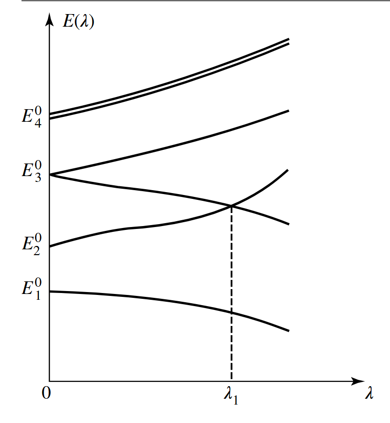

# 定态微扰理论

在量子力学的研究中，只有极少数的情况有严格解，例如一维谐振子、氢原子，它们的哈密顿量非常简单。一般的情况下，哈密顿量都很复杂，无法解析求出。而且，如果考虑了相对论修正，原来可以解析求解的问题也无法求出了。

但是存在一些近似方法，可以解析的求出本征方程的**近似解**。本章介绍“定态微扰法”，后面的章节还会介绍“含时微扰法”。

## 1. 方法概述

### 1.1 问题概述

我们将要研究的哈密顿量可以写作

$$
\newcommand \la \langle
\newcommand \ra \rangle
\newcommand \cal \mathcal
\newcommand \mr \mathrm
\newcommand \bm \boldsymbol
\newcommand \ds \displaystyle

H=H_0+W
$$
其中 $H_0$ 的本征值和本征矢已知（可解析求解），$W$ 是一个微扰项

> [!note]
>
> 微扰的正确性：
>
> - $W$ 的对角元 $\ll$ $H_0$ 的本征值
> - $W$ 的非对角元 $\ll$ 对应的两个非微扰能级之差
>
> 这个微扰条件在之后的推导中可以得到

除了上面的严格的微扰条件外，也可以简单的考虑为
$$
W=\lambda \hat{W},\quad \lambda
\ll1
$$
其中 $\hat{W}$ 的矩阵元与 $H_0$ 同量级。定态微扰理论的具体做法与经典力学中的微扰法完全相同，即：将 $H$ 的本征值和本征矢按 $\lambda$ 的幂次展开，并保留到有限阶项。

假设 $H_0$ 的本征值构成离散谱
$$
H_0|\varphi_{p}^{i}\ra=E_p^{(0)}|\varphi_{p}^{i}\ra
$$
且所有 $|\varphi_{p}^i\ra$ 构成态空间的一组正交归一基，即
$$
\la\varphi_{p'}^{i'}|\varphi_{p}^{i}\ra=\delta_{pp'}\delta{ii'}\\
\sum_{p}\sum_{i}|\psi_{p}^{i}\ra\la\psi_{p}^{i}|=1
$$
将微扰代入，则可认为哈密顿算符连续的依赖微扰强度的参数 $\lambda$ 
$$
H(\lambda)=H_0+\lambda \hat{W}
$$
对应的，本征值 $E(\lambda)$ 也一般依赖于 $\lambda$

由于微扰的存在，原来简并的能级可能会分开，例如图中 $E_{3}^{(0)}$

### 1.2 近似解法

现在的本征方程
$$
H(\lambda)|\psi(\lambda)\ra=E(\lambda)|\psi(\lambda)\ra
$$
假设 $E(\lambda)$ 和 $|\psi(\lambda)\ra$ 都可以展开为 $\lambda$ 的幂级数
$$
\begin{aligned}
E(\lambda)&=\varepsilon_0+\lambda \varepsilon_1 +\lambda^2 \varepsilon_2+\cdots\\
|\psi(\lambda)\ra&=|0\ra+\lambda|1\ra+\lambda^2|2\ra+\cdots
\end{aligned}
$$
将它们代入本征方程中并分离出 $\lambda$ 不同阶次的方程

- $\lambda$ 的零阶方程
  $$
  H_0|0\ra=\varepsilon_0|0\ra
  $$

- $\lambda$ 的一阶方程
  $$
  (H_0-\varepsilon_0)|1\ra+(\hat{W}-\varepsilon_1)|0\ra=0
  $$
  
- $\lambda$ 的二阶方程
  $$
  (H_0-\varepsilon_{0})|2\ra+(\hat{W}-\varepsilon_1)|1\ra-\varepsilon_2|0\ra=0
  $$

- $\lambda$ 的 $q$ 阶方程
  $$
  (H_0-\varepsilon_0)|q\ra+(\hat{W}-\varepsilon_1)|q-1\ra-\varepsilon_2|q-2\ra\cdots-\varepsilon_q|0\ra=0
  $$
  

为了得到确定的解，我们还需要约束 $|\psi(\lambda)\ra$ 的模和相位：规定 $|\psi(\lambda)\ra$ 是归一化的，并且 $\la0|\psi\ra$ 为实数
$$
\begin{aligned}
\la\psi|\psi\ra=&(\la0|+\lambda\la1|+\lambda^2\la2|+\cdots)\cdot(|0\ra+\lambda|1\ra+\lambda^2|2\ra+\cdots)\\
=&\quad\la0|0\ra\\
&+\lambda(\la1|0\ra+\la0|1\ra)\\
&+\lambda^2(\la1|1\ra+\la2|0\ra+\la0|2\ra)
\end{aligned}
$$
得到

$$
\la0|0\ra=1\\
\la0|1\ra=\la1|0\ra=0\\
\la0|2\ra=\la2|0\ra=-\frac{1}{2}\la1|1\ra
$$

## 2 非简并能级的微扰

对于无微扰时非简并的能级，由零阶方程可以直接得到
$$
\varepsilon_0=E_n^{(0)}\\
|0\ra=|\varphi_n\ra
$$

### 2.1 一阶修正

#### 2.1.1 能量的修正

将方程 (9) 投影到 $|\varphi_n\ra$ 上
$$
\la\varphi_n|\left((H_0-\varepsilon_0)|1\ra+(\hat{W}-\varepsilon_1)|0\ra\right)=0
$$
容易得到第一项为0，于是
$$
\varepsilon_1=\la\varphi_n|\hat{W}|0\ra=\la \varphi_n|\hat{W}|\varphi_n\ra
$$
在微扰 $W=\lambda\hat{W}$ 的一阶近似下，能级 $E(\lambda)$ 的形式为
$$
\boxed{E(\lambda)=E_{n}^{(0)}+\la \varphi_n|W|\varphi_n\ra+O(\lambda^2)}
$$

#### 2.1.2 本征矢的修正

将方程 (9) 投影到基 $\{|\varphi_{p}^{i}\ra\}$ 中除了 $|\varphi_n\ra$ 的其他矢量上
$$
\la\varphi_p^i|\left((H_0-\varepsilon_0)|1\ra+(\hat{W}-\varepsilon_1)|0\ra\right)=0\\
\Rightarrow (E_p^0-E_n^0)\la\varphi_p^i|1\ra+\la\varphi_p^i|\hat{W}|\varphi_n\ra=0
$$
从上面的式子结合前面给出的约束，可以得到 $|1\ra$ 在所有基矢上的投影
$$
\la\varphi_p^i|1\ra=\frac{\la\varphi_p^i|\hat{W}|\varphi_n\ra}{(E_n^0-E_p^0)}\quad(p\neq n)\\
\la\varphi_n|1\ra=0
$$
于是右矢 $|1\ra$ 形式为 
$$
|1\ra=\sum_{p\neq n}\sum_{i}\frac{\la\varphi_p^i|\hat{W}|\varphi_n\ra}{(E_n^0-E_p^0)}|\varphi_p^i\ra\quad(p\neq n)
$$
微扰 $W$ 的非对角元引入了 $|\varphi_p^i\ra$ 和 $|\varphi_n\ra$ 之间的耦合，或者说微扰使得 $|\varphi_n\ra$ 这个态收到 $H_0$ 其他本征态的“沾染”。能级 $E_p^0$ 越靠近 $E_n^0$，则 $|\varphi_p^i\ra$ 对这个态造成的“沾染”越突出。

从本征值和本征矢的修正，我们可以看出之前提到的微扰条件的意义。

### 2.2 二阶修正

#### 2.2.1 能量的修正

类似的，将二阶方程投影到 $|\varphi_n\ra$ 上
$$
\la\varphi_n|\left((H_0-\varepsilon_{0})|2\ra+(\hat{W}-\varepsilon_1)|1\ra-\varepsilon_2|\varphi_n\ra\right)=0
$$
得到
$$
\varepsilon_2=\la\varphi_n|\hat{W}|1\ra
$$
代入 $|1\ra$ 的表达式
$$
\varepsilon_2=\sum_{p\neq 1}\sum_i\frac{|\la\varphi_p^i|\hat{W}|\varphi_n\ra|^2}{(E_n^0-E_p^0)}
$$
在二阶的考虑下，如果 $E_p^0$ 与 $E_n^0$ 越是接近，则微扰下两个能级越是排斥

#### 2.2.2 本征矢的修正

将二阶方程投影到除 $|\varphi_n\ra$ 的所有其他基矢上，并结合式 (13) 中的约束，即可求解出本征值的二阶修正 $|2\ra$

## 3 简并能级的微扰

假设我们要研究的 $E_n^0$ 是 $g_n$ 重简并的，此时仅根据
$$
H_0|0\ra=\varepsilon_0|0\ra
$$
由 $\varepsilon_0=E_n^0$ 便不足以确定 $|0\ra$。为了确定 $\varepsilon_1$ 和 $|0\ra$，我们将一阶方程投影到 $\{|\varphi_n^i\ra, i = 1,\}$ 上
$$
\la \varphi_n^i|\hat{W}|0\ra=\varepsilon_1\la\varphi_n^i|0\ra
$$
将 $\{|\varphi_{p}^{i}\ra\}$ 的封闭性关系式插入到 $\hat{W}$ 和 $|0\ra$ 之间
$$
\sum_p\sum_{j}\la \varphi_n^i|\hat{W}|\varphi_p^j\ra\la\varphi_p^j|0\ra=\varepsilon_1\la\varphi_n^i|0\ra
$$
由于 $|0\ra$ 属于 $E_n^0$ 的子空间，因此 $\la\varphi_p^j|0\ra=\delta_{pn}\la\varphi_n^j|0\ra$，上式变为
$$
\sum_{j=1}^{g_n}\la \varphi_n^i|\hat{W}|\varphi_n^j\ra\la\varphi_n^j|0\ra=\varepsilon_1\la\varphi_n^i|0\ra,\quad(i=1,\dots,g_n)
$$
上式实际是 $\hat{W}$ 在 $E_n^0$ 子空间的限制算符的本征方程，定义算符 $\hat{W}^{(n)}$ 为 $E_n^0$ 子空间的限制算符，矩阵元为
$$
\left[\hat{W}^{(n)}\right]_{ij}=\la \varphi_n^i|\hat{W}|\varphi_n^j\ra
$$
因此方程 (82) 等价于
$$
\hat{W}^{(n)}|0\ra=\varepsilon_1|0\ra
$$

综上，**为了计算哈密顿算符 $H$ 的对应于未微扰简并能级 $E_n^0$ 的本征值（一阶）和本征矢（零阶）的修正，应将 $W$ 在 $E_n^0$ 的子空间的限制算符 $W^{(0)}$ 做对角化。**

> [!note]
>
> 从上面的讨论就可以看出，使用微扰法处理 $H$ 的本征值问题时，实际上是把整个态空间的哈密顿算符完全对角化，转化成了在每一个能量子空间 $\varepsilon_n^0$ 中对微扰算符做对角化（非简并能级也只是一种特殊的情况）

# Supplement

