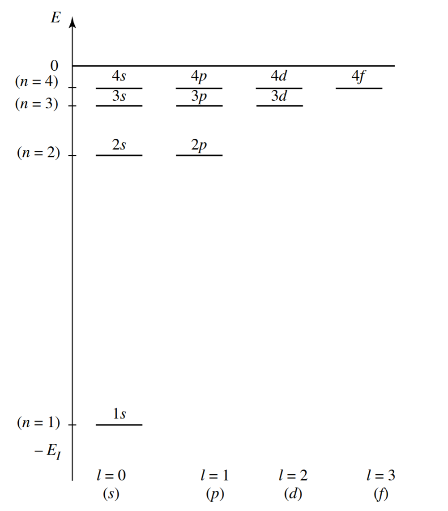

# 中心势场粒子，氢原子
## 1 中心势场粒子
### 1.1 哈密顿量算符
在中心势场中运动的粒子，其哈密顿量算符的本征方程为
$$
H |\psi\rangle = \left( -\frac{\hbar^2}{2m} \nabla^2 + V(r) \right) |\psi\rangle= E |\psi\rangle
$$

Laplace算符在球坐标系下写作
$$
\nabla^2 = \frac{1}{r^2} \frac{\partial}{\partial r} \left( r^2 \frac{\partial}{\partial r} \right) + \frac{1}{r^2}\underbrace{\left[\frac{1}{\sin\theta} \frac{\partial}{\partial \theta} \left( \sin\theta \frac{\partial}{\partial \theta} \right) + \frac{1}{\sin^2\theta} \frac{\partial^2}{\partial \phi^2}\right]}_{-\boldsymbol{L}^2/\hbar^2}
$$

> [!caution]
> Laplace算符的表达式在 $r=0$ 处不适用，需要特别处理。

于是，哈密顿量算符可以写作
$$
H = -\frac{\hbar^2}{2m}\frac{1}{r^2} \frac{\partial}{\partial r} \left( r^2 \frac{\partial}{\partial r} \right)+ \frac{\boldsymbol{L}^2}{2mr^2} + V(r)
$$

本征方程变为
$$
\left[-\frac{\hbar^2}{2m}\frac{1}{r^2} \frac{\partial}{\partial r} \left( r^2 \frac{\partial}{\partial r} \right)+ \frac{\boldsymbol{L}^2}{2mr^2} + V(r)\right] \psi(r,\theta,\phi) = E \psi(r,\theta,\phi)
$$

### 1.2 分离变量
可以证明 $H,\boldsymbol{L}^2,L_z$ 两两对易，因此存在一组它们的共同本征函数构成的完备正交归一基。三个算符的共同本征方程为
$$
\begin{aligned}
H \psi(r,\theta,\phi) &= E \psi(r,\theta,\phi)\\
\boldsymbol{L}^2 \psi(r,\theta,\phi) &= l(l+1)\hbar^2 \psi(r,\theta,\phi)\\
J_z \psi(r,\theta,\phi) &= m\hbar \psi(r,\theta,\phi)
\end{aligned}
$$

我们已经知道 $\boldsymbol{L}^2$ 和 $L_z$ 的本征函数为球谐函数 $Y_{lm}(\theta,\phi)$，因此最终的解一定可以写作
$$
\psi(r,\theta,\phi) = R(r) Y_{lm}(\theta,\phi)
$$

将其代入哈密顿量的本征方程，并利用球谐函数的本征方程，化简后可以得到径向方程
$$
\left[-\frac{\hbar^2}{2m}\frac{1}{r^2} \frac{d}{d r} \left( r^2 \frac{d}{d r} \right) + \frac{l(l+1)\hbar^2}{2mr^2} + V(r)\right] R(r) = E R(r)
$$

如果将前面的算符记作 $H_l$，那么我们可以 $E_{k,l}$ 表示 $H_l$ 的本征值，对应的本征函数记作 $R_{k,l}(r)$（后面会证明不会出现简并）。使用一个变量替换可以简化径向方程的形式，定义
$$u_{k,l}(r) = r R_{k,l}(r)$$
径向方程变为
$$
\left[-\frac{\hbar^2}{2m} \frac{d^2}{d r^2} + \frac{l(l+1)\hbar^2}{2mr^2} + V(r)\right] u_{k,l}(r) = E_{k,l} u_{k,l}(r)
$$

可以看作一个质量为 $m$ 的粒子在有效势场中运动，势场为
$$
V_{\mathrm{eff}}(r) = V(r) + \underbrace{\frac{l(l+1)\hbar^2}{2mr^2}}_{\text{离心势}}
$$

### 1.3 径向函数原点的行为

利用幂级数解法的思想，假设径向函数在 $r\to 0$ 附近的行为为
$$R(r) \sim r^s$$
将其代入径向方程，并取 $r\to 0$ 极限，可以得到
$$s(s+1) = l(l+1)$$
解得
$$
\begin{cases}
s = l\\
s = - (l+1)
\end{cases}
$$

对 $s=-(l+1)$ 的解，可以证明 $Y_l^m(\theta,\phi)/r^{l+1}$ 并不是本征方程的解（Laplace算符性质）。因此合理结果为 $s=l$，即
$$R(r) \sim r^l \quad (r\to 0)$$
这在后面求解具体问题时会用到。上面的推导也证明了对每一个 $E_{k,l}$，最多只存有一个物理上合理的径向函数解，因此我们直接使用 $k,l$ 指标来标记径向函数是合理的。

### 1.4 中心势场定态

#### 1.4.1 量子数

中心势场中粒子的波函数表示为
$$
\psi_{k,l,m}(r,\theta,\phi) = R_{k,l}(r) Y_{l}^m(\theta,\phi)
$$

一般情况下，要求波函数归一化，由于球谐函数已经归一化，因此径向函数需要满足
$$
\int_0^\infty |R_{k,l}(r)|^2 r^2 dr = 1
$$

如果 $H$ 存在连续谱，则应该改为广义正交归一条件
$$
\int_0^\infty R_{k,l}^*(r) R_{k',l}(r) r^2 dr = \delta(k-k')
$$

中心势场粒子的定态可以用三个量子数 $k,l,m$ 来标记：

- 径向量子数 $k$：表示径向函数的不同本征态
- 角量子数 $l$：表示角动量的大小，$l=0,1,2,\ldots$
- 磁量子数 $m$：表示角动量在 $z$ 方向的分量，$m=-l,-l+1,\ldots,l-1,l$

#### 1.4.2 能级简并度

由于能量只与 $k$ 和 $l$ 有关，而与 $m$ 无关，即 $m$ 可以取 $-l,\cdots,l$ 中的任意值，因此每个能级 $E_{k,l}$ 至少存在 $2l+1$ 重简并。由于这个简并总是存在，因此称为“实质性简并”。

在某些特定的势场中，可能存在 $E_{k,l}=E_{k',l'}$（$l\neq l'$）的情况（例如马上要讨论的氢原子），这种简并称为“偶然性简并”。

>[!note]
>
> 上面的讨论证明了 $H,\boldsymbol{L}^2,L_z$ 构成一组 ECOC，确定了三个本征值 $E_{k,l},l(l+1)\hbar^2,m\hbar$ 可以唯一确定一个本征函数 $\psi_{k,l,m}(r,\theta,\phi)$。

## 2 氢原子

### 2.1 氢原子哈密顿量

氢原子由一个质子和一个电子组成，两者的相互作用能为
$$
V(r) = -\frac{e^2}{4\pi \epsilon_0 r}=-\frac{\alpha}{r}
$$

哈密顿量为
$$
H = -\frac{\hbar^2}{2m} \nabla^2 - \frac{\alpha}{r}
$$

此时，径向方程为
$$
\left[-\frac{\hbar^2}{2m} \frac{d^2}{d r^2} + \frac{l(l+1)\hbar^2}{2mr^2} - \frac{\alpha}{r}\right] u_{k,l}(r) = E_{k,l} u_{k,l}(r)
$$

$H$ 的能谱包括离散谱（$E<0$，束缚态）和连续谱（$E>0$，游离态）两部分。

### 2.2 氢原子束缚态

#### 2.2.1 变量替换

为了求解束缚态，定义以下常量
$$
a_0 = \frac{4\pi \epsilon_0 \hbar^2}{m e^2} \quad \text{（玻尔半径）}
$$
$$
E_I = \frac{m e^4}{2(4\pi \epsilon_0)^2 \hbar^2} \quad \text{（离子化能）}
$$
并引入无量纲变量
$$
\rho = \frac{r}{a_0}, \quad \lambda_{k,l} = \sqrt{-\frac{E_{k,l}}{E_I}}
$$

径向方程变为
$$
\frac{d^2 u_{k,l}}{d \rho^2} + \left[ \frac{2}{\rho} - \frac{l(l+1)}{\rho^2} - \lambda_{k,l}^2 \right] u_{k,l} = 0
$$

#### 2.2.2 幂级数求解

- $\rho\to \infty$ 时，径向方程近似为
    $$
    \frac{d^2 u_{k,l}}{d \rho^2} - \lambda_{k,l}^2 u_{k,l} = 0
    $$
    有两个线性无关解 $e^{\pm \lambda_{k,l} \rho}$，由于波函数需要在无穷远处有界，因此
    $$
    u_{k,l}(\rho) \sim e^{-\lambda_{k,l} \rho} \quad (\rho\to \infty)
    $$
    做出如下变量替换
    $$
    u_{k,l}(\rho) = y_{k,l}(\rho) e^{-\lambda_{k,l} \rho}
    $$
    径向方程变为
    $$
    \left[\frac{\mathrm{d}^2}{\mathrm{d}\rho^2}-2\lambda_{k,l} \frac{\mathrm{d}}{\mathrm{d}\rho} + \frac{2}{\rho} - \frac{l(l+1)}{\rho^2}\right] y_{k,l}(\rho) = 0
    $$

- $\rho\to 0$ 时，我们前面已经知道
    $$
    R_{k,l}(r) \sim r^l \implies u_{k,l}(\rho) \sim \rho^{l+1} \quad (\rho\to 0)
    $$
    因此，$y_{k,l}(\rho)$ 在 $\rho\to 0$ 时的行为为
    $$
    y_{k,l}(\rho) \sim \rho^{l+1} \quad (\rho\to 0)
    $$

综上所述，$y_{k,l}(\rho)$ 展开为幂级数
$$
y_{k,l}(\rho) = \rho^{l+1} \sum_{m=0}^\infty c_m \rho^m
$$

将其代入径向方程，并比较各阶系数，可以得到递推关系
$$
c_{m} = \frac{2(\lambda_{k,l}(m+l)-1)}{m(m+2l+1)} c_{m-1}
$$

> [!note]
>
> 在 $m\to \infty$ 时，$c_{m+1}/c_m\to 2\lambda_{k,l}/m$，对比 $\mathrm{e}^{2\lambda_{k,l}\rho}$ 的幂级数展开
> $$\mathrm{e}^{2\lambda_{k,l}\rho} = \sum_{m=0}^\infty \frac{(2\lambda_{k,l}\rho)^m}{m!}$$
> 可以发现$y_{k,l}(\rho)\sim \mathrm{e}^{2\lambda_{k,l}\rho}$，因此 $u_{k,l}(\rho)\sim \mathrm{e}^{\lambda_{k,l}\rho}$，不符合物理要求。

为了使级数收敛，必须在某个 $m=k$ 处截止，即要求
$$
\lambda_{k,l}(k+l) - 1 = 0 \implies \lambda_{k,l} = \frac{1}{k+l}
$$

因而，对于给定的 $l$，离散的能量取值为
$$
E_{k,l} = -\frac{E_I}{(k+l)^2}
$$

于是系数的递推关系变为
$$
c_{m} = -\frac{2(k-m)}{m(m+2l+1)(k+1)} c_{m-1} \quad (m=1,2,\ldots,k)
$$
各项系数为
$$
c_m = (-1)^{m}\left(\frac{2}{k+l}\right)^m\frac{(k-1)!(2l+1)!}{(k-m-1)!(2l+1+m)!m!} c_0 \quad (m=0,1,2,\ldots,k)
$$
通过归一化条件确定 $c_0$ 的值。

### 2.3 氢原子波函数讨论

#### 2.3.1 原子参量量级

玻尔半径 $a_0$ 和离子化能 $E_I$ 的量级分别为
$$
a_0 \approx 5.29 \times 10^{-11} \mathrm{m} = 0.529 \mathrm{\AA}
$$
$$
E_I \approx 13.6 \mathrm{eV}\ll m_e c^2
$$
因此前面使用的非相对论量子力学方法是合理的。
> [!note]
>
> 虽然相对论效应较小，但其影响确实存在；正是因为这个效应很小，之后我们可以使用微扰论来处理相对论修正。

#### 2.3.2 能级简并度

对固定的 $k,l$，能量 $E_{k,l}$ 至少存在 $2l+1$ 简并（实质性简并）。但可以发现，当 $k+l=k'+l'$ 时，能量值 $E_{k,l}$ 和 $E_{k',l'}$ 相等，这种简并称为“偶然性简并”。

令 $n=k+l$，称为**主量子数**。能量只与主量子数 $n$ 有关，能级为
$$
E_n = -\frac{E_I}{n^2} \quad (n=1,2,3,\ldots)
$$
当 $n$ 固定时，$l$ 可以取 $0,1,2,\ldots,n-1$，此时能级的简并度为
$$
g_n = \sum_{l=0}^{n-1} (2l+1) = n^2
$$

历史上用 $s,p,d,f,\dots$ 等光谱学符号来表示不同的角量子数 $l$，具体对应关系为

#### 2.3.3 波函数

归一化后，氢原子波函数的完整形式为
$$
\psi_{n,l,m}(r,\theta,\phi) = R_{n,l}(r) Y_l^m(\theta,\phi)
$$

径向函数为
$$
R_{n,l}(r) = \sqrt{\left(\frac{2}{n a_0}\right)^3 \frac{(n-l-1)!}{2n[(n+l)!]^3}} \left(\frac{2r}{n a_0}\right)^l \mathrm{e}^{-\frac{r}{n a_0}} L_{n-l-1}^{2l+1}\left(\frac{2r}{n a_0}\right)
$$
其中，$L_{p}^{q}(x)$ 为广义拉盖尔多项式。角向函数为球谐函数 
$$
Y_l^m(\theta,\phi) = (-1)^m \sqrt{\frac{(2l+1)}{4\pi} \frac{(l-m)!}{(l+m)!}} P_l^m(\cos\theta) \mathrm{e}^{i m \phi}
$$
其中，$P_l^m(x)$ 为连带勒让德多项式。

与前面的复波函数不同，在化学和绘图中更多使用实轨道，实轨道具展现**方向性/叶瓣/节点面**，直观地指示电子云指向哪里，便于解释共价键重叠。[Atomic orbital](https://en.wikipedia.org/wiki/Atomic_orbital#cite_note-24) 可以找到轨道的具体形式。