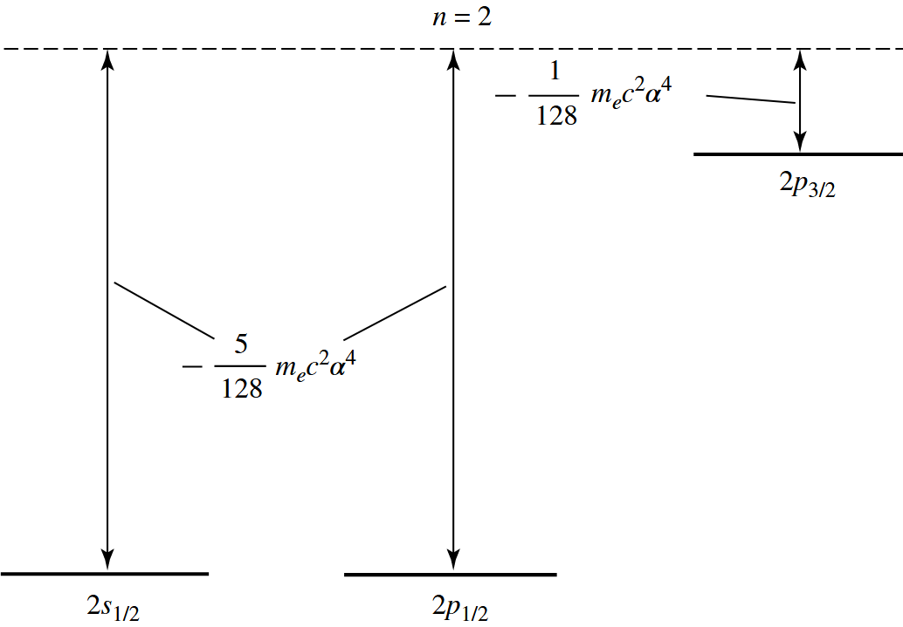

# 氢原子精细结构和超精细结构

在之前的对氢原子的讨论中，我们将哈密顿量写作
$$
\newcommand \la \langle
\newcommand \ra \rangle
\newcommand \cal \mathcal
\newcommand \mr \mathrm
\newcommand \bm \boldsymbol
\newcommand \ds \displaystyle

H=\frac{P^2}{2m_e}-\frac{e^2}{4\pi\epsilon_0 R^2}
$$
但这个简单的模型中，没有包括任何相对论效应，也忽略了自旋带来的磁效应。由于氢原子是一个弱相对论系统，对应 $n=1$ 的轨道
$$
\frac{v}{c}=\frac{e^2}{4\pi\epsilon_0\hbar c}=\alpha\approx\frac{1}{137}
$$
质子磁矩也很小，因此可以将这些效应以微扰的形式引入哈密顿量中，并用前面的微扰论进行处理。
$$
H=H_0+W
$$

## 1 哈密顿算符附加项

### 1.1 精细结构哈密顿算符

#### 1.1.1 弱相对论范围内的狄拉克方程

电子的严格描述需要使用**狄拉克方程**，这个方程既满足狭义相对论假定，又满足量子力学假定。它可以将很多物理现象（自旋，精细结构）考虑在内。

这里，我们无需研究狄拉克方程的具体形式，而只需要给出 $W$ 关于 $v/c$ 的展开的前几项
$$
H=m_ec^2+\underbrace{\frac{P^2}{2m_e}+V(R)}_{H_0}-\underbrace{\frac{P^4}{8m_e^3c^2}}_{W_{mv}}+\underbrace{\frac{1}{2m_e^2c^2}\frac{1}{R}\frac{\mathrm{d}V(R)}{\mathrm{d}R}\bm{L}\cdot\bm{S}}_{W_{\text{so}}}+\underbrace{\frac{\hbar^2}{8m_e^2c^2}\Delta V(R)}_{W_{\text{D}}}+\cdots
$$

> [!note]
>
> 对应库仑势场中的电子，狄拉克方程是可以严格解出的，这里将其拆分为有限项的展开，可以看出原子内各相互作用的形式和物理意义。并且这种微扰的观点还可以推广到多电子原子。

#### 1.1.2 精细结构哈密顿量中各项的物理意义

1. $W_{mv}$：质量随速度变化项

   - 物理起因：利用相对论的能动关系进行展开
     $$
     \begin{aligned}
     E&=c\sqrt{p^2+m_e^2c^2}\\
     &=m_ec^2+\frac{p^2}{2m_e}-\underline{\frac{p^4}{8m_e^3c^2}}+\cdots
     \end{aligned}
     $$

   - 数量级：为估计这项修正的影响，我们需要计算 $W_{mv}/H_0$
     $$
     \frac{W_{mv}}{H_0}\simeq\frac{\frac{p^4}{8m_e^3c^2}}{\frac{p^2}{2m_e}}\sim\left(\frac{v}{c}\right)^2=\alpha^2\approx\left(\frac{1}{137}\right)^2
     $$

2. $W_{\text{so}}$：自旋-轨道耦合项

   - 物理起因：电子在质子产生的静电场 $\bm{E}$ 中以速度 $\bm{v}$ 运动。狭义相对论表面，在电子自身系中，出现下面一个磁场
     $$
     \bm{B}'=-\frac{1}{c^2}\bm{v}\times\bm{E}
     $$
     电子具有内禀磁矩$\ds \bm{M}_S=\frac{e\bm{S}}{m_e}$，与磁场产生相互作用，相互作用能
     $$
     W'=-\bm{M}_S\cdot\bm{B}'
     $$
     代入得到
     $$
     W'=\frac{1}{m_e^2c^2}\frac{1}{R}\frac{\mr{d}V}{\mr{d}R}\bm{L}\cdot\bm{S}
     $$
     
     > [!note]
     >
     > 相互作用能与实际的 $W_\text{so}$ 相差一个 $1/2$ 的因子，这是由于电子围绕质子的运动不是匀速直线运行，这会引起电子自旋相对于实验室参考下的旋转（托马斯进动）
     
   - 数量级：$\bm{L}$ 和 $\bm{S}$ 的数量级都是 $\hbar$，于是
     $$
     W_{\text{SO}}\simeq\frac{1}{m_e^2c^2}\frac{e^2}{4\pi \epsilon_0}\frac{\hbar^2}{R^3}
     $$
     与 $H_0$ 相比
     $$
     \frac{W_{\text{SO}}}{H_0}\simeq\frac{W_{\text{SO}}}{\frac{e^2}{4\pi\epsilon_0R^2}}=\frac{\hbar^2}{m_e^2c^2R^2}
     $$
     其中 $R$ 量级相当于玻尔半径 $a_0$
     $$
     \frac{W_{\text{SO}}}{H_0}\simeq\alpha^2
     $$
   
3. $W_{\text{D}}$：达尔文项

   - 物理起因：狄拉克方程中，电子与核的库伦场的作用的“local”的，即场通过它在 $\bm{r}$ 处的值与电子发生相互作用，但做弱相对论近似时，会导致影响电子的场是 $\bm{r}$ 附近的一个区域内的值，区域的线度大约是电子的康普顿波长 $\hbar/m_ec$

   - 数量级：
     $$
     W_{\text{D}}=\frac{\hbar^2}{8m_e^2c^2}\Delta V(R)=\frac{\pi\hbar^2}{2m_e^2c^2}\frac{e^2}{4\pi\epsilon_0}\delta(\bm{R})
     $$
     考虑它在某一个原子态的平均值
     $$
     W_{\text{D}}=\frac{\pi\hbar^2}{2m_e^2c^2}\frac{e^2}{4\pi\epsilon_0}\delta(\bm{R})=\frac{\pi\hbar^2}{2m_e^2c^2}\frac{e^2}{4\pi\epsilon_0}|\psi(0)|^2
     $$
     其中 $\ds|\psi(0)|^2\simeq\frac{1}{{a_0}^3}$，于是
     $$
     W_{\text{D}}\simeq m_ec^2\alpha^4
     $$
     而 $H_0\simeq m_ec^2\alpha^2$
     $$
     \frac{W_{\text{D}}}{H_0}\simeq \alpha^2
     $$

### 1.2 超精细结构哈密顿算符

超精细结构哈密顿算符来自于与质子自旋有关的磁效应。引入自旋后，质子可表示为质量为 $m_p$、电荷为 $e$、自旋为 $1/2$ 的粒子，用 $\bm{I}$ 表示其自旋。存在一个质子磁矩
$$
\bm{M}_I=g_p\mu_n \bm{I}/\hbar
$$
其中 $\ds\mu_n=\frac{e\hbar}{2m_p}$ 为质子的玻尔磁子，$g_p\approx5.585$ 为质子的朗德因子。由于质量差异，质子磁矩比电子磁矩小约 2000 倍。超精细结构哈密顿算符 $W_{\text{hf}}$
$$
W_{\text{hf}}=-\frac{\mu_0}{4\pi}\left\{\underbrace{\frac{e}{m_eR^3}\bm{L}\cdot\bm{M}_I}_{①}+\underbrace{\frac{1}{R^3}\left[3(\bm{M}_S\cdot\bm{n})(\bm{M}_I\cdot\bm{n})-\bm{M}_S\cdot\bm{M}_I\right]}_{②}+\underbrace{\frac{8\pi}{3}\bm{M}_S\cdot\bm{M}_I\delta(\bm{R})}_{③}\right\}
$$

- 第一项：电子运动在质子处产生磁场，与电子产生相互作用
- 第二项：电子磁矩与质子磁矩之间的偶极相互作用
- 第三项：称为费米接触项，源自于质子并非质点，质子内部的磁场与 $\bm{M}_I$ 在它外部产生的偶极场不同。

超精细结构的数量级比精细结构小约 2000 倍，源自电子和质子质量差异。

## 2 能级 $n=2$ 的精细结构

### 2.1 问题梗概

对氢原子 $n=2$ 的能级，利用 $\bm{L}^2$ 的不同本征值，可以分为 $2s\ (n=2,l=0)$ 和 $2p\ (n=2,l=1)$ 两个次壳层。再考虑质子和电子的自旋 $m_S=\pm1/2$，$m_I=\pm1/2$，得到一组正交归一基
$$
\left\{|n=2;l=0;m_L=0;m_S=\pm\frac{1}{2};m_I=\pm\frac{1}{2}\right\}
$$
($4$ 维的 $2s$ 次壳层)
$$
\left\{|n=2;l=0;m_L=0,\pm1;m_S=\pm\frac{1}{2};m_I=\pm\frac{1}{2}\right\}
$$
($12$ 维的 $2p$ 次壳层)

$n=2$ 能级的总简并度为 $16$，按定态微扰理论，需要对微扰算符的 $16\times16$ 的限制矩阵对角化

### 2.2 $n=2$ 的能级内构造 $W_f$ 的矩阵

#### 2.2.1 普遍性质

先重写一项 $W_f$ 的表达式
$$
W_f=-\underbrace{\frac{P^4}{8m_e^3c^2}}_{W_{mv}}+\underbrace{\frac{1}{2m_e^2c^2}\frac{1}{R}\frac{\mathrm{d}V(R)}{\mathrm{d}R}\bm{L}\cdot\bm{S}}_{W_{\text{so}}}+\underbrace{\frac{\hbar^2}{8m_e^2c^2}\Delta V(R)}_{W_{\text{D}}}+
$$
下面我们将利用 $W_f$ 的一些性质，将原来 $16\times16$ 的矩阵降阶

- $W_f$ 不作用于质子的自旋变量，因此可不考虑 $\bm{I}$，矩阵降为 $8$ 阶

- $W_f$ 不连结 $2s$ 和 $2p$ 能级。可以证明 $\bm{L}^2$ 与 $W_f$ 对易

  - $\bm{L}^2$ 与 $\bm{L}$、$P^2$、$\bm{R}$ 对易

  - $2s$ 和 $2p$ 是根据 $\bm{L}^2$ 不同本征值划分的子空间
    $$
    \bm{L^2}W_f|n,l\ra=W_f\bm{L}^2|n,l\ra=n(n+1)W_f|n,l\ra
    $$
    即 $W_f$ 具有形式

    

#### 2.2.2 次壳层 $2s$ 中的 $W_f$

$W_{mv}$ 与 $W_{\text{D}}$ 都与 $\bm{S}$ 无关，$2s$ 此时的简并由自旋带来，因此这两个算符都正比于单位矩阵，系数可由下式求出
$$
\la W_{mv}\ra_{2s}=\la n=2,l=0,m_L=0\left|-\frac{P^4}{8m_ec^2}\right|n=2,l=0,m_L=0\ra=-\frac{13}{128}m_ec^2\alpha^4
$$

$$
\la W_{\text{D}}\ra_{2s}=\la n=2,l=0,m_L=0\left|\frac{\hbar^2}{8m_e^3c^2}\Delta V(R)\right|n=2,l=0,m_L=0\ra=\frac{1}{16}m_ec^2\alpha^4
$$

对 $W_{\text{SO}}$ 的计算，涉及 $\la l=0,m_L=0|L_{x,y,z}|l=0,m_L=0\ra$ 这样的角向计算，因此
$$
\la W_{\text{SO}}\ra_{n=2}=0
$$
因此，精细结构算符对 $2s$ 次壳层只带来一个 $\ds-\frac{5}{128}m_ec^2\alpha^4$ 的整体偏移。

#### 2.2.3 次壳层 $2p$ 中的 $W_f$

$2p$ 能级的简并由 $\bm{L}$ 的本征值和 $\bm{S}$ 的本征值带来

- $W_{mv} $ 项和 $W_{\text{D}}$ 都与 $\bm{S}$ 无关且与 $\bm{L}$ 的各分量对易，因此仍可得到两个算符都正比于单位矩阵
  $$
  \la W_{mv}\ra_{2p}=\la n=2,l=1,m_L\left|-\frac{P^4}{8m_ec^2}\right|n=2,l=1,m_L\ra=-\frac{7}{384}m_ec^2\alpha^4
  $$

  $$
  \la W_{\text{D}}\ra_{2p}=\la n=2,l=1,m_L\left|\frac{\hbar^2}{8m_e^3c^2}\Delta V(R)\right|n=2,l=1,\ra=0
  $$

- $W_{\text{SO}}$ 项
  $$
  W_{\text{SO}}=\frac{1}{2m_e^2c^2}\frac{1}{R}\frac{\mathrm{d}V(R)}{\mathrm{d}R}\bm{L}\cdot\bm{S}=\xi(R)\bm{L}\cdot\bm{S}
  $$
  - $R$ 方向可以分量出来单独计算
      $$
      \xi(R)=\frac{e^2}{8\pi \epsilon_0 m_e^2c^2}\frac{1}{R^3}
      $$
      计算得到
      $$
      \xi_{2p}=\frac{e^2}{8\pi \epsilon_0 m_e^2c^2}\int_{0}^{\infty}\frac{1}{r^3}|R_{21}(r)|^2r^2\mr{d}r=\frac{1}{48\hbar^2}m_ec^2\alpha^4
      $$
  - 为计算 $\bm{L}\cdot\bm{S}$ 的值，我们需要变换到**耦合基矢**下。考虑角动量
      $$
      \bm{J}=\bm{L}+\bm{S}
      $$
      此时的基矢为
      $$
      \left\{\left|l=1,s=\frac{1}{2},j,m_j\right\rangle\right\}
      $$
      其中
      $$
      j=\frac{1}{2},\frac{3}{2}
      $$
      在这组耦合基矢中 $\bm{L}\cdot\bm{S}$ 是对角的，因为
      $$
      \bm{J}^2=\bm{L}^2+\bm{S}^2+2\bm{L}\cdot\bm{S}\\
      \Rightarrow\bm{L}\cdot\bm{S}=\frac{1}{2}\left(J^2-L^2-S^2\right)
      $$
      于是
      $$
      \begin{aligned}&\left\langle l=1,s=\frac{1}{2},j,m_j\right|\bm{L}\cdot\bm{S}\left|l=1,s=\frac{1}{2},j,m_j\right\rangle\\
      &=\frac{1}{2}\left[j(j+1)-l(l+1)-s(s+1)\right]
      \end{aligned}
      $$
      对于 $j=1/2$
      $$
      \frac{1}{2}\xi_{2p}\left(\frac{3}{4}-2-\frac{3}{4}\right)=-\frac{1}{48}m_2c^2\alpha^4
      $$
      对于 $j=3/2$
      $$
      \frac{1}{2}\xi_{2p}\left(\frac{14}{4}-2-\frac{3}{4}\right)=\frac{1}{96}m_2c^2\alpha^4
      $$

经过上面的分析，可以看出原来 $2p$ 的 6 重简并被分离为 $j=1/2$（2重简并）和 $j=3/2$（4重简并）的两个能级

### 2.3 结果

考虑精细结构后，原来 $n=2$ 的能级分裂为 3 个不同的能级，分别记作：$2s_{1/2}$，$2p_{1/2}$，$2p_{3/2}$

能量偏移：

- $2s_{1/2}$：
  $$
  -\frac{5}{128}m_2c^2\alpha^4
  $$

- $2p_{1/2}$：
  $$
  \left(-\frac{7}{384}-\frac{1}{48}\right)m_ec^2\alpha^4=-\frac{5}{128}m_ec^2\alpha^4
  $$
  能级 $2s_{1/2}$ 与 $2p_{1/2}$ 仍是简并的，这应视作一种偶然简并

- $2p_{3/2}$：
  $$
  \left(-\frac{7}{384}+\frac{1}{96}\right)m_ec^2\alpha^4=-\frac{1}{128}m_ec^2\alpha^4
  $$

氢原子精细结构示意图：

狄拉克方程给出氢原子的能级的严格解为
$$
E_{n,j}=m_ec^2\left[1+\alpha^2\left(n-j-\frac{1}{2}+\sqrt{(j+1/2)^2-\alpha^2}\right)\right]
$$
能量只依赖于 $n$ 和 $j$，与 $l$ 无关

## 3 能级 $n=1$ 的超精细结构

### 3.1 问题梗概

能级 $1s$ 的简并度为 4（来自电子和质子自旋），对应的基矢
$$
\left\{\left|n=1,l=0,m_L=0,m_S=\pm\frac{1}{2},m_I=\pm\frac{1}{2}\right\rangle\right\}
$$
可以证明能级 $1s$ 没有精细结构

### 3.2 能级 $1s$ 中的 $W_{hf}$ 矩阵

除最后一项费米接触之外，可以证明另外两项的贡献为 $0$（涉及“角向”导数）
$$
\left\langle n=1,l=0,m_L=0,m_S,m_I\right|-\frac{2\mu_0}{3}\bm{M}_S\cdot\bm{M}_I\delta(\bm{R})\left| n=1,l=0,m_L=0,m_S,m_I\right\rangle
$$
用自旋算符表示为
$$
A\la m_S,m_I|\bm{I}\cdot\bm{S}|m_S,m_I\ra
$$
其中 $A$ 是各种常数和 $R$ 项
$$
\begin{aligned}
A&=\frac{e^2}{3\epsilon_0c^2}\frac{g_p}{m_em_p}\la n=1,l=0,m_L=0|\delta(\bm{R})|n=1,l=0,m_L=0\ra\\
&=\frac{e^2}{3\epsilon_0c^2}\frac{g_p}{m_em_p}\frac{1}{4\pi}|R_{10}(0)|^2\\
&=\frac{4}{3}g_p\frac{m_2}{m_p}m_ec^2\alpha^4
\left(1+\frac{m_e}{m_p}\right)^{-2}\frac{1}{\hbar^2}\end{aligned}
$$
对于 $\bm{I}\cdot\bm{S}$ 的本征值，我们同样引入总角动量
$$
\bm{F}=\bm{I}+\bm{S}
$$
于是
$$
\bm{I}\cdot\bm{S}=\frac{1}{2}\left(\bm{F}^2-\bm{I}^2-\bm{S}^2\right)
$$
对应的量子数 $i=1/2,s=1/2$，而 $f=0,1$。对 $f=1$，有
$$
\la f=1,i=1/2,s=1/2|\bm{I}\cdot\bm{S}|f=1,i=1/2,s=1/2\ra=\frac{1}{4}\hbar^2
$$
对 $f=0$ 则有
$$
\la f=0,i=1/2,s=1/2|\bm{I}\cdot\bm{S}|f=0,i=1/2,s=1/2\ra=-\frac{3}{4}\hbar^2
$$

### 3.3 结果

在 $W_{hf}$ 的影响下，能级 $1s_{1/2}$ 分裂为两个超精细结构，能量间隔为 $A\hbar^2$

氢原子中存在从 $f=1$ 到 $f=0$ 的超精细跃迁，是目前实验上测得有效数字醉倒的一个物理量
$$
\frac{A\hbar}{2\pi}=1\ 420\ 405\ 751.767+ 0.001 \text{Hz}
$$
