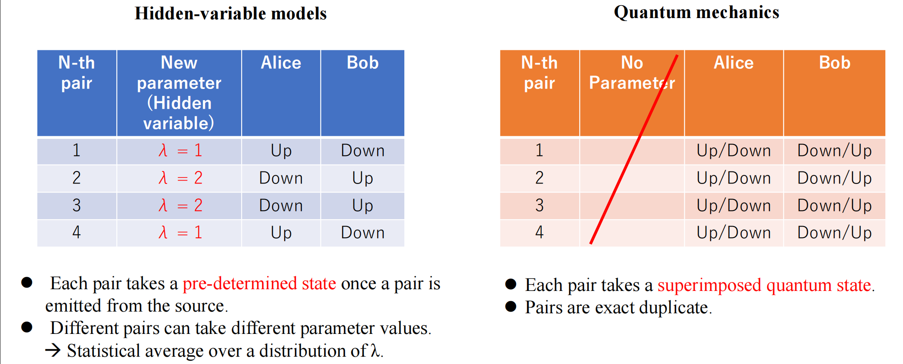
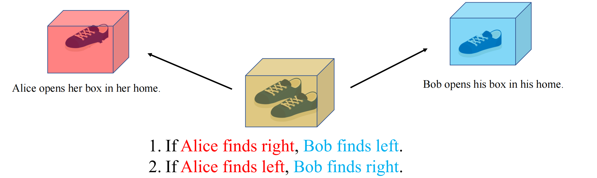
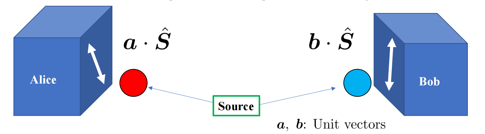
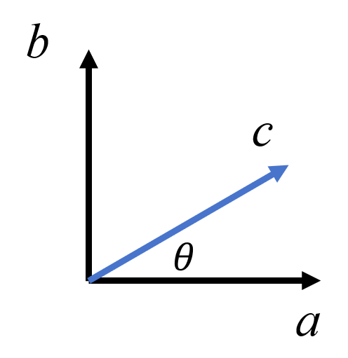
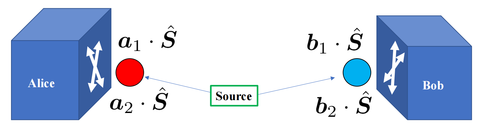
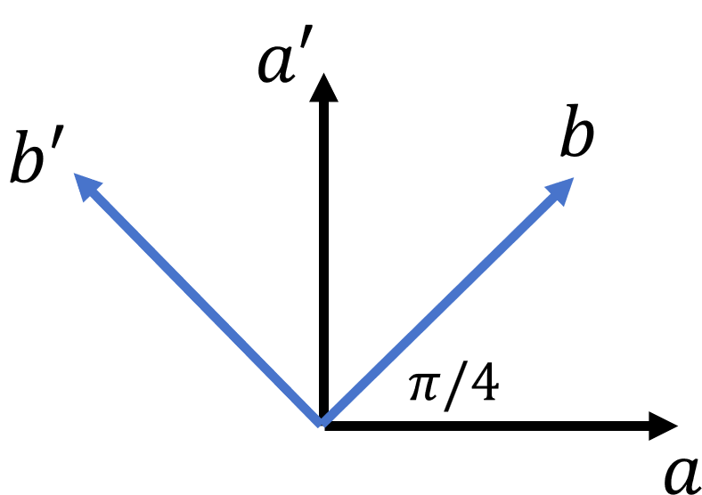

# Quantum Entanglement

Basic Review：[量子力学中的假设](..\量子力学\量子力学中的假设.md)

## 1 Quantum Entanglement from Superposition

在经典力学中，所有的可观测量都是确定的。即使是像掷骰子这样的看似随机的事件，其中的随机性也只是由于**缺少完整信息（抛掷力度、角度……）的伪随机**。在量子力学的理论中，即使我们已经了解系统的完整信息，也只能确定最终测量结果的概率。

- 在历史上，A.Einstein, B.Podolsky and N.Rosen 在论文 ["Can Quantum-Mechanical Description of Physical Reality Be Considered Complete?"](https://doi.org/10.1103/PhysRev.47.777) 中提出了著名的 EPR 佯谬；D.Bohm and Y.Aharonov 在 ["Phys. Rev. 108, 1070"](https://doi.org/10.1103/PhysRev.108.1070) 将其表述为更加明确的自旋形式

	

	当 Alice 测量后，Bob 手中粒子的自旋也被确定，这种情况被称为**量子纠缠**，这其中似乎发生了超光速的信息传递。EPR 三位科学家认为量子力学对物理实在的描述是**不完备的**，一定存在某种尚未被发现的“**隐变量**”（Hidden Variables）决定了粒子的状态

- 在 1964 年，J.S.Bell 导出了如果定域隐变量理论成立，则一定满足的 [Bell 不等式](https://doi.org/10.1103/PhysicsPhysiqueFizika.1.195)，量化了 EPR 佯谬

- 最后 Alain Aspect 等人在实验中，验证了 Bell 不等式被违反，证明了量子力学的不确定性真实存在

## 2 Product State v.s. Entangled State

- 可以写作两个 Hilbert 子空间的态的张量积的态称为**乘积态(Product State)** 或可分离态(Separable State)，例如
    $$
    |\Psi\rangle=|\psi_A\rangle\otimes|\psi_B\rangle=(a_1|\uparrow\rangle+a_2|\downarrow\rangle)\otimes(b_1|\uparrow\rangle+b_2|\downarrow\rangle)
    $$
    去掉归一化和全局相位，乘积态总共有 **4 个独立参数**

- 两粒子系统的 General State 可写作
    $$
    |\Psi\rangle=\alpha_1|\uparrow\uparrow\rangle+\alpha_2|\uparrow\downarrow\rangle+\alpha_3|\downarrow\uparrow\rangle+\alpha_4|\downarrow\downarrow\rangle
    $$
    总共有 **6 个独立参数**
    
- 因此，存在一些态不能写作乘积态的形式，称为**纠缠态(Entangled State)**。例如 Bell 态
    $$
    \begin{aligned}
        \ket{\Phi^+} &= \frac{1}{\sqrt{2}} (\ket{00} + \ket{11}) \\
        \ket{\Phi^-} &= \frac{1}{\sqrt{2}} (\ket{00} - \ket{11}) \\
        \ket{\Psi^+} &= \frac{1}{\sqrt{2}} (\ket{01} + \ket{10}) \\
        \ket{\Psi^-} &= \frac{1}{\sqrt{2}} (\ket{01} - \ket{10})
    \end{aligned}
    $$

如何区分 Product state 和 Entangled state？**Schmidt decomposing**

> [!note]
>
> Schmidt 分解：对于一个处于纯态的复合系统 $|\Psi\rangle_{AB}$，可以找到分别属于空间 $A$ 和 $B$ 的一组正交归一基 $\{|u_i\rangle_A\},\{|v_i\rangle_B\}$，使得
> $$
> |\Psi\rangle_{AB}=\sum_{i=1}^{k}\sqrt{\lambda_i}|u_i\rangle_{A}|v_{i}\rangle_{B}
> $$
>
> - $\lambda_{i}$：称为**施密特系数**，满足 $0<\lambda_i\leqslant 1$ 且 $\sum\lambda_i=1$
> - $k$ 称为**施密特秩**
>   - $k=1$：Product state
>   - $k>1$：Entangled state

判断乘积态和纠缠态的具体方法：

- Schmidt 分解：即对系数矩阵进行 SVD 分解
  $$
  C=U\Sigma V^{\dagger}
  $$
  其中 $\Sigma$ 是一个对角矩阵，对角元素就是 $\lambda_i$

- 对密度矩阵求偏迹(partial trace)
  $$
  \rho_A=\Tr_B(\rho)
  $$

  - $\Tr\left({\rho_A}^2\right)=1$：乘积态
  - $\Tr\left({\rho_A}^2\right)<1$：纠缠态

  > [!note]
  >
  > $\rho_A$ 的本征值就是 Schmidt 系数

- 求纠缠熵(Entanglement Entropy)
  $$
  S=-\Tr(\rho_A\ln\rho_A)=-\sum_i\lambda_i\ln\lambda_i
  $$

  - $S=0$：乘积态
  - $S>0$：纠缠态

## 3 Bell’s Inequality

EPR 提出的考虑是：所有的实验结果都是 pre-determined，测量的随机性仅来自于我们不知道系统的全部信息（即存在隐变量）

> [!note]
>
> 可以用一个直观的例子来解释
>
> 
> Charlie 将一双靴子的左右两只放在两个盒子里给 Alice 和 Bob，然后 Alice 和 Bob 分别测量盒中的靴子
>
> Alice 发现盒中是左脚的鞋子，则立刻直到 Bob 盒中是右脚的鞋子。两者最终的结果在 Charlie 分配时就已经确定，绝不可能中途变换。在这里 Charlie 的选择就是 Alice 和 Bob 不知道的**隐变量**

因此，对单一自旋分量的测量并不足以支持不确定性。

### 3.1 Setup and Proof

“局域隐变量理论”的两个核心假设

- **Realism：**物理系统的属性在被测量之前就已经客观存在。我们用一个“隐变量” $\lambda$ 来描述系统的所有初始状态和内在属性。
- **Locality：**在空间上相隔遥远的两个事件不能瞬间相互影响。即 Alice 的测量选择和结果，不能依赖于 Bob 的测量选择，反之亦然。

#### Setup

- 纠缠粒子源：纠缠态的粒子对（例如总自旋为0的双电子系统），分别飞向 Alice 和 Bob

- 测量方向：Alice 和 Bob 都可以选择 $\boldsymbol{a},\boldsymbol{b},\boldsymbol{c}$ 三个测量方向

- 测量结果有选择方向和隐变量共同决定：Alice 的结果为 $A(a, \lambda) \in \{+1, -1\}$，Bob 的结果为 $B(b, \lambda) \in \{+1, -1\}$

- 总自旋为 0，如果 Alice 和 Bob 在**相同方向**上进行测量，结果必定相反
  $$
  A(\boldsymbol{x},\lambda)=-B(\boldsymbol{x},\lambda)
  $$

#### Proof

令隐变量 $\lambda$ 的概率密度为 $\rho(\lambda)$ 满足
$$
\int\rho(\lambda)\ \mathrm{d}\lambda=1\quad \text{and}\quad \rho(\lambda)\geqslant 0
$$
令 $E(a, b)$ 为 Alice 沿 $a$ 方向、Bob 沿 $b$ 方向测量结果的期望值
$$
E(a,b)=\int A(a,\lambda)\ B(b,\lambda)\ \rho(\lambda)\ \mathrm{d}\lambda
$$
利用反相关性
$$
E(a,b)=-\int A(a,\lambda)\ A(b,\lambda)\ \rho(\lambda)\ \mathrm{d}\lambda
$$
下面考虑 $E(a,b)$ 与 $E(a,c)$ 之间的差值
$$
E(a,b)-E(a,c)=\int A(a,\lambda)\big(A(c,\lambda)-A(b,\lambda)\big)\ \mathrm{d}\lambda
$$
利用 $A(b,\lambda)^2=1$ 可以得到
$$
E(a,b)-E(a,c)=\int A(a,\lambda)A(b,\lambda)\big(A(b,\lambda)A(c,\lambda)-1\big)\ \mathrm{d}\lambda
$$
对两边求模长
$$
|E(a,b)-E(a,c)|\leqslant\int |A(a,\lambda)||A(b,\lambda)||\big(A(b,\lambda)A(c,\lambda)-1\big)|\ \mathrm{d}\lambda
$$
由于 $A(b,\lambda)A(c,\lambda)-1\leqslant 0$，上面的不等式可以变为
$$
\begin{aligned}
|E(a,b)-E(a,c)|&\leqslant\int \big(1-A(b,\lambda)A(c,\lambda)\big)\ \mathrm{d}\lambda\\
&=1-\int A(b,\lambda)A(c,\lambda)\ \mathrm{d}\lambda\\
&=1+E(b,c)
\end{aligned}
$$
这就是 **Bell 不等式**

#### Violation of QM

假设量子态为
$$
|\Psi\rangle=\frac{1}{\sqrt{2}}\big(|01\rangle-|10\rangle\big)
$$
则
$$
E(a,b)=\langle\Psi|(\sigma\cdot a)\otimes(\sigma\cdot b)|\Psi\rangle=-a\cdot b
$$

假设三个基矢的相对位置为

于是
$$
E(a,b)=0,\quad E(a,c)=-\cos\theta,\quad E(b,c)=-\sin\theta
$$
上面的不等式变为
$$
|\cos\theta|+\sin\theta\leqslant1
$$
在 $\theta=\pi/4$ 时就会违背

### 3.2 CHSH Inequality

贝尔不等式假设了“在相同方向上测量具有反相关”，这在实验上难以做到。Clauser, Horne, Shimony, and Holt 提出了一个更具有可行性的推广形式 [CHSH 不等式](https://doi.org/10.1103/PhysRevLett.23.880)

#### Setup

- Alice 沿两个方向测量 $a,a'$
- Bob 也沿两个方向测量 $b,b'$

#### Proof

构建一个观测量
$$
\begin{aligned}
S(\lambda)&=A(a,\lambda)B(b,\lambda)-A(a,\lambda)B(b',\lambda)+A(a',\lambda)B(b,\lambda)+A(a',\lambda)B(b',\lambda)\\
&=A(a\lambda)\big(B(b,\lambda)-B(b',\lambda)\big)+A(a',\lambda)\big(B(b\lambda)+B(b',\lambda)\big)

\end{aligned}
$$
由于所有测量的取值都只能是 $\pm1$，容易得到上面的表达式的取值只能是
$$
S(\lambda)=\pm 2
$$
对 $S(\lambda)$ 求平均再取模长得到
$$
|\langle S(\lambda)\rangle|=\left|\int S(\lambda)\rho(\lambda)\ \mathrm{d}\lambda\right|\leqslant \int|S(\lambda)||\rho(\lambda)|\ \mathrm{d}\lambda=2
$$
即
$$
|\langle S\rangle|\leqslant 2
$$
这就是 **CHSH 不等式**

#### Violation

仍然考虑量子态
$$
|\Psi\rangle=\frac{1}{\sqrt{2}}\big(|01\rangle-|10\rangle\big)
$$
则 $S$ 的期望为
$$
\langle S\rangle=-a\cdot b +a\cdot b'-a'\cdot b-a'\cdot b'
$$
考虑下面这种相对位置（实际上是 maximum violation）

$$
|\langle S\rangle|=\left|-\frac{1}{\sqrt{2}}-\frac{1}{\sqrt{2}}-\frac{1}{\sqrt{2}}-\frac{1}{\sqrt{2}}\right|=2\sqrt{2}
$$
量子力学的公式为
$$
|\langle S\rangle|_{\text{QM}}\leqslant 2\sqrt{2}
$$
边界被称为 **Tsirelson bound**
